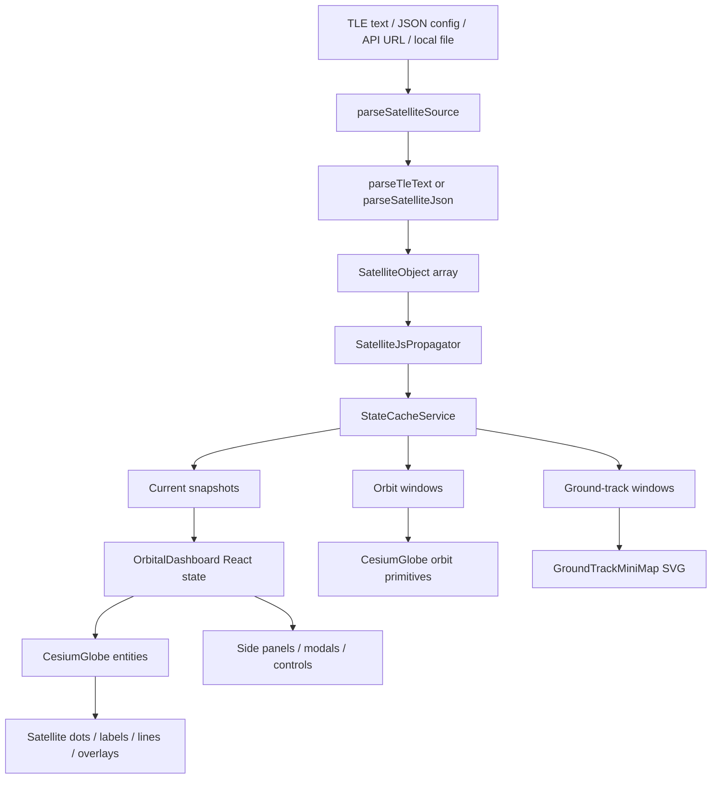
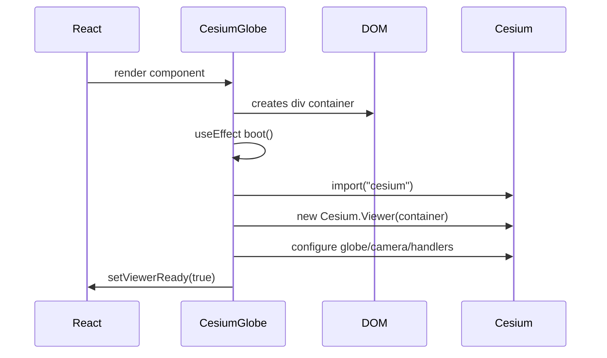
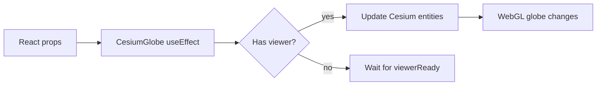
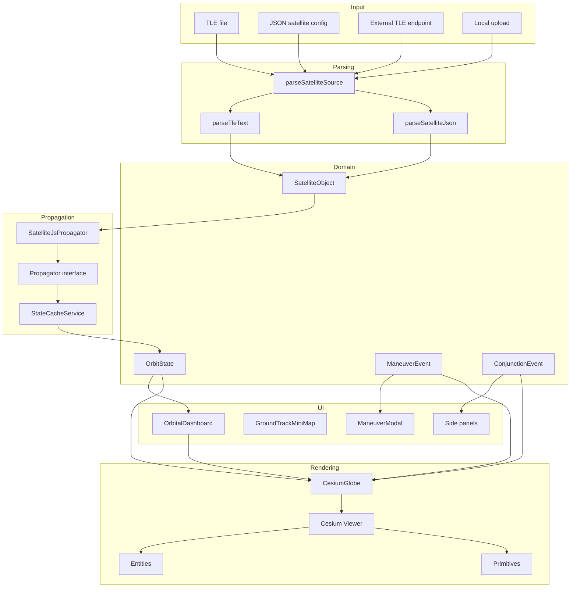
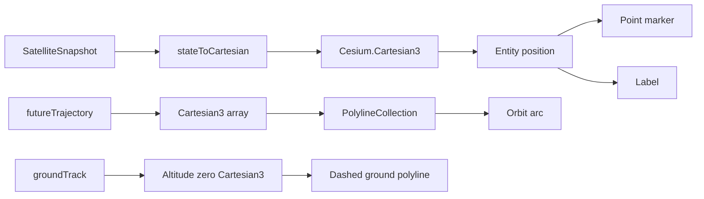
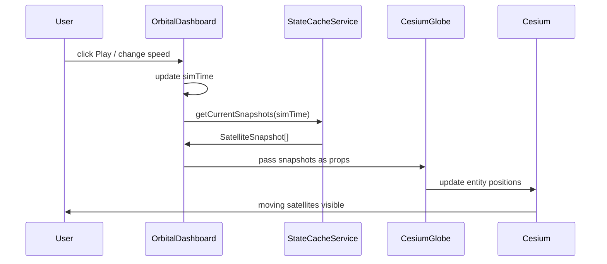
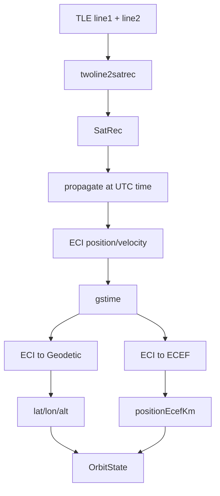
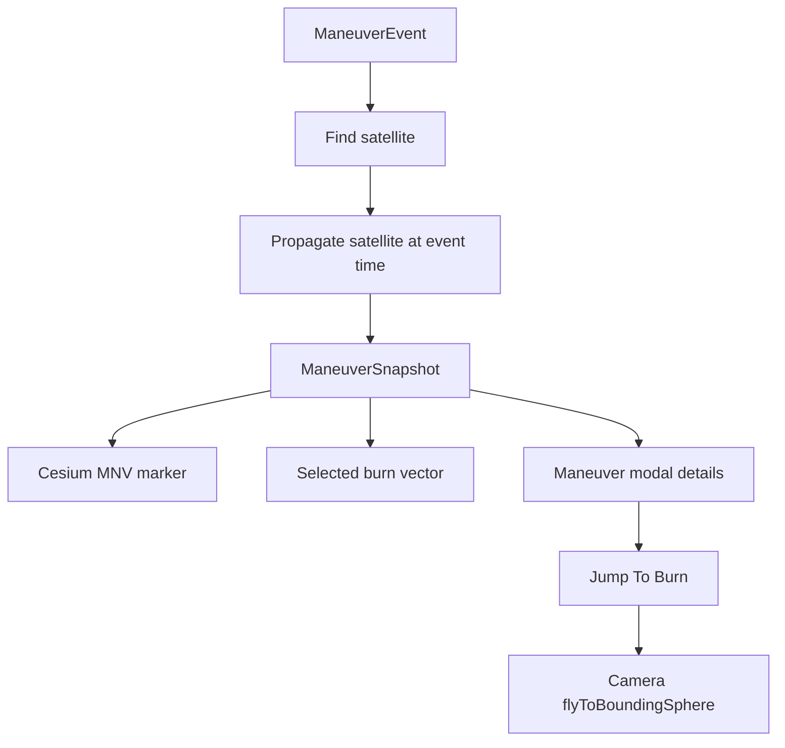
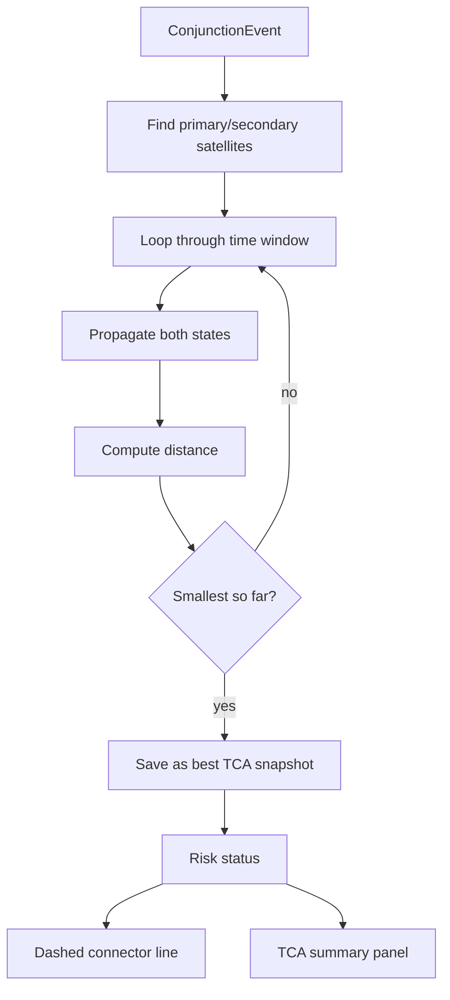
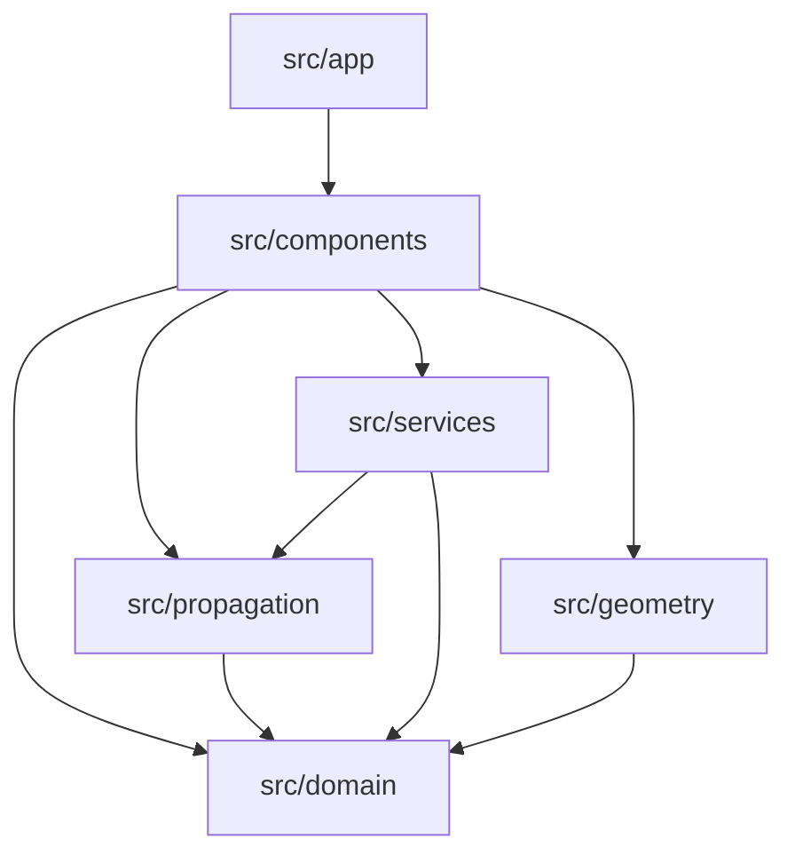

# orbit-visualization-engine Internal Architecture Guide

This guide is the "how this project really works" document.

It is written for a beginner MERN developer who knows React, APIs, JSON, and UI state, but is new to aerospace terms like TLE, SGP4, ground track, maneuver, and conjunction.

The project is currently a Phase 3 orbital visualization MVP built with:

- Next.js
- React
- TypeScript
- Tailwind CSS
- CesiumJS
- SatelliteJS

The most important idea:

```text
SatelliteJS calculates satellite positions.
CesiumJS draws those positions on a 3D Earth.
React controls the UI and decides what should be visible.
```

Think of it like a MERN dashboard:

```text
Backend/database data -> business logic -> normalized state -> UI components -> charts/map
```

Here the equivalent is:

```text
TLE/JSON satellite data -> propagation logic -> OrbitState snapshots -> Cesium globe + React panels
```

## Table Of Contents

- [Section 1: Product Purpose](#section-1-product-purpose)
- [Section 2: Complete Codebase Flow](#section-2-complete-codebase-flow)
- [Section 3: Folder-By-Folder Breakdown](#section-3-folder-by-folder-breakdown)
- [Section 4: File-By-File Breakdown](#section-4-file-by-file-breakdown)
- [Section 5: Cesium Internals](#section-5-cesium-internals)
- [Section 6: SatelliteJS Internals](#section-6-satellitejs-internals)
- [Section 7: Ground Track Logic](#section-7-ground-track-logic)
- [Section 8: Maneuvers](#section-8-maneuvers)
- [Section 9: Conjunctions](#section-9-conjunctions)
- [Section 10: UI + React Flow](#section-10-ui--react-flow)
- [Section 11: Performance](#section-11-performance)
- [Section 12: Engineering Design Rules](#section-12-engineering-design-rules)
- [Section 13: Interview / Owner Defense Prep](#section-13-interview--owner-defense-prep)
- [Section 14: Visual Diagrams](#section-14-visual-diagrams)
- [Section 15: Code Owner Explanation](#section-15-code-owner-explanation)

---

## Section 1: Product Purpose

### What This Project Actually Is

This is an orbital visualization engine.

In simple language:

```text
You load satellite orbit data.
The app calculates where those satellites are at a selected time.
Then it shows those satellites moving around Earth on a 3D globe.
```

It is not just a static globe. It has:

- satellite loading from TLE text, JSON config, local files, or endpoint URLs
- satellite position calculation over time
- live simulation playback
- orbit arcs
- past trails
- ground tracks
- satellite selection
- range/distance checks
- maneuver event markers
- conjunction close-approach checks
- UI panels for operator-style inspection

### What Real-World Problem It Solves

Real satellite operators need to answer questions like:

- Where is this satellite right now?
- Where will it be soon?
- What path is it following?
- What part of Earth is it passing over?
- Is it close to another object?
- Did a maneuver happen or is one planned?
- Which object should I inspect?
- Can I understand this quickly from a visual interface?

Your project solves the visualization and inspection part of that problem.

It helps a user see orbital behavior instead of reading only raw numbers.

### Visualization Layer vs Action Layer

This is very important.

Your app is currently a visualization layer.

It shows:

- where satellites are
- where paths are
- what events exist
- what distances or labels are associated with those events

It does not perform real spacecraft actions.

It does not:

- command a satellite
- approve a maneuver
- calculate certified collision avoidance
- communicate with spacecraft
- control mission operations

Think of it like a stock-market dashboard:

```text
Visualization layer:
  shows stock price, charts, alerts

Action layer:
  actually buys/sells stock
```

Your project is like the charting dashboard, not the trading engine.

For space:

```text
Visualization layer:
  Cesium globe, labels, orbit paths, events, panels

Action layer:
  command planning, maneuver approval, real risk decision, operations workflow
```

### Why CesiumJS Is Used

CesiumJS is a 3D geospatial engine.

Use Cesium when you need:

- a real 3D Earth
- latitude/longitude/altitude positions
- satellite or aircraft tracks
- camera movement around Earth
- labels/markers/polylines in 3D
- Earth imagery
- globe interaction

React is good at UI.
Cesium is good at 3D Earth rendering.

So the app uses:

```text
React = panels, buttons, state, forms
Cesium = globe, satellites, orbit lines, camera
```

MERN analogy:

```text
React component tree = your dashboard UI
Cesium viewer = a powerful map/chart library mounted inside one component
```

### Why SatelliteJS Is Used

SatelliteJS is a JavaScript library that understands TLE data and uses the SGP4 model to calculate satellite positions.

TLE text alone does not directly say:

```text
latitude = X
longitude = Y
altitude = Z
```

TLE is more like a compact orbit recipe.

SatelliteJS takes that recipe and answers:

```text
At this exact time, where should the satellite be?
```

In this project:

```text
TLE -> SatelliteJS -> OrbitState -> Cesium
```

### What TLE Means

TLE means Two-Line Element set.

It is usually 2 lines plus an optional name line:

```text
ISS (ZARYA)
1 25544U 98067A   26128.19937109  .00004920  00000+0  96926-4 0  9998
2 25544  51.6308 138.0417 0007476  35.9089 324.2400 15.49139257565554
```

Beginner explanation:

```text
TLE is a compact text description of an orbit at a specific time.
It is not a list of positions.
It is not a path file.
It is a set of parameters that a propagator can use.
```

MERN analogy:

```text
TLE = compact database row
SatelliteJS = service function that expands it into useful state
OrbitState = normalized DTO used by frontend rendering
```

### What SGP4 Means

SGP4 is the mathematical model used with TLE data.

In simple terms:

```text
SGP4 predicts where a satellite should be at a given time based on its TLE.
```

It is good for many public catalog visualization tasks, but it is not the same as a full high-fidelity flight-dynamics system.

### What OrbitState Means In This Project

`OrbitState` is your app's normalized position object.

Defined in:

```text
src/domain/orbit.ts
```

It contains:

- satellite id
- time
- ECI position
- ECI velocity
- ECEF position
- latitude
- longitude
- altitude
- velocity magnitude

It is the main "state vector" used by the app.

Simple meaning:

```text
OrbitState = "At this time, this satellite is here and moving like this."
```

### What Ground Track Means

A ground track is the path on Earth's surface directly underneath the satellite.

Imagine a satellite flying above Earth. If you draw a point straight down from the satellite to the surface, that surface point is the sub-satellite point.

As the satellite moves, those surface points create a ground track.

Important:

```text
Orbit path = path in space
Ground track = path projected onto Earth surface
```

### What Conjunction Means

A conjunction is a close approach between two space objects.

It does not automatically mean collision.

It means:

```text
These two objects are predicted to pass close enough that we should inspect the event.
```

In this app, conjunctions are currently sample/demo close-approach events.

### What Maneuver Means

A maneuver is a planned or executed change to a satellite's motion.

In real life, this usually means firing thrusters.

Examples:

- raise orbit
- lower orbit
- avoid collision
- adjust phasing
- maintain orbit

In this app, maneuvers are currently visual event markers with burn vectors. They are not true physics-based post-burn orbit calculations yet.

### How This Compares To MOSAIC, OrbPro, OpenMCT

This project is inspired by mission operations and space-domain awareness interfaces.

Comparison:

| System | What It Is | How This Project Relates |
| --- | --- | --- |
| MOSAIC-like systems | Operator tools for multi-object space-domain awareness | Your app mimics the visualization layer and event inspection workflows |
| OrbPro-style tools | Orbit analysis / mission planning tools | Your app has early orbit viewing, but not full professional analysis yet |
| OpenMCT | NASA-style telemetry and mission UI framework | Your app has a focused orbital UI rather than a generic telemetry framework |
| Cesium-based SDA tools | 3D globe visualizations of satellites/events | Your app is in this family |

The project is currently closest to:

```text
MOSAIC-like visualization prototype + beginner mission-ops UI
```

It is not yet:

```text
Certified orbital analysis platform
```

---

## Section 2: Complete Codebase Flow

### Full Data Flow Overview



### Step 1: Input Data Enters The App

Possible inputs:

- built-in sample TLE from `src/data/sampleTle.ts`
- public file `/data/sample.tle`
- JSON config `/data/satellites.json`
- CelesTrak or another endpoint URL
- local uploaded `.tle`, `.txt`, or `.json` file

Main file:

```text
src/components/OrbitalDashboard.tsx
```

Important functions:

- `loadFromUrl`
- `loadTleText`
- `getTleFetchUrl`
- `parseSatelliteSource`

Input:

```text
raw TLE text or raw JSON text
```

Output:

```text
SatelliteObject[]
messages/errors
```

What would break if removed:

```text
The app would have no way to create satellites from files or URLs.
```

### Step 2: TLE/JSON Parsing

Main files:

```text
src/domain/tle.ts
src/domain/satelliteConfig.ts
```

Flow:

```text
parseSatelliteSource(raw)
  -> if JSON-like: parseSatelliteJson(raw)
  -> else: parseTleText(raw)
```

`parseTleText` does:

- split text into clean lines
- detect optional satellite name line
- validate line 1 and line 2
- check matching satellite numbers
- check checksum
- create `SatelliteObject`
- enforce max 15 satellites

`parseSatelliteJson` does:

- JSON.parse
- normalize array/object shape
- validate each satellite entry
- reuse `parseTleText` for each embedded TLE
- merge metadata and visual settings

Input:

```text
raw string
```

Output:

```ts
{
  satellites: SatelliteObject[],
  errors: string[]
}
```

Why this layer exists:

It keeps messy external input away from the rest of the app.

MERN analogy:

```text
This is like request validation + DTO normalization before saving data.
```

What would break if removed:

The app would pass invalid or inconsistent data into SatelliteJS, causing crashes or invisible satellites.

### Step 3: SatelliteObject Creation

Main file:

```text
src/domain/orbit.ts
```

`SatelliteObject` is the app's normalized satellite model:

```ts
{
  id: string;
  name: string;
  noradId?: string;
  sourceType: "TLE" | "EPHEMERIS" | "MANUAL_STATE";
  tle: { line1: string; line2: string };
  visual: SatelliteVisualSettings;
  metadata?: {...};
}
```

Simple meaning:

```text
SatelliteObject = app-level satellite record
```

What would break if removed:

Every layer after parsing expects a consistent `SatelliteObject`. Rendering, selection, propagation, and UI panels all depend on it.

### Step 4: Propagator Creation

Main file:

```text
src/propagation/SatelliteJsPropagator.ts
```

Created inside:

```text
src/components/OrbitalDashboard.tsx
```

Code concept:

```ts
const propagator = useMemo(() => new SatelliteJsPropagator(satellites), [satellites]);
```

What happens:

- each `SatelliteObject` has two TLE lines
- `satellite.twoline2satrec(line1, line2)` creates a `SatRec`
- `SatRec` is SatelliteJS's internal orbit record

Input:

```text
SatelliteObject[]
```

Output:

```text
Propagator instance with internal SatRec records
```

Why this layer exists:

It hides SatelliteJS details behind your own interface.

What would break if removed:

You would have SatelliteJS calls scattered across UI components, making future backend/Orekit migration painful.

### Step 5: Current State Generation

Main files:

```text
src/propagation/SatelliteJsPropagator.ts
src/services/StateCacheService.ts
```

Call chain:

```text
OrbitalDashboard
  -> stateCache.getCurrentSnapshots(simTime)
  -> propagator.getState(satellite.id, simTime)
  -> satellite.propagate(satrec, date)
  -> eciToGeodetic / eciToEcf
  -> OrbitState
```

Input:

```text
satellite id + simulation time
```

Output:

```text
OrbitState
```

What `OrbitState` contains:

- ECI position
- ECI velocity
- ECEF position
- latitude
- longitude
- altitude
- velocity

What would break if removed:

The satellite dots would not move because Cesium would not receive current positions.

### Step 6: State Cache Service

Main file:

```text
src/services/StateCacheService.ts
```

Despite the name, it is more of a trajectory-window service right now.

It produces:

- current snapshots
- future trajectory windows
- past trail windows
- ground track windows

Important methods:

```ts
getCurrentSnapshots(timeUtc)
getWindowedSnapshots(timeUtc, options)
getGroundTrackSnapshots(timeUtc, options)
```

Why this layer exists:

It keeps "how many points should we sample?" out of the Cesium rendering file.

MERN analogy:

```text
Service layer that prepares chart data before React renders it.
```

What would break if removed:

`OrbitalDashboard` and `CesiumGlobe` would need to do raw propagation and trajectory sampling directly, making them too large and tightly coupled.

### Step 7: Orbit Path Generation

Main files:

```text
src/services/StateCacheService.ts
src/components/CesiumGlobe.tsx
```

`StateCacheService.getWindowedSnapshots` creates `futureTrajectory`.

`CesiumGlobe` converts those `OrbitState[]` into Cesium positions:

```text
OrbitState[] -> Cartesian3[] -> PolylineCollection
```

Input:

```text
futureTrajectory: OrbitState[]
```

Output:

```text
Cesium polyline around Earth
```

What would break if removed:

You would only see moving dots, not orbital arcs.

### Step 8: Ground Track Generation

Main files:

```text
src/services/StateCacheService.ts
src/geometry/groundTrack.ts
src/components/CesiumGlobe.tsx
src/components/GroundTrackMiniMap.tsx
```

For the 3D globe:

```text
OrbitState latitude/longitude -> altitude 0 -> Cesium surface polyline
```

For the 2D map:

```text
latitude/longitude -> SVG x/y projection -> polyline
```

What would break if removed:

Users could see satellites in space but not what parts of Earth they pass over.

### Step 9: Cesium Entity Rendering

Main file:

```text
src/components/CesiumGlobe.tsx
```

Cesium renders:

- satellite point entities
- satellite labels
- orbit polylines
- trail polylines
- ground track polylines
- range line
- maneuver markers
- maneuver burn vector
- conjunction line and label

React gives Cesium data through props.

Cesium stores live render objects in refs:

```ts
entitiesRef
pathPrimitiveRef
rangeEntityRef
maneuverEntitiesRef
conjunctionEntitiesRef
```

What would break if removed:

No 3D visualization.

### Step 10: React UI Updates

Main file:

```text
src/components/OrbitalDashboard.tsx
```

React state controls:

- satellites
- selected satellite ids
- simulation time
- play/pause
- speed
- label visibility
- all-orbits mode
- range check mode
- maneuver toggle
- conjunction toggle
- ground track range
- selected maneuver
- selected conjunction

What would break if removed:

The app would still maybe draw something, but users could not interact with it cleanly.

### Step 11: User Interactions

User interactions flow:

```text
User clicks UI button
  -> React state changes
  -> derived snapshots recompute
  -> CesiumGlobe receives new props
  -> Cesium useEffect updates entities/primitives
```

For globe clicks:

```text
User clicks satellite in Cesium
  -> ScreenSpaceEventHandler
  -> picked entity properties.satelliteId
  -> onToggleSatellite(id)
  -> OrbitalDashboard updates selectedSatelliteIds
  -> Cesium rerenders selected styles/orbits
```

### Step 12: Maneuver And Conjunction Overlays

Maneuvers:

```text
sampleManeuvers / maneuvers.json
  -> ManeuverEvent[]
  -> ManeuverSnapshot[]
  -> Cesium marker + selected burn vector
  -> Maneuver panel/modal
```

Conjunctions:

```text
sampleConjunctions
  -> loop over time window
  -> compute minimum distance
  -> ConjunctionSnapshot
  -> Cesium dashed connector + label
  -> Conjunction panel
```

---

## Section 3: Folder-By-Folder Breakdown

### `src/app`

Responsibility:

Next.js App Router entry points and API routes.

Key files:

- `src/app/page.tsx`
- `src/app/layout.tsx`
- `src/app/api/tle/route.ts`
- `src/app/globals.css`

Execution order:

```text
layout.tsx wraps app
page.tsx renders OrbitalDashboard
api/tle/route.ts runs only when client requests /api/tle
```

Relationship:

`page.tsx` is intentionally tiny. It delegates the real app to `OrbitalDashboard`.

### `src/components`

Responsibility:

UI and rendering components.

Key files:

- `OrbitalDashboard.tsx`
- `CesiumGlobe.tsx`
- `GroundTrackMiniMap.tsx`

Execution order:

```text
OrbitalDashboard renders first
  -> dynamically loads CesiumGlobe on client only
  -> renders side panels, bottom controls, modals
  -> passes computed data into CesiumGlobe and GroundTrackMiniMap
```

Why client-only Cesium:

Cesium needs browser APIs like `window`, canvas, WebGL, and DOM. It cannot run during server-side rendering.

### `src/domain`

Responsibility:

Pure TypeScript domain models and parsing rules.

Key files:

- `orbit.ts`
- `tle.ts`
- `satelliteConfig.ts`
- `maneuver.ts`
- `conjunction.ts`

This folder should not know about React or Cesium.

MERN analogy:

```text
domain = types + validators + business rules
```

### `src/propagation`

Responsibility:

Orbit propagation abstraction and SatelliteJS implementation.

Key files:

- `PropagatorInterface.ts`
- `SatelliteJsPropagator.ts`

Important architectural choice:

The UI depends on your `Propagator` interface, not directly on SatelliteJS.

This means later you can replace:

```text
SatelliteJS in browser
```

with:

```text
Orekit backend API
```

without rewriting the whole UI.

### `src/services`

Responsibility:

Application service layer between raw propagation and UI rendering.

Key file:

- `StateCacheService.ts`

It answers:

```text
Give me all current satellite states.
Give me future orbit windows.
Give me past trails.
Give me ground-track history.
```

### `src/geometry`

Responsibility:

Math and formatting helpers.

Key files:

- `distance.ts`
- `groundTrack.ts`
- `format.ts`

This folder is small but important. It keeps reusable math out of components.

### `public/data`

Responsibility:

Browser-accessible sample data.

Key files:

- `sample.tle`
- `satellites.json`
- `maneuvers.json`

These are static files that can be loaded by the frontend with URLs like:

```text
/data/sample.tle
/data/satellites.json
/data/maneuvers.json
```

---

## Section 4: File-By-File Breakdown

### `src/app/page.tsx`

Purpose:

Renders the main application.

Core logic:

```tsx
import { OrbitalDashboard } from "@/components/OrbitalDashboard";

export default function Home() {
  return <OrbitalDashboard />;
}
```

Why it exists:

This is the Next.js route for `/`.

### `src/app/layout.tsx`

Purpose:

Defines root HTML layout and imports global CSS/Cesium CSS.

Important import:

```ts
import "cesium/Build/Cesium/Widgets/widgets.css";
```

Without Cesium CSS, Cesium widgets and internal UI styles can look broken.

### `src/app/api/tle/route.ts`

Purpose:

Server-side proxy for external TLE endpoints.

Why proxy exists:

Browsers can hit CORS restrictions when fetching third-party URLs directly.

Instead:

```text
Browser -> /api/tle?url=...
Next API route -> external TLE endpoint
Next API route -> returns text to browser
```

Important validation:

- missing URL returns 400
- invalid URL returns 400
- only `http` and `https` allowed
- failed upstream returns error

MERN analogy:

```text
Express route that proxies an external API.
```

### `src/domain/orbit.ts`

Purpose:

Defines the core data types used across the app.

Key types:

- `SatelliteVisualSettings`
- `SatelliteObject`
- `OrbitState`
- `SatelliteSnapshot`
- `RangeMeasurement`

Most important type:

```ts
OrbitState
```

This is the bridge between SatelliteJS and Cesium.

### `src/domain/tle.ts`

Purpose:

Parse and validate raw TLE text.

Core functions:

- `checksumIsValid`
- `normalizeLines`
- `parseTleText`

Input:

```text
raw TLE text
```

Output:

```text
TleParseResult = satellites + errors
```

Important rule:

```text
The parser enforces MAX_TLE_OBJECTS = 15.
```

Why checksum matters:

TLE lines include a final checksum digit. If the line is copied incorrectly, checksum can fail.

### `src/domain/satelliteConfig.ts`

Purpose:

Support both raw TLE text and structured JSON satellite config.

Core function:

```ts
parseSatelliteSource(raw)
```

It decides:

```text
Looks like JSON -> parseSatelliteJson
Otherwise -> parseTleText
```

Why JSON config exists:

TLE text only describes orbit. JSON lets you add app metadata:

- color
- labels
- marker defaults
- mission
- owner
- object type

### `src/domain/maneuver.ts`

Purpose:

Defines maneuver event data.

Core types:

- `ManeuverEvent`
- `ManeuverSnapshot`
- `ManeuverStatus`
- `ManeuverType`

Core functions:

- `getDeltaVMagnitudeMps`
- `getManeuverTone`

Important:

The model supports statuses:

- `planned`
- `candidate`
- `executed`

Current limitation:

The maneuver model is visual. It does not yet alter the propagated orbit after the burn.

### `src/domain/conjunction.ts`

Purpose:

Defines close-approach data.

Core types:

- `ConjunctionEvent`
- `ConjunctionSnapshot`
- `ConjunctionStatus`

Core functions:

- `getConjunctionStatus`
- `getConjunctionTone`

Current limitation:

The app computes closest approach over sample windows using propagated states. It does not yet ingest real CDM covariance data or compute probability of collision.

### `src/propagation/PropagatorInterface.ts`

Purpose:

Defines a contract for anything that can produce orbit states.

```ts
export interface Propagator {
  getState(satelliteId: string, timeUtc: string): OrbitState | null;
  getTrajectory(satelliteId, startUtc, endUtc, stepSec): OrbitState[];
}
```

Why this is important:

This is a replaceable engine boundary.

Today:

```text
Propagator = SatelliteJsPropagator
```

Future:

```text
Propagator = BackendOrekitPropagator
```

### `src/propagation/SatelliteJsPropagator.ts`

Purpose:

Actual SatelliteJS implementation of the `Propagator` interface.

Core logic:

```text
constructor:
  SatelliteObject[] -> satellite.twoline2satrec -> SatRec map

getState:
  SatRec + Date -> satellite.propagate
  ECI -> geodetic/ECEF
  returns OrbitState

getTrajectory:
  loops start to end by stepSec
  calls getState repeatedly
```

Important SatelliteJS calls:

- `twoline2satrec`
- `propagate`
- `gstime`
- `eciToGeodetic`
- `eciToEcf`
- `degreesLat`
- `degreesLong`

### `src/services/StateCacheService.ts`

Purpose:

Prepare state windows for UI rendering.

Core methods:

```ts
getCurrentSnapshots(timeUtc)
getWindowedSnapshots(timeUtc, options)
getGroundTrackSnapshots(timeUtc, options)
```

It returns `SatelliteSnapshot[]`.

Simple meaning:

```text
It turns "I need data around this time" into ready-to-render satellite snapshots.
```

### `src/geometry/distance.ts`

Purpose:

Calculate 3D distance between two orbit states.

Core function:

```ts
distanceBetweenOrbitStatesKm(a, b)
```

It uses:

```text
sqrt(dx^2 + dy^2 + dz^2)
```

This is Euclidean distance in 3D space, not surface distance on Earth.

### `src/geometry/groundTrack.ts`

Purpose:

Prevent ugly lines across the 2D map when longitude jumps from +179 to -179.

Core function:

```ts
splitGroundTrackByLongitudeWrap(states)
```

Problem:

```text
longitude 179 -> -179
```

On a flat map, that looks like a huge line across the whole world.

Solution:

Split into separate polyline segments when longitude jumps more than 180 degrees.

### `src/geometry/format.ts`

Purpose:

Small formatting helpers.

Core functions:

- `formatNumber`
- `formatUtc`

### `src/components/OrbitalDashboard.tsx`

Purpose:

Main React controller for the entire app.

It owns:

- loaded satellites
- messages
- selected satellites
- simulation time
- playback
- speed
- layer toggles
- range check
- maneuvers
- conjunctions
- modal state
- camera focus requests

Think of it as:

```text
The brain of the React app.
```

It does not directly draw Cesium. It calculates and passes props to `CesiumGlobe`.

### `src/components/CesiumGlobe.tsx`

Purpose:

Client-only Cesium rendering engine.

It owns:

- Cesium Viewer initialization
- satellite point entities
- labels
- orbit/trail/ground-track primitives
- range line
- maneuver markers/vectors
- conjunction overlays
- click/hover handlers
- camera zoom/focus/reset

Think of it as:

```text
The bridge between React state and Cesium's imperative 3D engine.
```

### `src/components/GroundTrackMiniMap.tsx`

Purpose:

2D SVG ground-track visualization.

It renders:

- small card with ground-track count
- expanded modal
- time-range dropdown
- 2D SVG world-like coordinate grid
- ground-track polylines
- current satellite points

It does not use Cesium.

It uses simple SVG math:

```text
longitude -180..180 -> x 0..360
latitude 90..-90 -> y 0..180
```

---

## Section 5: Cesium Internals

### How Cesium Globe Initializes

File:

```text
src/components/CesiumGlobe.tsx
```

Cesium initializes inside a `useEffect` called `boot`.

Why inside `useEffect`?

Because Cesium needs the browser DOM. React must first mount the `<div ref={containerRef}>`.

Flow:



Key configuration:

- animation disabled
- timeline disabled
- baseLayerPicker disabled
- NaturalEarthII imagery
- globe lighting enabled
- atmosphere enabled
- camera default view set
- min/max zoom distance set

### React To Cesium Interaction Model

React is declarative.
Cesium is imperative.

React says:

```text
Here is new state.
```

Cesium needs commands:

```text
Add entity.
Remove entity.
Update entity position.
Update polyline.
Move camera.
```

This is why `CesiumGlobe` uses refs:

```ts
viewerRef
entitiesRef
pathPrimitiveRef
rangeEntityRef
maneuverEntitiesRef
conjunctionEntitiesRef
```

Refs hold Cesium objects without forcing React rerenders.

Diagram:



### How Satellites Become Cesium Entities

Relevant effect:

```text
useEffect depending on snapshots, selectedSatelliteIds, showLabels, viewerReady
```

Flow:

```text
Snapshot with OrbitState
  -> stateToCartesian
  -> Cesium.Cartesian3.fromDegrees(lon, lat, altitude)
  -> viewer.entities.add(...)
```

Each satellite entity has:

- `id`
- `name`
- `position`
- `point`
- `label`
- `properties.satelliteId`

`properties.satelliteId` is important because click handlers use it.

### How Cartesian Coordinates Are Created

Cesium does not draw using latitude/longitude directly.

It draws using Cartesian coordinates in 3D.

Your helper:

```ts
function stateToCartesian(Cesium, state) {
  return Cesium.Cartesian3.fromDegrees(
    state.longitudeDeg,
    state.latitudeDeg,
    state.altitudeKm * 1000,
  );
}
```

Important:

SatelliteJS returns altitude in kilometers.
Cesium expects meters.

So:

```text
altitudeKm * 1000
```

### How Orbit Polylines Are Generated

Orbit lines use future trajectory points.

Flow:

```text
futureTrajectory OrbitState[]
  -> map each state to Cartesian3
  -> create PolylineCollection
  -> add polyline to PrimitiveCollection
```

Why primitives instead of only entities?

Long static path lines are often easier and more predictable as Cesium primitives.

### How Ground Tracks Are Projected

3D ground track:

```text
OrbitState lat/lon
  -> altitude = 0
  -> Cartesian3.fromDegrees(lon, lat, 0)
  -> dashed polyline on Earth surface
```

Helper:

```ts
stateToGroundCartesian(Cesium, state)
```

2D ground track:

```text
lat/lon
  -> x/y SVG projection
  -> polyline
```

### How Labels And Markers Work

Satellite marker:

```text
Cesium entity point
```

Satellite label:

```text
Cesium entity label
```

Selected satellites get:

- bigger point
- stronger outline
- slightly larger label

Label visibility depends on:

```text
snapshot.satellite.visual.showLabel && (showLabels || isSelected)
```

Meaning:

- satellite-specific label must be enabled
- global labels enabled OR satellite is selected

### How Click Handlers Work

Cesium click handler:

```ts
new Cesium.ScreenSpaceEventHandler(viewer.scene.canvas)
```

On left click:

```text
pick object under mouse
if maneuverId -> select maneuver
else if conjunctionId -> select conjunction
else if satelliteId -> toggle satellite
```

This is how clicking a satellite on the globe updates React state.

### How Camera Focus Works

There are three focus paths:

1. Satellite focus
2. Maneuver focus
3. Reset/home camera

Satellite focus:

```text
focusRequest satelliteId
  -> find latest snapshot
  -> camera.flyTo(lon, lat, altitude + offset)
```

Maneuver focus:

```text
maneuverFocusRequest lat/lon/alt
  -> Cartesian3 burnPosition
  -> camera.flyToBoundingSphere(...)
```

Reset:

```text
resetSignal changes
  -> camera.flyTo(default Earth view)
```

### How Simulation Time Affects Rendering

Simulation time is owned by `OrbitalDashboard`.

Every 100ms:

```text
if playing:
  simTime = simTime + elapsedMs * speed
```

When `simTime` changes:

- current snapshots recompute
- satellite entities update
- range measurement updates
- selected telemetry changes
- maneuver relative time changes

Orbit windows update less often using bucket anchors.

This avoids recomputing expensive path arrays every animation tick.

---

## Section 6: SatelliteJS Internals

### How TLE Is Parsed

Your parser validates TLE text first.

Then SatelliteJS parses the TLE here:

```ts
satellite.twoline2satrec(sat.tle.line1, sat.tle.line2)
```

This creates a `SatRec`.

Think of `SatRec` like a compiled version of the TLE.

MERN analogy:

```text
Raw JSON request -> validated DTO -> compiled model object
```

### How Propagation Works

For a given satellite and time:

```ts
satellite.propagate(record, date)
```

Output:

- ECI position
- ECI velocity

ECI means Earth-Centered Inertial.

Simple explanation:

```text
ECI is a space-fixed coordinate frame centered on Earth.
It does not rotate with Earth in the same way the ground does.
```

### How Current State Is Calculated

`getState(satelliteId, timeUtc)`:

1. find satellite's `SatRec`
2. convert time string to `Date`
3. call `satellite.propagate`
4. convert ECI to geodetic lat/lon/alt
5. convert ECI to ECEF
6. return `OrbitState`

### ECI, ECEF, Geodetic

Beginner explanation:

| Frame | Meaning | Used For |
| --- | --- | --- |
| ECI | Space-fixed Earth-centered coordinates | orbital motion, distances, velocity |
| ECEF | Earth-fixed Earth-centered coordinates | Earth-relative position |
| Geodetic | latitude, longitude, altitude | globe rendering and UI |

Your `OrbitState` stores all three concepts where available.

### How Future Trajectory Is Sampled

`getTrajectory` loops from start time to end time:

```text
time = start
while time <= end:
  getState(time)
  time += stepSec
```

Example:

```text
futureMinutes = 110
stepSec = 60
```

That means roughly 111 points per satellite for future orbit path.

### How Past Trail Is Generated

Same method, different time range:

```text
pastStart = currentTime - 35 minutes
pastEnd = currentTime
```

This creates a recent trail behind the satellite.

### How Orbit Windows Are Created

In `OrbitalDashboard`:

```ts
const trajectoryAnchorMs = Math.floor(simTime.getTime() / trajectoryBucketMs) * trajectoryBucketMs;
```

This buckets orbit recomputation every 5 minutes.

Why?

If the app recomputed every path on every 100ms tick, performance would suffer.

So:

```text
satellite dot updates continuously
orbit path updates less often
```

### Accuracy Limitations

SatelliteJS + TLE + SGP4 is good for visualization, but not enough for certified analysis.

Limitations:

- TLEs get stale
- SGP4 is simplified compared to high-fidelity propagation
- no covariance
- no probability of collision
- no real maneuver physics
- no atmosphere/drag tuning beyond TLE/SGP4 model behavior
- no operator ephemeris ingestion yet

For production, use a backend with tools like Orekit/GMAT and real CDM/OEM data.

---

## Section 7: Ground Track Logic

### Why Ground Track Looks Like A Sine Wave

A satellite orbit is a tilted path around Earth.

Earth is rotating underneath it.

When you project the satellite's sub-point onto a flat map, the path often looks like a wave.

Simple mental model:

```text
Satellite moves around Earth in a tilted loop.
Earth rotates below it.
Flat map unwraps the globe.
The result looks wave-shaped.
```

It is similar to peeling an orange and flattening it. Curved paths become stretched and wavy.

### Sub-Satellite Point

The sub-satellite point is:

```text
The point on Earth directly below the satellite.
```

Your app gets it from SatelliteJS geodetic conversion:

```text
latitudeDeg
longitudeDeg
altitudeKm
```

For ground track:

```text
same latitude/longitude
altitude = 0
```

### Longitude Wrap Logic

Problem:

Longitude range is:

```text
-180 to +180
```

If a satellite crosses the international date line:

```text
179 -> -179
```

Numerically that is a jump of 358 degrees.

If you draw a flat polyline between those two points, it cuts across the whole map.

Fix:

```ts
splitGroundTrackByLongitudeWrap(states)
```

It starts a new segment when longitude jumps more than 180 degrees.

### 3D Ground Track

Rendered in:

```text
src/components/CesiumGlobe.tsx
```

It draws dashed green-ish lines on Earth surface.

### 2D Ground Track Modal

Rendered in:

```text
src/components/GroundTrackMiniMap.tsx
```

It uses SVG, not Cesium.

Projection:

```ts
x = ((longitude + 180) / 360) * mapWidth
y = ((90 - latitude) / 180) * mapHeight
```

This is a simple rectangular projection.

### Expanded Timeline Ranges

Configured in:

```text
OrbitalDashboard groundTrackRangeOptions
```

Ranges:

- Live 6h
- Last 24h
- Last 7d
- Last 2mo
- Last 2y

Important:

Longer ranges use coarser sampling. They are approximate visual histories, not precision analytics.

---

## Section 8: Maneuvers

### What A Maneuver Is

A maneuver is a satellite motion-change event.

Usually this means:

```text
Thruster burn changes velocity.
Velocity change changes orbit.
```

### Maneuver Event Model

Defined in:

```text
src/domain/maneuver.ts
```

Important fields:

- `id`
- `satelliteId`
- `title`
- `timeUtc`
- `type`
- `status`
- `deltaVMps`
- `deltaVVectorMps`
- `frame`
- `durationSec`
- `description`

### Delta-V

Delta-V means change in velocity.

Unit:

```text
m/s
```

If delta-v is 0.55 m/s, it means:

```text
The maneuver changes satellite velocity by 0.55 meters per second.
```

That sounds small, but in orbit, small velocity changes can produce meaningful orbit changes over time.

### RTN Frame

RTN means:

- R = Radial
- T = Transverse / Along-track
- N = Normal / Cross-track

Beginner explanation:

```text
R = push away/toward Earth
T = push forward/backward along orbit
N = push sideways out of orbital plane
```

### Planned vs Candidate vs Executed

| Status | Meaning |
| --- | --- |
| Planned | scheduled or approved, not happened yet |
| Candidate | possible option being reviewed |
| Executed | already happened |

### Burn Marker Rendering

In `CesiumGlobe`, maneuvers render as:

- point marker
- label `MNV`
- selected burn vector arrow

Only selected maneuver shows the vector to keep the globe readable.

### Burn Vector

Current function:

```ts
getManeuverVectorEndpoint(Cesium, snapshot)
```

It scales the RTN vector into a visible 3D arrow.

Important:

```text
This is visual context, not true post-burn physics.
```

### Timeline Modal

`ManeuverModal` shows:

- event list
- selected event details
- status
- type
- burn duration
- event time
- relative time
- altitude
- delta-v
- RTN vector values
- Jump To Burn CTA

### What Is Real vs Placeholder

Real in current app:

- TLE-based satellite position at event time
- marker placement at propagated event position
- delta-v values from sample data
- status and event metadata
- camera focus to maneuver location

Placeholder/demo:

- burn vector scale
- maneuver event data
- post-burn orbit behavior
- maneuver planning workflow
- maneuver validation

---

## Section 9: Conjunctions

### What A Conjunction Is

A conjunction is a close-approach event between two objects.

It does not automatically mean collision.

It means:

```text
Two objects are predicted to pass close enough that we should inspect the risk.
```

### Closest Approach Logic

Defined in `OrbitalDashboard`.

For each `ConjunctionEvent`:

1. find primary satellite
2. find secondary satellite
3. loop from start time to end time
4. propagate both satellites at each sample time
5. calculate distance
6. keep the smallest distance
7. mark that time as TCA

### Miss Distance

Miss distance means:

```text
The closest predicted distance between the two satellites.
```

In code:

```ts
distanceBetweenOrbitStatesKm(primaryState, secondaryState)
```

### Relative Velocity

Relative velocity means:

```text
How fast the two objects are moving relative to each other.
```

If relative velocity is high, even a small object can be dangerous in real operations.

### TCA

TCA means Time of Closest Approach.

Simple:

```text
The exact time when the pair is closest within the checked window.
```

### Risk State

Risk state is based on thresholds:

```ts
getConjunctionStatus(missDistanceKm, warningDistanceKm, criticalDistanceKm)
```

Statuses:

- safe
- warning
- critical

### Pairwise Comparisons

Current app uses sample `ConjunctionEvent` pairs, not all possible pair combinations.

It checks only pairs defined in:

```text
src/data/sampleConjunctions.ts
```

### Visual Overlays

In Cesium:

- dashed line between primary and secondary at TCA states
- label at midpoint showing status and distance

Important:

The dashed line is not the path satellites travel.

It is a connector that says:

```text
These two objects are the close-approach pair.
```

### Current Simplifications

Current conjunction system does not include:

- covariance
- probability of collision
- CDM ingestion
- uncertainty ellipsoids
- screening of all loaded satellite pairs
- high-fidelity propagation

It is a visualization prototype.

---

## Section 10: UI + React Flow

### Main Dashboard Controller

`OrbitalDashboard` is the main controller.

It owns app state and passes data down.

State groups:

```text
Data state:
  satellites, messages, maneuverEvents, conjunctionEvents

Time state:
  simTime, isPlaying, speed

Selection state:
  selectedSatelliteIds, selectedManeuverId, selectedConjunctionId

Layer state:
  showLabels, showAllOrbits, showRangeCheck, showManeuvers, showConjunctions

Camera state:
  focusRequest, maneuverFocusRequest, resetSignal

Modal state:
  isManeuverModalOpen
```

### `useMemo` Flow

`useMemo` prevents expensive recalculations unless dependencies change.

Examples:

```text
satellites changed -> create new propagator
propagator changed -> create new state cache
simTime changed -> current snapshots recompute
trajectory bucket changed -> orbit windows recompute
ground track bucket changed -> ground tracks recompute
```

### Playback Controls

Interval:

```ts
window.setInterval(..., 100)
```

It updates simulation time:

```text
elapsed real milliseconds * speed
```

At 60x:

```text
1 real second = 60 simulation seconds
```

### Speed Controls

Current speeds:

- 60x
- 300x
- 600x

These are simulation multipliers.

### Selection Logic

When range check is off:

```text
only one selected satellite
```

When range check is on:

```text
up to two selected satellites
```

If a third satellite is selected while range check is on:

```text
oldest selected is removed
new one is added
```

### Satellite Toggles

Each satellite supports:

- Orbit
- Trail
- Ground
- Dot
- Name
- Focus

These update `satellite.visual`.

### Ground-Track Modal

Lives in:

```text
GroundTrackMiniMap.tsx
```

Uses `createPortal` to render modal in `document.body`.

This prevents the modal from being trapped inside a small side panel.

### Maneuver Modal

Lives inside:

```text
OrbitalDashboard.tsx
```

It also uses `createPortal`.

It shows details and provides `Jump To Burn`.

### Event Panels

Right-side panels:

- satellite filter
- range check
- maneuvers
- conjunctions

They are scrollable:

```text
absolute top-24 right-4 bottom-4 overflow-y-auto
```

---

## Section 11: Performance

### Why Cache/Windowing Exists

Satellite propagation is not free.

If you have 15 satellites and recompute hundreds of points every 100ms, the UI can lag.

So the app separates:

```text
current satellite positions -> frequent updates
orbit/trail/ground paths -> less frequent bucketed updates
```

### Current Timing

Current snapshots:

```text
recomputed when simTime changes
```

Orbit windows:

```text
recomputed every 5 simulation minutes
```

Ground-track windows:

```text
recomputed based on selected range bucket
```

### Sampling Windows

Orbit:

```text
futureMinutes = 110
pastMinutes = 35
stepSec = 60
```

Maneuver:

```text
45 minutes before/after event
step 90 seconds
```

Conjunction:

```text
sample every 120 seconds
```

Ground track:

Depends on selected time range.

### Render Throttling

Cesium entities update from React effects.

Long path lines are rebuilt when relevant window/layer dependencies change, not every tick.

### Satellite Limit

`MAX_TLE_OBJECTS = 15`

Reason:

This is an MVP. More satellites means more:

- propagation calls
- Cesium entities
- polyline points
- labels
- UI controls

### Performance Bottlenecks

Most likely bottlenecks:

- many satellites
- long ground-track ranges
- frequent trajectory recomputation
- too many labels
- too many Cesium polylines
- modal SVG rendering with long ranges

Future optimization:

- backend precomputed ephemeris
- Web Workers
- requestAnimationFrame-based updates
- Cesium sampled positions
- binary time-series tiles
- server-side state cache

---

## Section 12: Engineering Design Rules

### Separation Of Concerns

Good separation in this project:

```text
domain = models and validation
propagation = orbital calculation interface
services = snapshot/window preparation
geometry = reusable math
components = UI and rendering
```

### Replaceable Propagator Design

The `Propagator` interface is the key.

Because UI code depends on:

```ts
getState()
getTrajectory()
```

not on SatelliteJS directly.

This allows migration:

```text
SatelliteJsPropagator
  -> BackendApiPropagator
  -> OrekitPropagator
```

### Why Propagation Is Decoupled From Rendering

If Cesium calculated satellite positions directly, the app would become hard to test and replace.

Better:

```text
SatelliteJS computes.
Service prepares.
Cesium renders.
React controls.
```

### Future Backend Migration Path

Current:

```text
Browser TLE -> SatelliteJS -> Cesium
```

Production:

```text
Backend ingestion -> Orekit/GMAT -> database -> API -> React/Cesium
```

Frontend would receive:

```json
{
  "satelliteId": "25544",
  "states": [
    {
      "timeUtc": "...",
      "latitudeDeg": 10,
      "longitudeDeg": 20,
      "altitudeKm": 420
    }
  ]
}
```

### Scalability

For production scale:

- do not propagate thousands of satellites in the browser
- do not render all labels at once
- use clustering/filtering
- cache time windows
- stream only visible objects
- keep Cesium as rendering client

---

## Section 13: Interview / Owner Defense Prep

### Question: What does this project do?

Strong answer:

```text
It is a browser-based orbital visualization engine. It loads TLE or JSON satellite data, uses SatelliteJS/SGP4 to propagate positions, normalizes those positions into OrbitState snapshots, and renders satellites, orbit paths, trails, ground tracks, maneuver markers, range checks, and conjunction overlays on a CesiumJS 3D globe.
```

### Question: Why did you use CesiumJS?

Answer:

```text
Cesium is designed for 3D geospatial visualization. It handles Earth rendering, Cartesian coordinate conversion, camera navigation, labels, points, and polylines. React is not a 3D globe engine, so Cesium is used as the rendering layer while React controls the UI state.
```

### Question: Why did you use SatelliteJS?

Answer:

```text
SatelliteJS supports TLE parsing and SGP4 propagation in JavaScript. It lets the MVP calculate satellite positions directly in the browser from public TLE data. The architecture wraps it behind a Propagator interface so it can later be replaced by a backend service.
```

### Question: What is the main data object in your system?

Answer:

```text
OrbitState. It represents a satellite's position and velocity at a specific UTC time. It contains geodetic lat/lon/alt for rendering and ECI/ECEF position data for distance and analysis.
```

### Question: Why is propagation separate from rendering?

Answer:

```text
Because orbital calculation and 3D rendering are different responsibilities. SatelliteJS computes states, StateCacheService prepares windows, and Cesium only renders. This makes the app easier to test and easier to migrate to a backend propagator later.
```

### Question: Is this production accurate?

Answer:

```text
Not yet. It is accurate enough for TLE/SGP4 visualization, but production orbital analysis requires authoritative ephemeris, covariance, CDM ingestion, high-fidelity propagation, and validation against trusted tools like Orekit or GMAT.
```

### Question: What is a conjunction in your app?

Answer:

```text
A conjunction is a close-approach check between two satellites. The app samples both satellites over a time window, finds the time of minimum distance, labels it as TCA, and displays miss distance, relative velocity, and a risk state.
```

### Question: What is a maneuver in your app?

Answer:

```text
A maneuver is represented as an event tied to a satellite and time. The app places a burn marker at the satellite's propagated position at that time and shows a scaled burn vector based on sample delta-v values. It is visual context, not real post-burn propagation yet.
```

### Question: Why does the ground track look like waves?

Answer:

```text
The satellite moves in a tilted orbit while Earth rotates underneath it. When the sub-satellite point is projected onto a flat map, the path becomes wave-shaped.
```

### Question: What would you improve next?

Answer:

```text
I would add a backend analysis service using Orekit, ingest OMM/OEM/CDM data, store propagated state windows, compute covariance-based conjunction risk, and keep the frontend focused on visualization.
```

### Limitations To Say Honestly

- no real CDM ingestion yet
- no probability of collision
- no real post-maneuver orbit propagation
- no database
- no authentication
- browser-only propagation
- max 15 satellites for MVP performance

Honesty here is a strength. It shows you understand the difference between MVP visualization and operational analysis.

---

## Section 14: Visual Diagrams

### Full Architecture Diagram



### Data Flow Diagram

```text
Raw input
  |
  v
parseSatelliteSource()
  |
  v
SatelliteObject[]
  |
  v
new SatelliteJsPropagator(satellites)
  |
  v
new StateCacheService(propagator, satellites)
  |
  +--> getCurrentSnapshots(simTime)
  |       |
  |       v
  |    satellite dots + telemetry
  |
  +--> getWindowedSnapshots(bucketedTime)
  |       |
  |       v
  |    orbit arcs + trails + ground traces
  |
  +--> getGroundTrackSnapshots(rangeTime)
          |
          v
       2D ground track modal
```

### Cesium Rendering Pipeline



### React To Cesium Sequence



### Propagation Diagram



### Maneuver Diagram



### Conjunction Diagram



### Folder Dependency Diagram



Correct dependency direction:

```text
Components can use domain/services/geometry.
Domain should not use components.
Propagation should not use React.
Geometry should not use React.
```

---

## Section 15: Code Owner Explanation

If someone asks:

```text
How does your project work internally?
```

Say this:

```text
The app starts by loading satellite data from TLE text, JSON config, a URL, or a local file. That raw input is parsed and validated into a normalized SatelliteObject model. Each SatelliteObject contains TLE lines plus UI metadata like color and layer defaults.

Then the app creates a SatelliteJsPropagator. This wraps SatelliteJS behind a Propagator interface. SatelliteJS converts each TLE into a SatRec and uses SGP4 to propagate the satellite at any UTC time.

OrbitalDashboard owns the simulation clock. As time changes, it asks StateCacheService for current satellite snapshots and trajectory windows. Current snapshots update the moving satellite markers. Windowed snapshots provide future orbit arcs, recent trails, and ground tracks.

CesiumGlobe is the rendering bridge. React passes snapshots and UI flags into it. CesiumGlobe initializes a Cesium Viewer, creates point and label entities for satellites, uses primitives for orbit/trail/ground polylines, and adds extra entities for range checks, maneuvers, and conjunctions.

User interactions flow back upward. Clicking a satellite in Cesium reads the entity's satelliteId property and calls React callbacks. React updates selectedSatelliteIds, then Cesium receives new props and updates the visuals.

The system is intentionally layered: domain parsing is separate from propagation, propagation is separate from state-window generation, and Cesium only renders already-computed states. This makes the current SatelliteJS implementation replaceable with a backend Orekit or GMAT-based service later.

Right now the project is a strong visualization MVP. It is scientifically useful for TLE/SGP4 visualization, but production-grade orbital analysis would require backend propagation, CDM/OEM ingestion, covariance, probability of collision, validation, and real maneuver modeling.
```

Short version:

```text
Raw orbit data comes in.
The domain layer validates it.
SatelliteJS propagates it.
StateCacheService prepares render windows.
React controls UI state.
Cesium renders the 3D Earth and overlays.
```

Even shorter:

```text
SatelliteJS is the calculator.
Cesium is the globe.
React is the control room.
```

---

## Final Mental Model

Always explain this project in layers:

```text
1. Input layer
   TLE, JSON, endpoint, upload

2. Domain layer
   validation, normalized satellite/event objects

3. Propagation layer
   SatelliteJS SGP4 states

4. Service layer
   current states, orbit windows, trail windows, ground-track windows

5. Visualization layer
   Cesium entities, primitives, labels, camera

6. UI layer
   dashboard, controls, toggles, modals

7. Analysis overlays
   range, maneuvers, conjunctions
```

That is the architecture.

