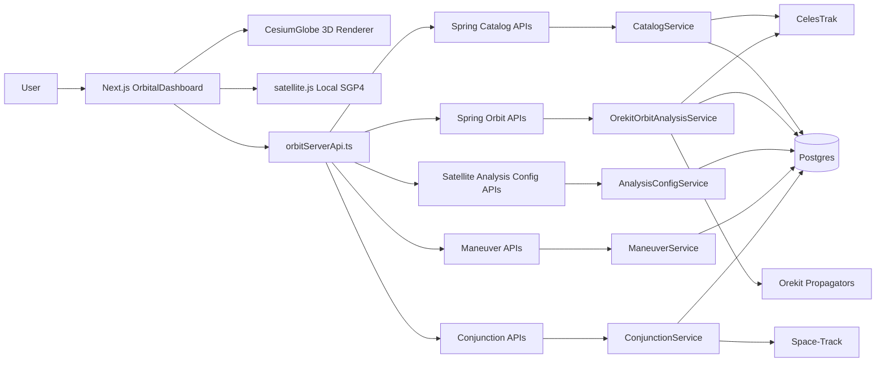
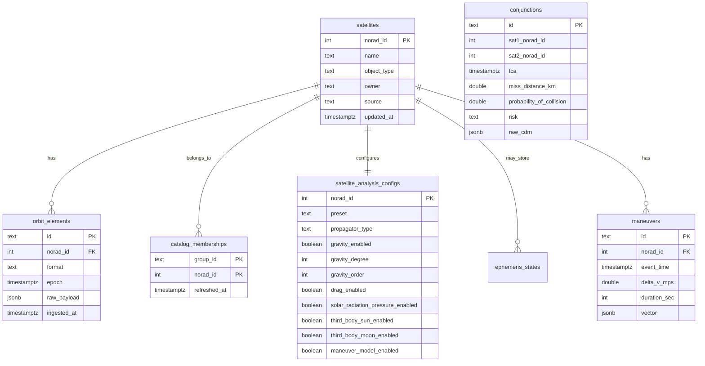
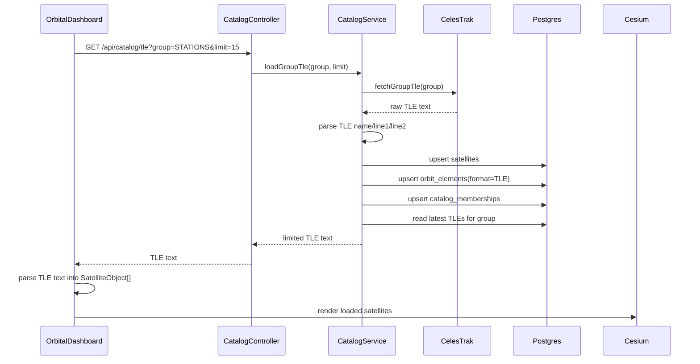
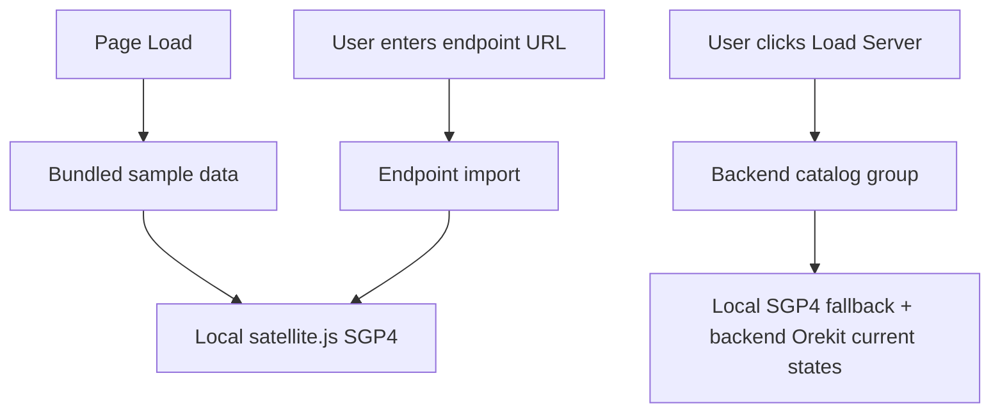
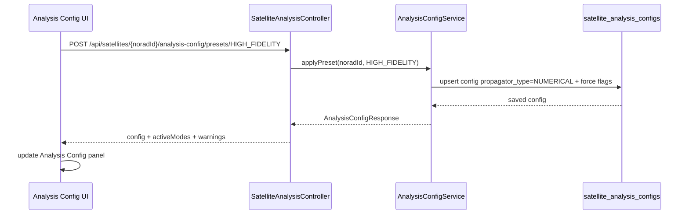
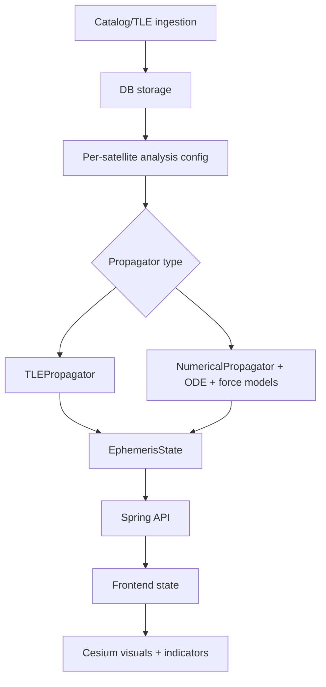

# Orbit Visualization Engine - Handover Implementation Guide

This document explains the current frontend and backend implementation so a new developer can understand how the project works today, especially TLE ingestion, DB storage, propagation, force-model configuration, UI indicators, and the switch from TLE/SGP4 to Orekit numerical propagation.

## Current Product Shape

The project is a satellite visualization and analysis system with:

- A Next.js frontend that renders a 3D Cesium globe, satellite markers, orbit arcs, trails, ground tracks, range checks, maneuvers, conjunction indicators, and analysis controls.
- A Spring Boot backend that stores satellite catalog data, TLE orbit elements, analysis configuration, maneuvers, conjunctions, and serves Orekit propagation APIs.
- A Postgres database used as the source of truth for backend-loaded catalogs and per-satellite analysis settings.
- External catalog/risk sources:
  - CelesTrak for catalog groups and TLEs.
  - Space-Track for CDM/conjunction records.

## High-Level Architecture



## Main Frontend Files

| File | Responsibility |
|---|---|
| `src/components/OrbitalDashboard.tsx` | Main UI state manager. Handles catalog loading, speed controls, selected satellites, analysis config, range checks, maneuvers, conjunctions, and data source state. |
| `src/components/CesiumGlobe.tsx` | Cesium 3D rendering layer. Draws satellite markers, labels, orbit arcs, trails, ground tracks, maneuver vectors, conjunction links, and range measurements. |
| `src/components/GroundTrackMiniMap.tsx` | Expanded 2D ground-track modal. Uses Earth map texture and ground trace polylines. |
| `src/services/orbitServerApi.ts` | Frontend API client for backend catalog, orbit, analysis config, maneuver, and conjunction APIs. |
| `src/services/StateCacheService.ts` | Builds current snapshots, orbit windows, trails, and ground tracks using the current frontend propagator. |
| `src/propagation/SatelliteJsPropagator.ts` | Local browser-side SGP4 propagation using `satellite.js`. |

## Main Backend Files

| File | Responsibility |
|---|---|
| `server/src/main/java/.../service/CatalogService.java` | Fetches CelesTrak catalog/TLE data, stores it in DB, returns cached TLEs for frontend loading. |
| `server/src/main/java/.../service/OrekitOrbitAnalysisService.java` | Loads TLEs, chooses TLE/SGP4 or numerical Orekit propagation, computes ephemeris states. |
| `server/src/main/java/.../service/AnalysisConfigService.java` | Stores and updates per-satellite analysis settings and force-model flags. |
| `server/src/main/java/.../api/OrbitController.java` | Exposes `/api/orbits` current-state and trajectory endpoints. |
| `server/src/main/java/.../api/SatelliteAnalysisController.java` | Exposes analysis config APIs for presets and individual modes. |
| `server/src/main/resources/db/schema.sql` | DB schema for satellites, orbit elements, memberships, analysis configs, ephemeris states, maneuvers, and conjunctions. |

## Database Model



### Important Tables

- `satellites`: one row per NORAD object known to the backend.
- `orbit_elements`: stores latest and historical orbit element payloads. Current propagation expects stored `TLE` payloads with `line1` and `line2`.
- `catalog_memberships`: maps satellites into UI groups such as `STATIONS`, `ACTIVE`, `WEATHER`, `GEO`, and `SCIENCE`.
- `satellite_analysis_configs`: per-satellite propagation mode and force-model settings.
- `maneuvers`: planned/candidate/executed maneuver records.
- `conjunctions`: Space-Track CDM records and derived risk fields.

## Catalog And TLE Flow

When the user clicks `Load Server` in the frontend:



If CelesTrak fails but the DB already has cached group data, the backend returns cached TLEs from the database. This is why the DB is now in the middle of catalog loading instead of the frontend always depending directly on an external API.

## Frontend Data Source Modes

The frontend tracks the active source explicitly:

- `sample`: initial bundled sample TLE from `sampleTle`.
- `endpoint`: user-provided TLE endpoint URL.
- `backend`: Spring backend catalog group loaded through `/api/catalog/tle`.

Only backend-loaded satellites can reliably use server Orekit current-state fetching, because those satellites exist in the backend DB and have analysis configs.



## Propagation Modes

There are two propagation paths in the backend:

1. `TLE_SGP4`: analytical TLE propagation using Orekit `TLEPropagator`.
2. `NUMERICAL`: ODE-based numerical propagation using Orekit `NumericalPropagator` and force models.

The selected mode is stored per satellite in `satellite_analysis_configs.propagator_type`.

### TLE/SGP4 Flow

```mermaid
flowchart TD
  Request[Orbit request for NORAD ID] --> Config[Load analysis config from DB]
  Config --> Type{propagator_type}
  Type -->|TLE_SGP4| LoadTle[Load latest TLE from orbit_elements]
  LoadTle --> Missing{TLE exists?}
  Missing -->|No| FetchCelesTrak[Fetch TLE by NORAD from CelesTrak]
  FetchCelesTrak --> Store[Store satellite + TLE in DB]
  Missing -->|Yes| BuildTle[Build Orekit TLE object]
  Store --> BuildTle
  BuildTle --> SGP4[TLEPropagator.selectExtrapolator]
  SGP4 --> Dates[For each requested timestamp]
  Dates --> PV[getPVCoordinates(date, ITRF)]
  PV --> Geo[Convert to lat/lon/alt]
  Geo --> Response[Return EphemerisState]
```

Implementation location:

- `OrekitOrbitAnalysisService.propagate`
- `OrekitOrbitAnalysisService.currentState`
- `OrekitOrbitAnalysisService.buildPropagator`
- `OrekitOrbitAnalysisService.propagateOne`

The TLE/SGP4 path is fast and good for catalog visualization. It uses the physics embedded in the TLE/SGP4 model and does not use the UI force-model toggles.

### Numerical ODE Flow

```mermaid
flowchart TD
  Request[Orbit request for NORAD ID] --> Config[Load satellite_analysis_configs]
  Config --> Type{propagator_type}
  Type -->|NUMERICAL| LoadTle[Load latest TLE]
  LoadTle --> Seed[Seed initial state from TLE epoch using TLEPropagator]
  Seed --> Orbit[Create CartesianOrbit in EME2000]
  Orbit --> State[Create SpacecraftState]
  State --> Integrator[DormandPrince853Integrator]
  Integrator --> Numerical[NumericalPropagator]
  Numerical --> ForceSwitch{Enabled force models?}
  ForceSwitch --> Gravity[Gravity harmonics]
  ForceSwitch --> Drag[Atmospheric drag]
  ForceSwitch --> Sun[Sun third-body gravity]
  ForceSwitch --> Moon[Moon third-body gravity]
  ForceSwitch --> SRP[Solar radiation pressure]
  Gravity --> Solve[Solve motion equations]
  Drag --> Solve
  Sun --> Solve
  Moon --> Solve
  SRP --> Solve
  Solve --> PV[getPVCoordinates(date, ITRF)]
  PV --> Geo[Convert to lat/lon/alt]
  Geo --> Response[Return EphemerisState]
```

The numerical path is the GMAT-style foundation. It solves satellite motion through numerical integration:

```text
Current position + velocity
-> compute acceleration from enabled forces
-> integrate ODE over time
-> produce future position + velocity
```

Current numerical implementation:

```java
DormandPrince853Integrator integrator =
    new DormandPrince853Integrator(0.1, 120.0, 1.0, 1.0);

NumericalPropagator propagator = new NumericalPropagator(integrator);
propagator.setOrbitType(OrbitType.CARTESIAN);
propagator.setMu(Constants.EGM96_EARTH_MU);
propagator.setInitialState(initialState);
```

Enabled force models are added conditionally:

| Config flag | Orekit model |
|---|---|
| `gravity_enabled` | `HolmesFeatherstoneAttractionModel` |
| `drag_enabled` | `DragForce(HarrisPriester, IsotropicDrag)` |
| `solar_radiation_pressure_enabled` | `SolarRadiationPressure` |
| `third_body_sun_enabled` | `ThirdBodyAttraction(Sun)` |
| `third_body_moon_enabled` | `ThirdBodyAttraction(Moon)` |
| `maneuver_model_enabled` | Stored as planning flag only; finite-burn thrust force is not implemented yet. |

## Analysis Config And UI Modes

The UI panel called `Analysis Config` controls the per-satellite config stored in DB.

Presets:

| Preset | Propagator | Force settings |
|---|---|---|
| `FAST_PREVIEW` | `TLE_SGP4` | No force toggles. |
| `OPERATIONAL_REVIEW` | `NUMERICAL` | Gravity 20x20, drag, Sun, Moon. |
| `HIGH_FIDELITY` | `NUMERICAL` | Gravity 40x40, drag, SRP, Sun, Moon. |
| `MANEUVER_PLANNING` | `NUMERICAL` | Gravity 20x20, drag, SRP, Sun, Moon, maneuver planning flag. |

Mode buttons:

- `GRAV`
- `DRAG`
- `SRP`
- `SUN`
- `MOON`
- `BURN`

When a mode is enabled, the backend stores it and switches `propagator_type` to `NUMERICAL`.



## Frontend Rendering And Indicators

The frontend uses multiple visual layers:

- Satellite marker/dot.
- Satellite name label.
- Orbit arc.
- Recent trail.
- Ground track.
- Range check between two selected satellites.
- Maneuver markers and modal.
- Conjunction risk links and labels.
- 2D ground-track modal.

### Current Rendering State Sources

```mermaid
flowchart TD
  UI[OrbitalDashboard] --> Local[StateCacheService + SatelliteJsPropagator]
  UI --> ServerState{activeDataSource == backend?}
  ServerState -->|No| Snapshots[Use local snapshots]
  ServerState -->|Yes| BackendCurrent[GET /api/orbits/{noradId}/current]
  BackendCurrent --> Merge[Replace current marker/telemetry state with backend Orekit state]
  Local --> Merge
  Merge --> Cesium[CesiumGlobe]
```

Important current limitation:

- Current marker/telemetry for backend-loaded satellites can use server Orekit states.
- Orbit arcs, trails, maneuver preview trajectories, and some conjunction calculations still use local `satellite.js` propagation for responsiveness.
- Moving all trajectory windows to server-side Orekit propagation is the next step for complete backend physics consistency.

## Speed And Sampling

The frontend simulation speed options are user-facing:

- `1 min/sec` maps to `60x`.
- `5 min/sec` maps to `300x`.
- `10 min/sec` maps to `600x`.
- `Custom` accepts a `min/sec` value and converts internally to `minutes * 60`.

Sampling is adaptive:

```text
sampleSpacing = max(10, simulationSpeed / 2)
```

Examples:

- `60x` -> `30 sec` sample spacing.
- `300x` -> `150 sec` sample spacing.
- `600x` -> `300 sec` sample spacing.

For live ground track, adaptive spacing is used directly. For longer ground-track ranges, the app keeps a range-specific minimum spacing to avoid producing too many points.

## Maneuvers

Current maneuver implementation:

- Backend stores maneuver events in the `maneuvers` table.
- Frontend loads maneuvers from `/api/maneuvers`.
- Frontend filters events to loaded/visible satellites.
- Cesium can show maneuver markers and selected burn vector visuals.
- Maneuver preview API exists, but finite-burn numerical thrust modeling is not yet wired into Orekit propagation.

Current warning behavior:

- If `maneuver_model_enabled` is on in numerical mode, backend warns that finite-burn thrust acceleration is the next force-model module.

## Conjunctions

Current conjunction implementation:

- Backend can sync CDM records from Space-Track.
- Records are stored in `conjunctions`.
- Frontend loads conjunctions for currently loaded NORAD IDs.
- Conjunctions are displayed only when matching loaded satellites exist.
- Risk labels are derived from stored CDM fields such as miss distance, probability of collision, and `risk`.

Important limitation:

- If a Space-Track CDM record includes only one object from the currently loaded group, it may be stored in DB but not rendered as a pair in the UI because both satellites are not loaded.

## External APIs

| Source | Used for | Current role |
|---|---|---|
| CelesTrak | Catalog group JSON and TLE text | Primary satellite/TLE ingestion source. |
| Space-Track | CDM/conjunction records | Conjunction sync source. Requires credentials/config. |
| Orekit data path | Earth orientation, gravity, time/frames data | Configured by `OREKIT_DATA_PATH`. Required for robust numerical/frame behavior. |

## Important Backend Endpoints

| Endpoint | Purpose |
|---|---|
| `GET /api/catalog/tle?group=STATIONS&limit=15` | Refresh/cache group TLEs and return limited TLE text. |
| `GET /api/orbits/{noradId}/current?time=...` | Return one propagated state. Uses TLE/SGP4 or numerical based on DB config. |
| `GET /api/orbits/{noradId}/trajectory?from=...&to=...&stepSeconds=...` | Return propagated state list. Uses selected backend propagator mode. |
| `POST /api/orbits/propagate` | Body-based propagation request. |
| `GET /api/satellites/{noradId}/analysis-config` | Get per-satellite config. |
| `POST /api/satellites/{noradId}/analysis-config/presets/{preset}` | Apply analysis preset. |
| `POST /api/satellites/{noradId}/analysis-config/modes/{mode}` | Toggle a single force/model mode. |
| `GET /api/maneuvers` | Load maneuver events. |
| `GET /api/conjunctions?noradIds=...` | Load conjunction records for loaded satellites. |
| `POST /api/conjunctions/refresh` | Sync Space-Track CDM records. |

## Important Implementation Details For New Developers

1. TLE catalog load is not just a pass-through anymore. It refreshes CelesTrak, writes DB rows, then returns TLEs from DB.
2. Analysis config lives in DB per NORAD ID.
3. Numerical mode is real on the backend for orbit API calls.
4. Frontend current marker state can use backend Orekit state only after backend catalog loading.
5. Local `satellite.js` still exists and is used for sample/endpoint imports and some high-frequency visualization paths.
6. `ephemeris_states` exists in schema but current propagation returns computed states directly; it does not yet persist every propagated state.
7. Maneuver and conjunction UI is dynamic from backend data, but maneuver physics is still not a finite-burn ODE force.

## Current Gaps / Next Handover Notes

To move closer to a GMAT-like product, the next developer should focus on:

- Server-side trajectory windows for all loaded satellites, not only current states.
- Replace frontend local orbit/trail/ground-track propagation with server `/trajectory` responses when source is backend.
- Add finite-burn maneuver force model:
  - burn start time
  - duration
  - thrust or delta-V direction
  - spacecraft mass
  - fuel tank / mass depletion
- Add spacecraft physical properties:
  - mass
  - drag area
  - drag coefficient
  - SRP area
  - reflectivity coefficient
- Add mission-object model similar to GMAT:
  - spacecraft
  - propagator
  - force model
  - burn
  - fuel tank
  - report
  - plot
- Add targeting and optimization:
  - target altitude/inclination/orbit period
  - solve maneuver delta-V
  - minimize fuel
- Add EKF/GNSS module separately:
  - RINEX navigation parsing
  - GNSS propagators
  - range/phase/Doppler measurements
  - covariance `P`, process noise `Q`, measurement noise `R`
  - Kalman update loop

## Mental Model

Think of the current system like this:



The project is now past a pure demo: backend storage, analysis config, and numerical Orekit propagation are in place. It is not full GMAT yet, but the foundation is aligned with GMAT's architecture: objects, propagators, force models, simulation state, and visualization.
