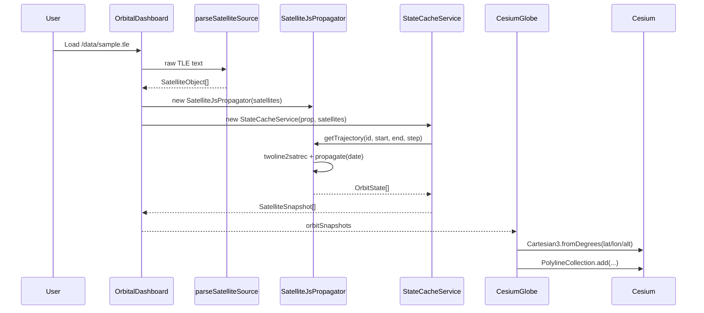

# Orbit Visualization Engineering Audit

This is a professional review of the Phase 3 `orbit-visualization-engine` implementation. It focuses on whether the app renders satellite motion, orbit paths, ground tracks, maneuvers, and conjunction overlays in a physically believable and professionally defensible way.

The short version:

```text
The current app is a strong educational / MVP visualization.
It is not yet a professional-grade orbital analysis viewer.
```

Your strongest foundation is the separation between parsing, propagation, cached state generation, and Cesium rendering. The original Phase 3 technical weakness was that the visible 3D orbit path was generated from Earth-fixed geodetic samples over a sliding future window. That is useful for "where the satellite will appear over the rotating Earth", but it is not the same as a stable orbit plane like users expect from STK, GMAT, Orbitron, or serious SSA viewers.

Implementation update:

```text
The orbit arc rendering has now been changed to use propagated Cartesian state.
Ground tracks remain latitude/longitude surface projections.
This fixes the worst visual/frame-semantics problem while keeping the app in MVP territory.
```

## Section 1: Is The Orbit Visualization Correct?

### Verdict

| Area | Verdict | Beginner Meaning |
|---|---:|---|
| TLE parsing | Good MVP | You correctly turn TLE text into satellite objects. |
| SGP4 propagation | Mostly correct for TLE-based display | SatelliteJS is the right browser library for TLE demo propagation. |
| Current satellite marker position | Good MVP | The dot is being placed at the propagated latitude, longitude, altitude. |
| 3D orbit line | Improved MVP | It is now drawn from Cartesian propagated state using a fixed display epoch, instead of lat/lon ground samples. |
| Ground track | Conceptually correct | The sine-wave behavior is expected. |
| Maneuver visualization | Mostly illustrative | Maneuver markers/vectors are UI placeholders, not real burn physics. |
| Conjunction visualization | Demo-only | It shows sample closest-approach information, not real CDM/Pc analysis. |

### Is the orbit geometrically correct?

For the current satellite point: yes, for an MVP.

The current satellite position is computed here:

[SatelliteJsPropagator.ts](/Users/madhu/Documents/personal/mosaic-like-app/src/propagation/SatelliteJsPropagator.ts:30)

```text
TLE -> twoline2satrec -> propagate(date) -> ECI/TEME position
```

Then the app converts that state into geodetic latitude/longitude/altitude:

[SatelliteJsPropagator.ts](/Users/madhu/Documents/personal/mosaic-like-app/src/propagation/SatelliteJsPropagator.ts:42)

```text
ECI/TEME-ish position -> GMST -> geodetic lat/lon/alt
```

Then Cesium renders the current marker from the propagated fixed Cartesian position:

[CesiumGlobe.tsx](/Users/madhu/Documents/personal/mosaic-like-app/src/components/CesiumGlobe.tsx:69)

```text
positionEcefKm -> Cartesian3(x, y, z)
```

That is a valid MVP way to put a satellite marker on the globe.

For the orbit line: improved for MVP.

The orbit line is created from `futureTrajectory`:

[CesiumGlobe.tsx](/Users/madhu/Documents/personal/mosaic-like-app/src/components/CesiumGlobe.tsx:403)

Each future point is now converted with:

```text
future sample TEME/ECI-like Cartesian -> one display GMST -> Cesium fixed Cartesian
```

That gives a much more stable orbit-arc visual than the previous lat/lon approach. It is still not a full Cesium inertial-reference-frame implementation, but it is now closer to "space geometry" than "Earth-surface prediction".

A professional aerospace person may still ask:

```text
"Are you drawing an inertial orbit, an Earth-fixed path, or a time-dynamic sampled trajectory?"
```

The honest answer is now:

```text
"A Cartesian propagated orbit arc rendered into Cesium's fixed scene using one display epoch."
```

That is not wrong if labeled honestly, but it is visually easy to confuse with a physical orbit plane.

### Is the orbit physically believable?

Mostly yes for a beginner-friendly viewer, but some visuals can look fake:

- The satellite markers follow plausible SGP4 motion.
- ISS altitude and velocity values are plausible.
- Sun-synchronous satellites like NOAA 19 and LANDSAT 8 show high-inclination behavior.
- Ground tracks can look wave-shaped, which is expected.

Remaining fake-looking or risky parts:

- Orbit arcs are still an MVP approximation, not a formally validated inertial reference-frame product.
- Orbit arcs can still refresh when the cached trajectory bucket changes, but this now happens far less often.
- Maneuver arrows are scaled UI vectors, not actual burn propagation.
- Conjunction lines are closest-approach indicators, not collision geometry.

### Would a professional aerospace engineer consider it valid?

For a Phase 3 MVP demo: yes, with disclaimers.

For operational analysis: no.

A professional reviewer would say:

```text
This is a good visualization prototype using TLE/SGP4.
It is not yet an authoritative orbit-analysis tool.
The rendering needs clearer frame semantics and validation against reference tools.
```

## Section 2: Professional Comparison

Professional systems such as STK, GMAT, Orbitron, OrbPro, OpenMCT-style dashboards, and SSA viewers usually separate three visual concepts:

| Visual Layer | What It Means | How It Should Behave |
|---|---|---|
| Current position | Satellite now/current sim time | Moves continuously with time |
| Orbit path | Physical orbital path, often inertial | Stable, smooth, not randomly morphing |
| Ground track | Projection on rotating Earth | Drifts and forms sine-wave-like curves |
| Trail | Past motion over time | Follows behind the satellite |
| Prediction | Future path over time | Can slide, but should be labeled as prediction |

The original app mixed these visually. The future Earth-relative path was rendered like a static orbit ring, so it felt confusing. The current implementation is cleaner: orbit arcs use Cartesian propagated state, trails use space history, and ground tracks use lat/lon surface projection.

### What you are doing correctly

- You use SatelliteJS for TLE/SGP4 propagation.
- You keep propagation outside Cesium rendering.
- You cache trajectory windows instead of recomputing every render.
- You use Cesium primitives for longer path lines.
- You split 2D ground tracks at longitude wrap boundaries.
- You provide toggles for orbit, trail, ground, labels, range, maneuvers, and conjunctions.

### What looks amateur or incorrect

- Orbit path semantics are better, but still need explicit "MVP orbit arc" wording in demos.
- The orbit line is still not a full Cesium inertial-reference-frame product.
- The line can still refresh at cache-bucket boundaries, though the bucket is now much longer.
- Satellite movement is React-tick driven instead of Cesium-clock driven.
- Maneuver pre/post context arcs now render for the selected maneuver, but they are still illustrative context, not true burn-propagated post-maneuver orbits.
- Conjunction rendering can be misunderstood as "where collision happens", when it is only a closest-approach connector at TCA.
- Ground tracks on the 3D globe are drawn as zero-altitude polylines, not true clamped ground primitives.

## Section 3: Debugging Analysis

### Issue 1: Orbit line can morph because it is a sliding future window

Code:

[OrbitalDashboard.tsx](/Users/madhu/Documents/personal/mosaic-like-app/src/components/OrbitalDashboard.tsx:200)

```ts
const trajectoryAnchorMs = Math.floor(simTime.getTime() / trajectoryBucketMs) * trajectoryBucketMs;
```

previously with:

```ts
const trajectoryBucketMs = 5 * 60 * 1000;
```

Meaning:

```text
Every 5 simulated minutes, the orbit window anchor changed.
Then the future trajectory is recomputed.
Then Cesium removes and rebuilds the orbit primitive.
```

At 60x speed:

```text
5 simulated minutes = about 5 real seconds
```

At 300x:

```text
5 simulated minutes = about 1 real second
```

This has now been changed to a 90-minute bucket:

```ts
const trajectoryBucketMs = 90 * 60 * 1000;
```

That means the path is much less likely to visibly morph during normal playback.

Professional fix:

- Keep current satellite marker updating continuously.
- Keep orbit path stable for a full orbital period or a fixed analysis epoch.
- Recompute path only when the user changes time aggressively, changes TLE, or requests refresh.

### Issue 2: Orbit path was Earth-fixed, not inertial

Old code pattern:

[CesiumGlobe.tsx](/Users/madhu/Documents/personal/mosaic-like-app/src/components/CesiumGlobe.tsx:407)

```ts
snapshot.futureTrajectory?.map((state) => stateToCartesian(Cesium, state))
```

and:

[CesiumGlobe.tsx](/Users/madhu/Documents/personal/mosaic-like-app/src/components/CesiumGlobe.tsx:69)

```ts
Cartesian3.fromDegrees(longitude, latitude, altitude)
```

This used lat/lon/alt for every future sample. That meant each point had already been converted into Earth-fixed geodetic form.

In simple language:

```text
You were drawing "where the satellite will be over Earth at each future time".
You were not drawing "the fixed orbital ring in space".
```

Current code now uses:

[CesiumGlobe.tsx](/Users/madhu/Documents/personal/mosaic-like-app/src/components/CesiumGlobe.tsx:98)

```text
positionEciKm + display GMST -> Cesium Cartesian orbit arc
```

Professional systems often let the operator choose:

- Inertial view
- Earth-fixed view
- Ground-track view
- Future/past time-dynamic path

### Issue 3: Satellite motion used to update at 10 Hz through React state

Old code:

[OrbitalDashboard.tsx](/Users/madhu/Documents/personal/mosaic-like-app/src/components/OrbitalDashboard.tsx:471)

```ts
window.setInterval(..., 100)
```

At 600x, each 100ms tick advances:

```text
0.1 real seconds * 600 = 60 simulated seconds
```

That meant the satellite marker could jump minute-by-minute at high speed.

Current MVP fix:

```text
Playback now uses requestAnimationFrame so the simulation advances smoothly with the browser render loop.
```

Professional fix:

```text
Use React for UI state.
Use Cesium clock / sampled positions / imperative RAF for animation.
```

The project now uses the imperative RAF approach. A future professional upgrade would still move more of the animation into Cesium `Clock` / `SampledPositionProperty`.

### Issue 4: Maneuver pre/post trajectories were computed but not rendered

Code computes them:

[OrbitalDashboard.tsx](/Users/madhu/Documents/personal/mosaic-like-app/src/components/OrbitalDashboard.tsx:226)

```ts
preTrajectory
postTrajectory
```

`CesiumGlobe.tsx` now renders selected maneuver pre/post context arcs:

[CesiumGlobe.tsx](/Users/madhu/Documents/personal/mosaic-like-app/src/components/CesiumGlobe.tsx:572)

Important caveat:

```text
These are visual context arcs. They are not true post-burn trajectories from maneuver physics yet.
```

### Issue 5: Ground-track polyline is conceptually right but visually fragile

Code:

[CesiumGlobe.tsx](/Users/madhu/Documents/personal/mosaic-like-app/src/components/CesiumGlobe.tsx:467)

```ts
positions.map((state) => stateToGroundCartesian(Cesium, state))
```

This puts points at altitude zero. Good concept.

But these are ordinary 3D polylines between points. For true surface visualization, professional Cesium apps often use:

- `GroundPolylinePrimitive`
- `clampToGround`
- denser samples
- depth behavior carefully tuned

Your ground line can look like it cuts through the globe if sampling is coarse or if depth handling is confusing.

### Issue 6: Frame naming is loose

SatelliteJS returns SGP4 coordinates in TEME-like coordinates. Your type calls it `positionEciKm`:

[SatelliteJsPropagator.ts](/Users/madhu/Documents/personal/mosaic-like-app/src/propagation/SatelliteJsPropagator.ts:50)

That is acceptable for an MVP, but in aerospace terms TEME is not the same as GCRF/J2000 ECI.

Professional fix:

```ts
positionTemeKm
velocityTemeKmps
positionFixedKm
```

This avoids overclaiming precision.

## Section 4: Orbit Path Validation

### ISS

Expected:

- Low Earth orbit
- Around 400-430 km altitude
- Around 7.6-7.7 km/s velocity
- About 90-93 minute orbital period
- 51.6 degree inclination
- Ground track shifts west/east between passes because Earth rotates

Should remain stable:

- Altitude should not jump wildly.
- Velocity should remain near 7.6 km/s.
- Orbit inclination should not randomly change.

Should never happen:

- Orbit line suddenly becomes a totally different tilt every few seconds.
- Satellite marker appears far away from its own current path.
- Orbit cuts through Earth.

Your ISS position/velocity behavior is believable. The orbit path is now more stable because it is built from Cartesian samples and refreshed less often.

### Polar / Sun-Synchronous Satellites

NOAA 19 and LANDSAT 8 are near-polar / sun-synchronous style LEO satellites.

Expected:

- High inclination, around 98-99 degrees.
- They pass near the poles.
- The ground track makes repeated north-south waves.
- Earth rotates under them, so each pass appears shifted.

Your samples are plausible for this category.

### GEO Satellites

You do not currently include a GEO sample.

Expected for GEO:

- Altitude around 35,786 km.
- Near-equatorial orbit.
- Ground track is almost a point or small analemma if inclined/eccentric.
- Satellite appears nearly fixed over longitude.

If you add GEO later, your 15-object parser and SatelliteJS can handle TLE propagation, but camera defaults and orbit scaling will need care because GEO is far outside LEO.

## Section 5: Ground Track Validation

### Is sinusoidal behavior correct?

Yes.

A ground track is the point on Earth directly under the satellite. Because the satellite orbits in an inclined plane while Earth rotates underneath, the 2D map usually looks like repeating sine-wave-like curves.

MERN analogy:

```text
3D orbit = object moving in world space.
Ground track = that object's shadow projected onto a moving map.
```

### Is longitude wrapping handled?

Yes for the 2D map and 3D ground paths:

[groundTrack.ts](/Users/madhu/Documents/personal/mosaic-like-app/src/geometry/groundTrack.ts:3)

It splits segments when longitude jumps by more than 180 degrees. This prevents a line from drawing across the whole map at the international date line.

### Polar crossings

Polar orbit tracks can bunch near top/bottom of a rectangular map. That is normal. A rectangular lat/lon map stretches polar areas heavily, so polar paths may look visually exaggerated.

### Drift over time

Your ground tracks drift because every sample uses `eciToGeodetic` with GMST at that sample time. That is conceptually correct for a TLE/SGP4 MVP.

## Section 6: Performance + Architecture Review

### What is good

`StateCacheService` is a good architectural boundary:

[StateCacheService.ts](/Users/madhu/Documents/personal/mosaic-like-app/src/services/StateCacheService.ts:19)

It keeps the renderer from owning propagation. This is exactly the kind of separation professional systems use.

The project has a clean flow:


### What is dangerous

#### React is driving high-rate animation

React state updates every 100ms:

```text
Good for UI.
Not ideal for smooth 3D simulation animation.
```

Professional Cesium apps usually let Cesium animate positions and use React for controls, not every frame of orbital motion.

#### `PolylineCollection` usage is inefficient

You create many `PolylineCollection` instances, each with one polyline:

[CesiumGlobe.tsx](/Users/madhu/Documents/personal/mosaic-like-app/src/components/CesiumGlobe.tsx:416)

Cesium's own `PolylineCollection` docs recommend organizing primitives thoughtfully because each collection can affect performance. A better pattern is one collection for all orbit arcs, one for trails, one for ground tracks, or use lower-level geometry for large scenarios.

#### 15 satellite limit is good for MVP

The limit is reasonable because browser-side SGP4 plus React/Cesium rendering can become heavy quickly. For 100+ objects, move propagation and trajectory tiling to a backend/worker.

## Section 7: Visual Quality Review

### Orbit lines

Current orbit lines can be smooth enough with 60-second samples for LEO, but they are not ideal. A LEO satellite moves about 7.6 km/s, so 60 seconds is roughly 456 km between samples. That can visibly segment curves.

Better:

```text
Orbit visual step: 10-30 seconds for LEO.
Ground track step: 30-120 seconds depending zoom.
Long history step: coarse is okay, but label it approximate.
```

### Labels

Labels are readable and use backgrounds. Good.

Risk:

```text
disableDepthTestDistance = infinity
```

This keeps labels visible, but can also make back-side satellites look visible through Earth depending camera. Professional tools often offer "occlude behind Earth" toggles.

### Camera movement

Satellite focus is usable:

[CesiumGlobe.tsx](/Users/madhu/Documents/personal/mosaic-like-app/src/components/CesiumGlobe.tsx:746)

Maneuver focus is better than before, but still fragile because it focuses on a point in space without guaranteeing the related satellite/orbit/vector are all in view.

Professional maneuver camera should frame:

```text
burn marker + parent satellite + local tangent vector + Earth limb
```

## Section 8: Step-By-Step Internal Flow Audit

### One orbit generation flow



### Every transformation

```text
TLE text
  -> SatRec
  -> propagate(date)
  -> TEME/ECI-like km position
  -> GMST
  -> geodetic latitude/longitude/altitude
  -> Cesium WGS84 Cartesian meters
  -> polyline primitive
```

Possible bug sources:

- Bad TLE checksum
- Old TLE epoch
- Misunderstanding TEME vs ECI
- Too-coarse sample step
- Sliding window recompute
- Drawing Earth-fixed paths as if they are inertial orbits
- Back-side line visibility
- Longitude wrap jumps

## Section 9: Fix Recommendations

### Fix 1: Rename orbit modes clearly

Current `Orbit` button should ideally become one of:

```text
Future Path
Orbit Arc
Ground Track
Trail
```

If you keep "Orbit", add a tooltip. This has been added in the UI:

```text
Stable orbit arc built from propagated Cartesian state, not lat/lon ground samples.
```

### Fix 2: Add a true inertial orbit option

Current MVP fix:

```text
Use propagated Cartesian samples and hold one display epoch for the arc.
```

Professional next step:

1. Keep propagated TEME/ECI samples.
2. For display, transform them into the Cesium fixed frame appropriate for each sample time.
3. Optionally show inertial orbit in an inertial scene/reference frame.

Code-level direction:

```ts
type OrbitState = {
  positionTemeKm: [number, number, number];
  positionFixedKm: [number, number, number];
  latitudeDeg: number;
  longitudeDeg: number;
  altitudeKm: number;
}
```

Then render space paths from fixed Cartesian positions, not only lat/lon:

```ts
function fixedKmToCartesian(Cesium, state) {
  const [x, y, z] = state.positionEcefKm;
  return new Cesium.Cartesian3(x * 1000, y * 1000, z * 1000);
}
```

This avoids a second geodetic conversion in Cesium and makes the frame explicit.

### Fix 3: Stop rebuilding orbit paths every few real seconds

Old:

```text
orbit path anchor changes every 5 simulated minutes
```

Current:

```text
orbit path anchor changes every 90 simulated minutes
```

Better:

```text
current marker: update continuously
orbit path: update on demand or every full orbit period
```

Suggested implementation:

```ts
const orbitPathAnchorRef = useRef(initialSimulationTime);

// Recompute only on load, reset, or explicit "Refresh path"
```

Or use separate modes:

- "Locked orbit arc"
- "Sliding future path"

### Fix 4: Use Cesium clock / SampledPositionProperty for smooth motion

Professional Cesium pattern:

```text
Precompute sampled positions
Give Cesium a SampledPositionProperty
Let Cesium interpolate as time moves
React only changes speed/play/pause
```

This will make satellites move continuously instead of jumping every 100ms.

### Fix 5: Render maneuver pre/post arcs or remove the claim

This has been implemented for the selected maneuver:

```ts
preTrajectory
postTrajectory
```

Render them only for selected maneuver:

```ts
const prePositions = maneuverSnapshot.preTrajectory.map(...)
const postPositions = maneuverSnapshot.postTrajectory.map(...)
```

Use distinct styling:

```text
pre-burn = dashed muted line
post-burn = solid bright projected line
burn vector = arrow
```

But be honest: post-burn is currently not physically altered by delta-v. It is only the original TLE trajectory after event time unless you implement actual burn propagation.

### Fix 6: Improve conjunction semantics

Current conjunction line should be labeled:

```text
TCA separation vector
```

Not:

```text
collision line
```

Explain in UI:

```text
This line connects the two satellites at the sampled time when they are closest in this window.
```

### Fix 7: Add validation tests

Add tests/scripts that check:

- ISS altitude stays 350-500 km for your sample time.
- ISS velocity stays 7.4-7.9 km/s.
- LANDSAT/NOAA inclination behavior looks polar.
- No propagated altitude is negative for active sample satellites.
- Trajectory sample count matches expected window/step.
- Ground track segment split happens at longitude wrap.

## Section 10: Final Verdict

### Scores

| Category | Score | Reason |
|---|---:|---|
| MVP orbit propagation | 8/10 | SatelliteJS/SGP4 usage is appropriate. |
| Current marker correctness | 8/10 | Lat/lon/alt placement is sane. |
| 3D orbit path correctness | 7/10 | It now uses Cartesian samples and stable display epoch, but is still not a fully validated inertial mode. |
| Ground-track correctness | 7/10 | Conceptually right, needs better surface rendering and clearer long-range caveats. |
| Maneuver realism | 3/10 | Useful UI placeholder, not real maneuver physics. |
| Conjunction realism | 4/10 | Useful demo, lacks CDM/covariance/Pc. |
| Visual polish | 7/10 | Strong UI direction, some overlays can confuse users. |
| Architecture | 8/10 | Separation of concerns is good. |
| Scalability | 5/10 | Fine for 15 objects, needs worker/backend for serious scale. |

### Most critical flaws

1. Orbit arcs are improved, but still need explicit reference-frame validation.
2. Maneuver visuals are illustrative but can be mistaken for real burn propagation.
3. Conjunction visuals are sample screening, not operational conjunction assessment.
4. Production-grade accuracy still requires backend validation against trusted tools.
5. Cesium `Clock` / `SampledPositionProperty` would still be a better long-term animation model.

### Most impressive parts

1. Clean separation between parser, propagator, cache service, and renderer.
2. Good use of SatelliteJS for a browser-side TLE MVP.
3. Sensible max-object limit.
4. Good UI affordances for toggles, range, maneuvers, and conjunctions.
5. Ground-track longitude-wrap splitting is the right instinct.

### What experts would praise

```text
The project has a serious architecture shape for an MVP.
The author understands that Cesium renders and SatelliteJS propagates.
The UI is moving toward mission-operations workflows, not just a toy globe.
```

### What experts would criticize

```text
The orbit path needs explicit reference-frame semantics.
The app should not imply maneuver/conjunction precision it does not have.
Animation should be Cesium-clock/interpolation driven.
Ground/orbit/path/trail overlays need clearer visual language.
Validation against reference tools is missing.
```

## Professional Bottom Line

If you present this as:

```text
A Phase 3 browser-based orbital visualization MVP using public TLEs and SGP4.
```

That is defensible.

If you present it as:

```text
A production-grade orbital analysis or collision-avoidance system.
```

That is not defensible yet.

The next engineering milestone should not be "more panels". It should be:

```text
Make the orbit/reference-frame model explicit and validated.
```

Once that is fixed, the whole app becomes much easier to trust.

## External References

- CesiumJS `Cartesian3.fromDegrees` reference: https://cesium.com/learn/cesiumjs/ref-doc/Cartesian3.html
- CesiumJS `PolylineCollection` reference: https://cesium.com/learn/cesiumjs/ref-doc/PolylineCollection.html
- CesiumJS `SampledPositionProperty` reference: https://cesium.com/learn/cesiumjs/ref-doc/SampledPositionProperty.html
- SatelliteJS package/docs: https://github.com/shashwatak/satellite-js
- CelesTrak NORAD GP data: https://celestrak.org/NORAD/elements/
- CCSDS conjunction data message overview: https://public.ccsds.org/Pubs/508x0b1e2.pdf
- Orekit project for high-fidelity astrodynamics: https://www.orekit.org/
