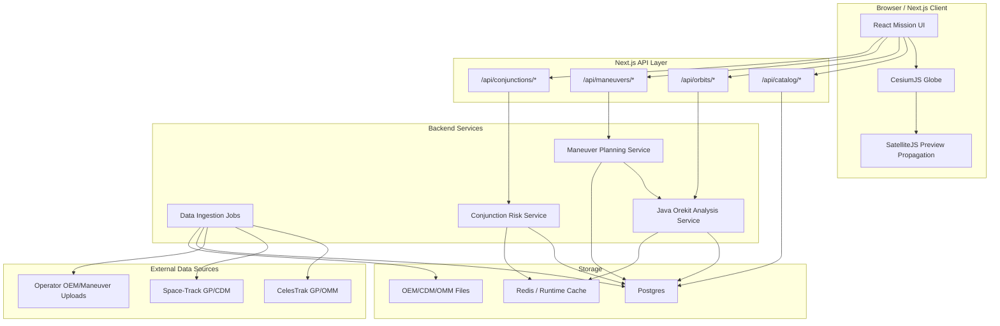
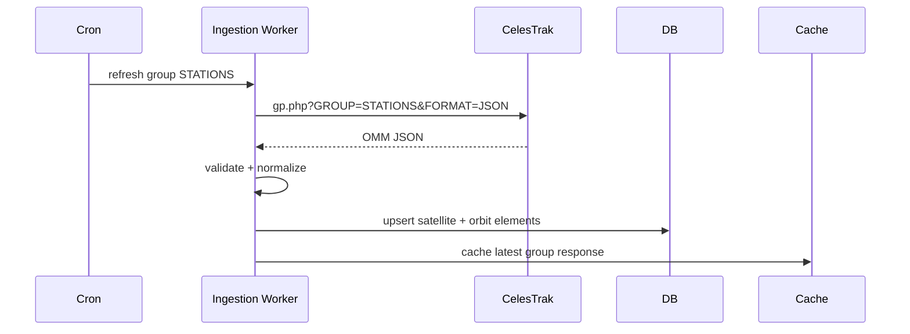
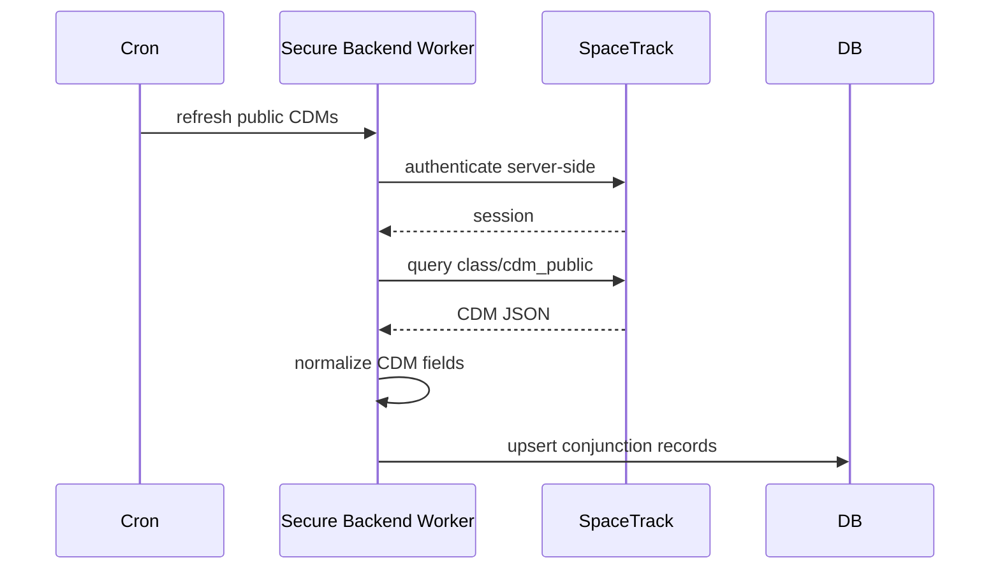
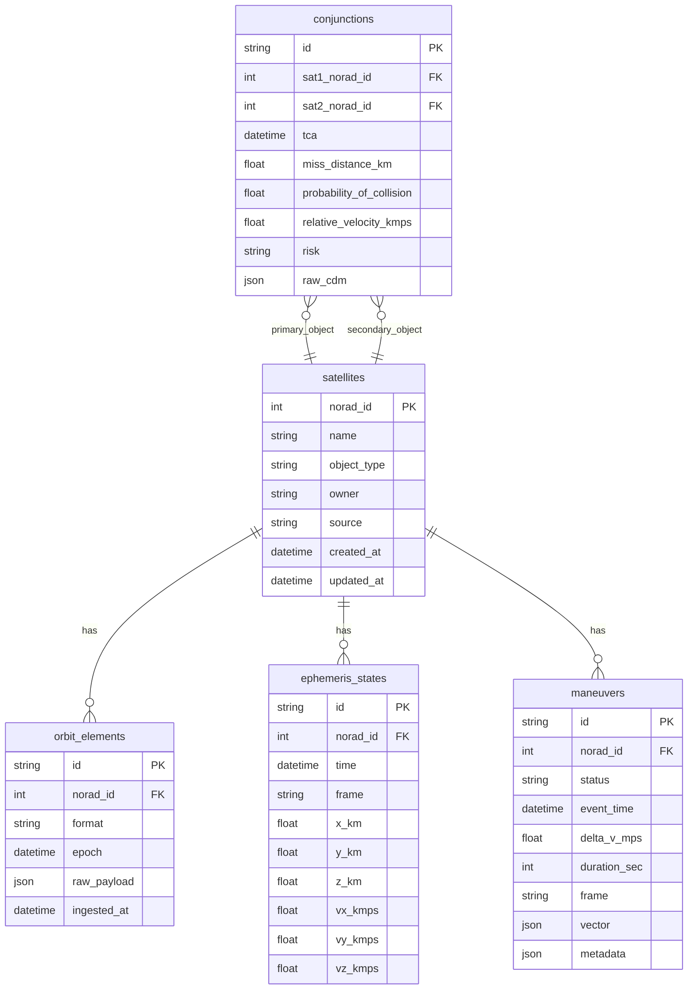
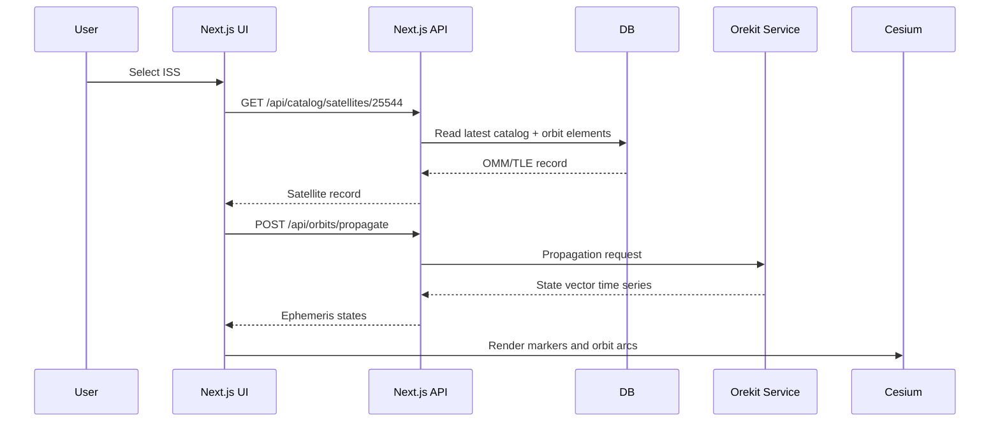
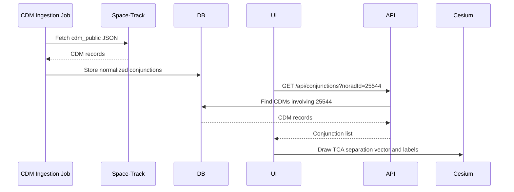
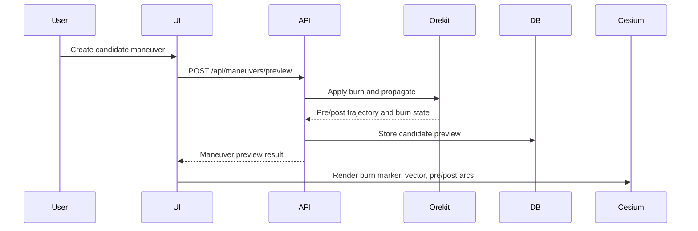

# Production-Grade Orbital System Implementation Plan

This document resets the product direction away from the phase labels and toward a real operational-style architecture.

The production scope for now is:

- Real satellite catalog/orbit data
- Real orbit visualization
- Real maneuver data model and maneuver analysis workflow
- Real conjunction data ingestion and conjunction review workflow

The goal is not to make the browser do aerospace-grade math. The goal is to make the browser a clean visualization client and move authoritative astrodynamics work into backend services.

## Executive Summary

Current app:

```text
Next.js + React + CesiumJS + SatelliteJS
```

This is good for:

- Visualizing TLE/GP objects
- User interaction
- Globe rendering
- Orbit/ground-track inspection
- MVP-level propagation

Production-grade app:

```text
Next.js frontend
  + backend data ingestion
  + Orekit-based orbit analysis service
  + database/cache
  + real external data sources
```

Core rule:

```text
Frontend renders.
Backend analyzes.
```

## What We Keep And What We Add

### Keep SatelliteJS

Keep SatelliteJS in the frontend for:

- Fast visual previews
- Fallback TLE propagation
- Local development
- Lightweight demo mode
- Client-side "what am I looking at?" interactions

SatelliteJS should not be the final authority for:

- Certified maneuver planning
- High-fidelity force modeling
- Probability of collision
- Covariance-based conjunction risk
- Operator-grade mission analysis

### Add Orekit Backend

Orekit is a Java astrodynamics library. It should run on the server, not in the browser.

Use Orekit for:

- High-fidelity propagation
- Orbit frame/time conversion
- Maneuver modeling
- Pre-burn/post-burn trajectory generation
- Event detection
- Access windows later
- Conjunction screening later
- Validation against trusted dynamics models

Orekit service shape:

```text
Java Spring Boot / Quarkus service
  -> Orekit
  -> Earth orientation data
  -> gravity/drag/solar models
  -> JSON APIs consumed by Next.js
```

## External Data Sources

### 1. CelesTrak GP / OMM Data

Use CelesTrak for public catalog orbit data.

Main docs:

```text
https://celestrak.org/NORAD/documentation/gp-data-formats.php
```

Important implementation detail:

```text
Always pass FORMAT explicitly.
Do not rely on default format.
```

Examples:

```text
https://celestrak.org/NORAD/elements/gp.php?CATNR=25544&FORMAT=JSON
https://celestrak.org/NORAD/elements/gp.php?CATNR=25544&FORMAT=TLE
https://celestrak.org/NORAD/elements/gp.php?GROUP=STATIONS&FORMAT=JSON
https://celestrak.org/NORAD/elements/gp.php?GROUP=ACTIVE&FORMAT=JSON
```

Use for:

- Satellite catalog objects
- Public TLE/OMM orbit elements
- Refreshing known satellite states
- Bootstrapping scenarios

Do not use for:

- Maneuver events
- Collision probability
- Operator-private ephemeris
- Certified conjunction decisions

### 2. Space-Track GP Data

Use Space-Track for authenticated catalog data and historical records.

Base:

```text
https://www.space-track.org
```

Typical use:

```text
class/gp
class/tle_latest
class/satcat
```

Space-Track requires an account and rate-limit-aware access.

Critical security rule:

```text
Never call Space-Track directly from the browser.
Never expose username/password/session cookies to React.
```

Use backend-only ingestion jobs.

### 3. Space-Track CDM Public

Use Space-Track `cdm_public` for public conjunction records.

Model definition:

```text
https://www.space-track.org/basicspacedata/modeldef/class/cdm_public/format/html
```

Query pattern:

```text
https://www.space-track.org/basicspacedata/query/class/cdm_public/format/json
```

This is real conjunction data. It contains fields such as:

- `CDM_ID`
- `CREATED`
- `TCA`
- `MIN_RNG`
- `PC`
- `SAT_1_ID`
- `SAT_1_NAME`
- `SAT_2_ID`
- `SAT_2_NAME`

Meaning:

```text
CDM = Conjunction Data Message
TCA = Time of Closest Approach
MIN_RNG = predicted closest separation distance
PC = probability of collision
```

Use for:

- Real public conjunction review
- Displaying close approach records
- Showing TCA, miss distance, relative velocity, and risk status
- Linking conjunctions to the two involved satellite objects

### 4. CCSDS Standards

Use CCSDS formats as internal long-term data contracts.

Relevant standards:

```text
CCSDS OMM = Orbit Mean-Elements Message
CCSDS OEM = Orbit Ephemeris Message
CCSDS CDM = Conjunction Data Message
```

CDM official page:

```text
https://ccsds.org/publications/allpubs/entry/3064/
```

Why this matters:

```text
If our internal model follows CCSDS concepts, we can ingest real aerospace data later without rewriting everything.
```

## Target Architecture



## Backend Endpoints To Create

### Catalog Endpoints

#### `GET /api/catalog/groups`

Returns supported public groups.

Example response:

```json
{
  "groups": [
    { "id": "STATIONS", "label": "Space Stations" },
    { "id": "ACTIVE", "label": "Active Satellites" },
    { "id": "WEATHER", "label": "Weather" },
    { "id": "GEO", "label": "Geosynchronous" }
  ]
}
```

#### `GET /api/catalog/satellites?group=STATIONS`

Fetches normalized satellite catalog records from database/cache.

Backend source:

```text
CelesTrak GROUP=STATIONS&FORMAT=JSON
or Space-Track class/gp
```

Response:

```json
{
  "source": "celestrak",
  "updatedAt": "2026-05-20T00:00:00Z",
  "satellites": [
    {
      "noradId": 25544,
      "name": "ISS (ZARYA)",
      "epoch": "2026-05-19T...",
      "sourceFormat": "OMM_JSON"
    }
  ]
}
```

#### `GET /api/catalog/satellites/:noradId`

Returns one satellite with latest orbit element record and metadata.

### Orbit Endpoints

#### `POST /api/orbits/propagate`

Authoritative propagation request.

Input:

```json
{
  "noradId": 25544,
  "start": "2026-05-20T00:00:00Z",
  "end": "2026-05-20T03:00:00Z",
  "stepSeconds": 30,
  "model": "SGP4"
}
```

Response:

```json
{
  "frame": "ITRF",
  "states": [
    {
      "time": "2026-05-20T00:00:00Z",
      "positionKm": [1234.1, 5678.2, 901.3],
      "velocityKmps": [1.2, 7.3, 0.4],
      "latitudeDeg": 10.2,
      "longitudeDeg": 72.1,
      "altitudeKm": 420.3
    }
  ]
}
```

First implementation can call SatelliteJS on server or client. Production implementation should call Orekit.

#### `GET /api/orbits/:noradId/current`

Returns current authoritative state for one object.

Use for:

- Satellite info card
- Current marker
- Health/status displays

#### `GET /api/orbits/:noradId/trajectory?from=&to=&step=`

Returns a time-window trajectory for Cesium.

Use for:

- Orbit arcs
- Recent trail
- Ground track
- Time slider

### Maneuver Endpoints

#### `GET /api/maneuvers?noradId=25544`

Returns maneuver events related to a satellite.

Response:

```json
{
  "maneuvers": [
    {
      "id": "mnv_001",
      "satelliteId": 25544,
      "name": "ISS reboost",
      "status": "planned",
      "eventTime": "2026-05-20T01:30:00Z",
      "deltaVMps": 0.9,
      "durationSec": 420,
      "frame": "RTN",
      "vector": { "r": 0.02, "t": 0.88, "n": 0.08 }
    }
  ]
}
```

#### `POST /api/maneuvers/preview`

Computes before/after trajectory for a proposed burn.

Input:

```json
{
  "satelliteId": 25544,
  "eventTime": "2026-05-20T01:30:00Z",
  "deltaVMps": 0.9,
  "durationSec": 420,
  "frame": "RTN",
  "vector": { "r": 0.02, "t": 0.88, "n": 0.08 },
  "previewHours": 6
}
```

Output:

```json
{
  "maneuver": { "id": "preview_001" },
  "preBurnTrajectory": [],
  "postBurnTrajectory": [],
  "burnMarker": {},
  "warnings": []
}
```

Orekit responsibility:

- Apply impulsive or finite burn model
- Generate post-burn trajectory
- Return actual changed orbit

Frontend responsibility:

- Render marker
- Render burn vector
- Render pre/post arcs
- Let user compare visually

#### `POST /api/maneuvers/:id/screen-conjunctions`

Runs conjunction screening before and after maneuver.

Use for:

```text
"If I do this burn, does collision risk improve or get worse?"
```

### Conjunction Endpoints

#### `GET /api/conjunctions`

Returns recent conjunction/CDM records.

Query examples:

```text
/api/conjunctions?severity=warning
/api/conjunctions?noradId=25544
/api/conjunctions?from=2026-05-20T00:00:00Z&to=2026-05-27T00:00:00Z
```

Response:

```json
{
  "conjunctions": [
    {
      "id": "cdm_123",
      "source": "space-track",
      "createdAt": "2026-05-20T00:00:00Z",
      "tca": "2026-05-21T03:14:00Z",
      "sat1": { "noradId": 25544, "name": "ISS (ZARYA)" },
      "sat2": { "noradId": 33591, "name": "NOAA 19" },
      "missDistanceKm": 6.4,
      "probabilityOfCollision": 0.000001,
      "relativeVelocityKmps": 9.36,
      "risk": "warning"
    }
  ]
}
```

#### `GET /api/conjunctions/:id`

Returns full CDM/conjunction detail.

Should include:

- TCA
- Miss distance
- Relative velocity
- Collision probability
- Covariance if available
- RIC/RTN separation if available
- involved satellite states around TCA
- source metadata

#### `POST /api/conjunctions/screen`

Computes a local close-approach screening run.

Input:

```json
{
  "primaryNoradIds": [25544],
  "secondaryGroup": "ACTIVE",
  "start": "2026-05-20T00:00:00Z",
  "end": "2026-05-27T00:00:00Z",
  "screeningDistanceKm": 25
}
```

Output:

```json
{
  "windows": [
    {
      "primary": 25544,
      "secondary": 33591,
      "tca": "2026-05-21T03:14:00Z",
      "missDistanceKm": 6.4,
      "relativeVelocityKmps": 9.36,
      "risk": "warning"
    }
  ]
}
```

This endpoint should be backed by Orekit or another validated backend screening engine.

## Data Ingestion Jobs

### CelesTrak GP Refresh Job

Schedule:

```text
Every 2 hours or slower
```

Reason:

```text
CelesTrak explicitly warns against overly frequent polling.
```

Flow:



### Space-Track CDM Refresh Job

Schedule:

```text
Every few hours, respecting Space-Track rules and account limits
```

Flow:



## Database Model

Recommended tables:



## Frontend Changes Needed

### Satellite / Orbit UI

Replace raw file-first workflow with:

- Search satellite by name/NORAD ID
- Choose catalog group
- Load latest public data
- Show data age
- Show source: CelesTrak / Space-Track / uploaded OEM
- Show propagation model: SGP4 / Orekit numerical

Suggested UI copy:

```text
Orbit Source: CelesTrak GP JSON
Propagation: SGP4
Data Age: 3h 12m
Frame: Earth-fixed / Inertial
```

### Maneuver UI

Current maneuver cards should become a real maneuver workspace.

Features:

- Maneuver list
- Planned/candidate/executed status
- Delta-v vector editor
- Burn duration
- Burn frame selector: RTN / VNC / ECI
- Preview button
- Pre-burn trajectory
- Post-burn trajectory
- Conjunction impact summary

Flow:

```mermaid
flowchart LR
  User[Operator creates maneuver] --> Form[Maneuver Form]
  Form --> Api[/api/maneuvers/preview]
  Api --> Orekit[Orekit Service]
  Orekit --> Result[Pre/Post trajectories]
  Result --> Cesium[Render burn and changed orbit]
  Result --> Risk[Screen conjunction impact]
```

### Conjunction UI

Current conjunction panel should become a review panel.

Features:

- CDM list
- Risk filters
- TCA timeline
- Pair details
- Miss distance
- Probability of collision
- Relative velocity
- Primary/secondary object info
- Jump to TCA camera
- Show separation vector at TCA
- Show pre/post TCA path snippets

Important label:

```text
Conjunction does not mean collision.
It means two objects are predicted to pass close to each other.
```

## Implementation Phases

### Stage 1: Data Contracts

Create TypeScript domain models:

- `SatelliteCatalogRecord`
- `OrbitElementRecord`
- `EphemerisState`
- `ManeuverEvent`
- `ConjunctionRecord`
- `CdmRecord`

Goal:

```text
Stop letting UI components define aerospace data shapes.
```

### Stage 2: Backend API Shell

Create Next.js API routes:

- `/api/catalog/groups`
- `/api/catalog/satellites`
- `/api/orbits/propagate`
- `/api/maneuvers`
- `/api/maneuvers/preview`
- `/api/conjunctions`
- `/api/conjunctions/:id`

At first, these can return normalized data from CelesTrak and Space-Track where possible.

### Stage 3: Secure Ingestion

Add backend ingestion jobs:

- CelesTrak GP refresh
- Space-Track CDM refresh
- Optional upload parser for OEM/CDM files

Store results in database.

### Stage 4: Orekit Service

Create Java service:

```text
orbit-analysis-service/
  src/main/java/...
  /propagate
  /maneuver/preview
  /conjunction/screen
```

Next.js calls Java service internally.

### Stage 5: Replace Dummy Maneuvers

Remove hardcoded sample maneuver assumptions from production mode.

Support:

- API-loaded maneuver records
- User-created candidate maneuvers
- Orekit-generated post-burn trajectories

### Stage 6: Replace Dummy Conjunctions

Remove synthetic conjunction windows from production mode.

Support:

- Space-Track CDM public ingestion
- CDM detail page/modal
- TCA visualization
- Risk filters

### Stage 7: Validation

Add validation scripts:

- Compare propagated ISS state with known reference output
- Verify altitude/velocity bounds
- Verify ground-track longitude wrapping
- Verify CDM parsing
- Verify maneuver preview changes post-burn trajectory

## Production Accuracy Rules

### Browser Rules

The browser may:

- Render trajectories
- Show selected satellite state
- Animate Cesium
- Let user inspect events
- Run approximate fallback propagation

The browser must not:

- Own Space-Track credentials
- Claim certified collision probability
- Perform authoritative maneuver planning
- Be the only source of propagated truth

### Backend Rules

The backend should:

- Own external credentials
- Normalize all external data
- Store raw source payloads
- Store normalized records
- Run propagation
- Run maneuver previews
- Run conjunction screening
- expose clean JSON to frontend

## Real-Data Flow



## Conjunction Real-Data Flow



## Maneuver Real-Data Flow



## What To Remove From Current MVP Mode

Remove or isolate:

- Hardcoded maneuver events as default production data
- Synthetic conjunction pairs as default production data
- UI language that implies fake events are real
- Browser-only conjunction screening for production mode

Keep them only under:

```text
Demo mode
```

## Recommended Environment Variables

```text
SPACE_TRACK_USERNAME=
SPACE_TRACK_PASSWORD=
SPACE_TRACK_BASE_URL=https://www.space-track.org

CELESTRAK_BASE_URL=https://celestrak.org

OREKIT_SERVICE_URL=http://localhost:8080

DATABASE_URL=
REDIS_URL=
```

Never expose these with `NEXT_PUBLIC_` unless they are safe public URLs.

## Key Risks

### Space-Track Authentication

Risk:

```text
Credential leak if called from browser.
```

Fix:

```text
Backend-only ingestion.
```

### CelesTrak Rate Limits

Risk:

```text
Polling too frequently can get blocked.
```

Fix:

```text
Cache and refresh slowly.
```

### Maneuver Accuracy

Risk:

```text
Pretty burn arrows can look authoritative even when they are not.
```

Fix:

```text
Use Orekit-generated post-burn trajectory and show model assumptions.
```

### Conjunction Accuracy

Risk:

```text
Miss distance alone is not enough for collision risk.
```

Fix:

```text
Use CDM fields, covariance when available, and probability of collision.
```

## Final Target Mental Model

Say this when explaining the production architecture:

```text
The frontend is a Cesium-based mission visualization client.
It can preview TLE motion using SatelliteJS, but production orbit analysis happens on the backend.
CelesTrak and Space-Track provide real catalog and conjunction data.
Orekit handles high-fidelity propagation and maneuver previews.
The frontend renders normalized ephemeris, maneuver, and conjunction products from our APIs.
```

## Source Links

- CelesTrak GP data formats: https://celestrak.org/NORAD/documentation/gp-data-formats.php
- CelesTrak current GP element sets: https://celestrak.org/NORAD/elements/
- Space-Track CDM public model: https://www.space-track.org/basicspacedata/modeldef/class/cdm_public/format/html
- Space-Track base site: https://www.space-track.org
- CCSDS CDM standard page: https://ccsds.org/publications/allpubs/entry/3064/
- Orekit propagation architecture: https://www.orekit.org/static/architecture/propagation.html
- Orekit maneuver API docs: https://www.orekit.org/static/apidocs/org/orekit/forces/maneuvers/Maneuver.html
