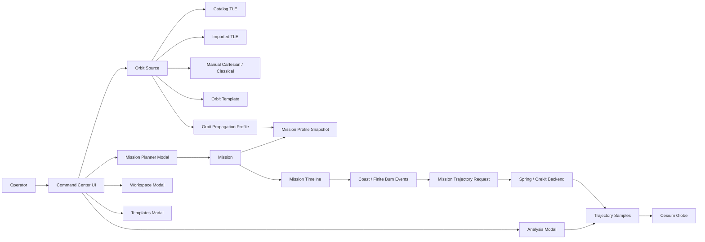
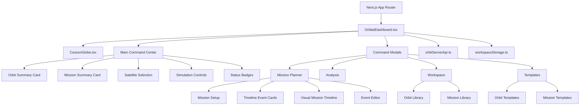
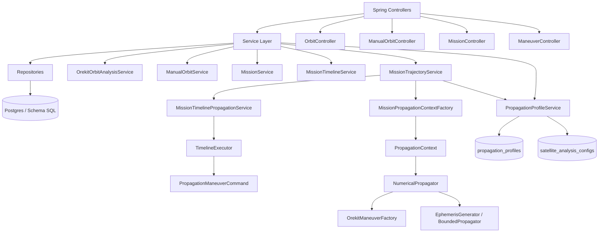
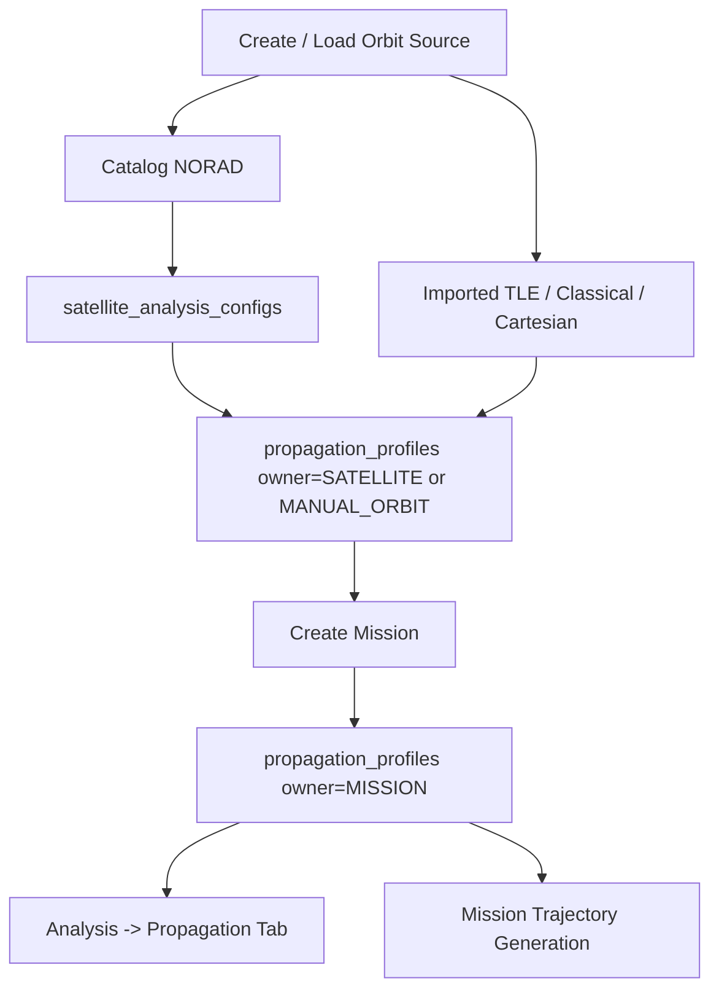
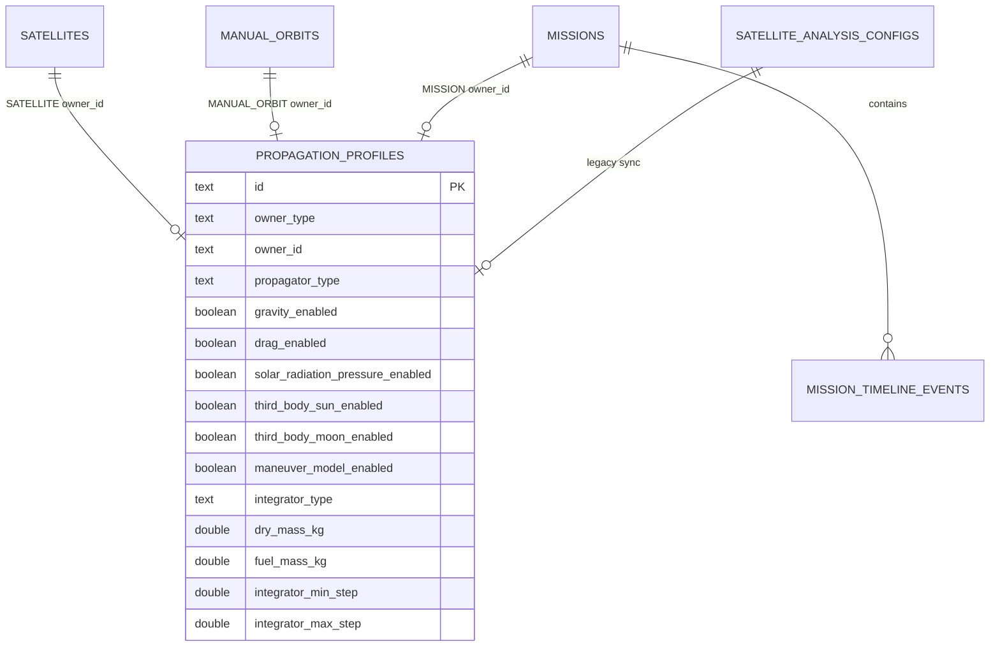
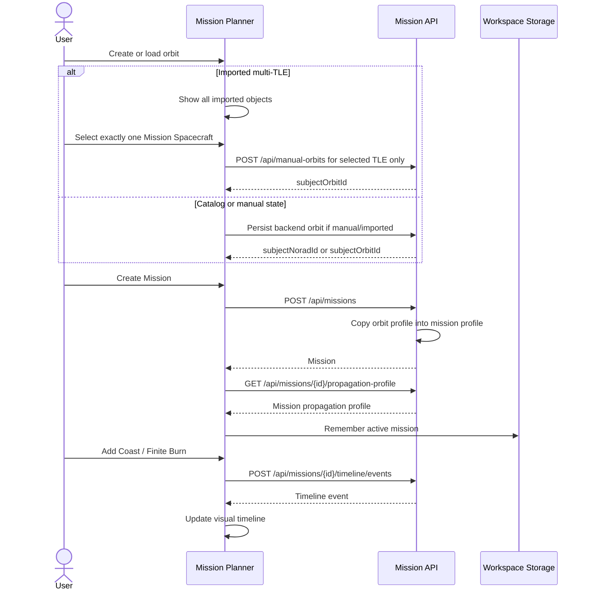
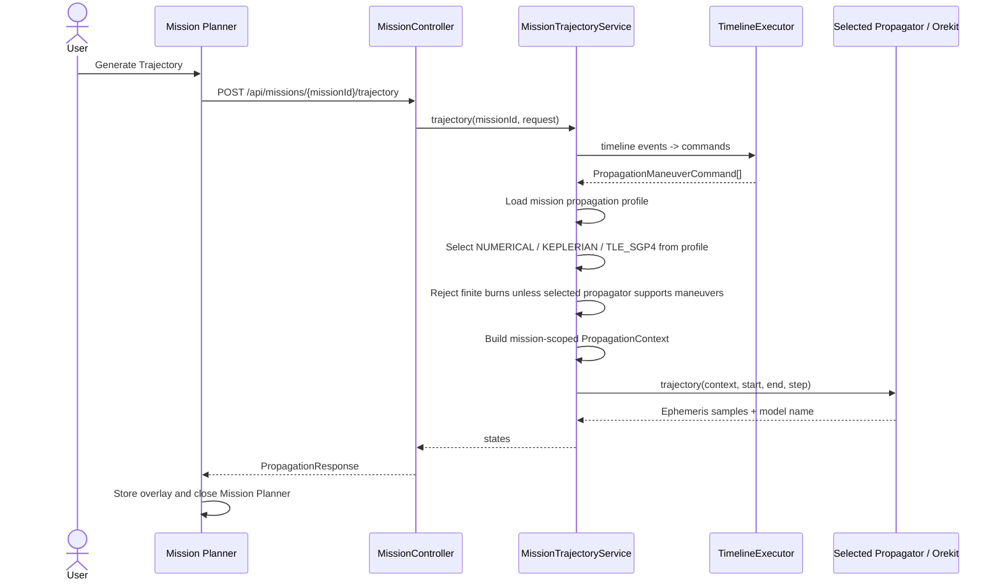

# Orbit Visualization Engine

Command-center orbital operations and mission-planning workspace built with Next.js, CesiumJS, SatelliteJS, Spring Boot, and Orekit.

The product model is:

```text
Orbit -> Propagation Profile -> Mission -> Mission Profile Snapshot -> Timeline Events -> Trajectory Products -> Cesium Visualization
```

The main screen is for situational awareness. Planning, analysis, workspace management, and reusable templates live in dedicated command modals.

## Screenshots

### Orbit Source Selection


Create spacecraft orbits using TLE catalogs, imported TLEs, orbital elements, Cartesian states, or reusable templates.

---

### TLE Import Workflow


Import one or more spacecraft from raw TLE data with validation, preview, and mission-ready initialization.

---

### Mission Planning & Timeline Design


Configure propagation settings, force models, finite burns, coast phases, and mission timelines before trajectory generation.

---

### Operational Visualization


Visualize satellite trajectories in 3D, monitor mission status, and analyze generated mission plans in real time.


## Running Locally

Install frontend dependencies:

```bash
npm install
```

Run the frontend:

```bash
npm run dev
```

Run the backend:

```bash
cd server
mvn spring-boot:run
```

Open:

```text
http://localhost:3000
```

## Verification Commands

Frontend lint:

```bash
npm run lint
```

Frontend production build:

```bash
npm run build
```

Backend tests:

```bash
cd server
mvn test
```

## Architecture Overview



## Frontend Architecture



## Backend Architecture



## Propagation Profile Lifecycle



Every backend mission uses a mission-scoped propagation profile snapshot. Orbit-source configuration and mission execution configuration are intentionally separate so one orbit can support multiple missions with different force-model settings.

## Database Ownership Model



## Mission Planning Sequence



## Trajectory Generation Sequence



## Data Flow Diagram

```mermaid
flowchart LR
  TLE[TLE / Manual State / Template] --> OrbitObject[Frontend Orbit Object]
  OrbitObject --> SpacecraftChoice[Mission Spacecraft Selection]
  SpacecraftChoice --> BackendOrbit[Backend Manual Orbit or Catalog NORAD]
  BackendOrbit --> OrbitProfile[Orbit Propagation Profile]
  OrbitProfile --> Mission[Mission Subject]
  Mission --> MissionProfile[Mission Profile Snapshot]

  Mission --> TimelineEvents[Timeline Events]
  TimelineEvents --> Scheduling[UTC / MET / AFTER_EVENT Metadata]
  Scheduling --> ExecutionTime[UTC executionTime]
  ExecutionTime --> BackendTimeline[Backend Timeline Event]

  MissionProfile --> PropagationContext[PropagationContext]
  BackendTimeline --> TimelineExecutor[TimelineExecutor]
  TimelineExecutor --> Commands[Propagation Commands]
  Commands --> PropagationContext
  PropagationContext --> Numerical[NumericalPropagator]
  Numerical --> Samples[Trajectory Samples]
  Samples --> OrbitSnapshots[Frontend Orbit Snapshots]
  OrbitSnapshots --> Cesium[Cesium Renderer]
```




## Mission Spacecraft Rule

Imported TLE files may contain multiple spacecraft. The application treats those objects as visualization and analysis objects until the operator chooses exactly one `Mission Spacecraft`.

Only the Mission Spacecraft receives:

- mission propagation profile.
- numerical integrator settings.
- force-model configuration.
- spacecraft mass and optical/aerodynamic properties.
- maneuver timeline execution.

Non-selected imported objects remain visible on the globe and available for range/conjunction-style analysis, but they continue using their native TLE/SGP4 visualization path and do not receive mission maneuvers.

## Propagator UI Behavior

Mission propagation profile selection is not cosmetic:

- `NUMERICAL` exposes backend-supported integrators from `GET /api/capabilities`, gravity degree/order, force-model toggles, spacecraft parameters, and expert integrator tolerances.
- `KEPLERIAN` hides numerical force-model and integrator controls. The Mission Summary reports force models and integrator as not applicable.
- `TLE_SGP4` hides numerical controls. The Mission Summary reports force models as embedded in SGP4 and integrator as not applicable.

Finite-burn mission events require `NUMERICAL` propagation. If enabled finite burns exist under `KEPLERIAN` or `TLE_SGP4`, the Mission Planner disables trajectory generation and explains the incompatibility.

## Capability Registry

The frontend does not hardcode the available propagators, integrators, or force-model support matrix. On startup it calls:

```text
GET /api/capabilities
```

The response advertises:

- propagators: `NUMERICAL`, `KEPLERIAN`, `TLE_SGP4`.
- integrators: `DORMAND_PRINCE_853`, `DORMAND_PRINCE_54`, `CLASSICAL_RUNGE_KUTTA`, `GILL`, `LUTHER`, `MIDPOINT`, `THREE_EIGHTHES`, `ADAMS_BASHFORTH`, `ADAMS_MOULTON`, `GRAGG_BULIRSCH_STOER`.
- which propagators support integrators, force models, maneuvers, and spacecraft physical parameters.

The Mission Planner and Analysis views render controls from this registry and read/write the same persisted mission propagation profile.
