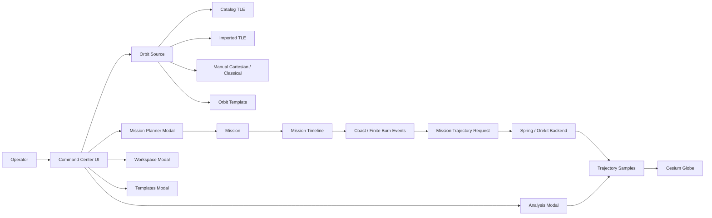
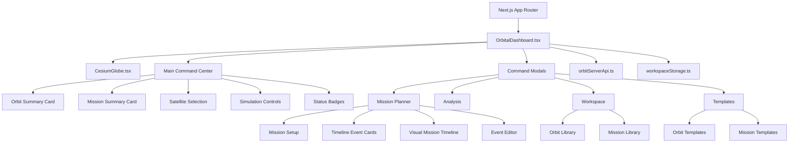
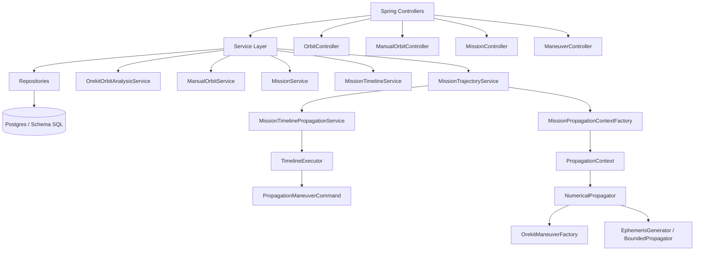
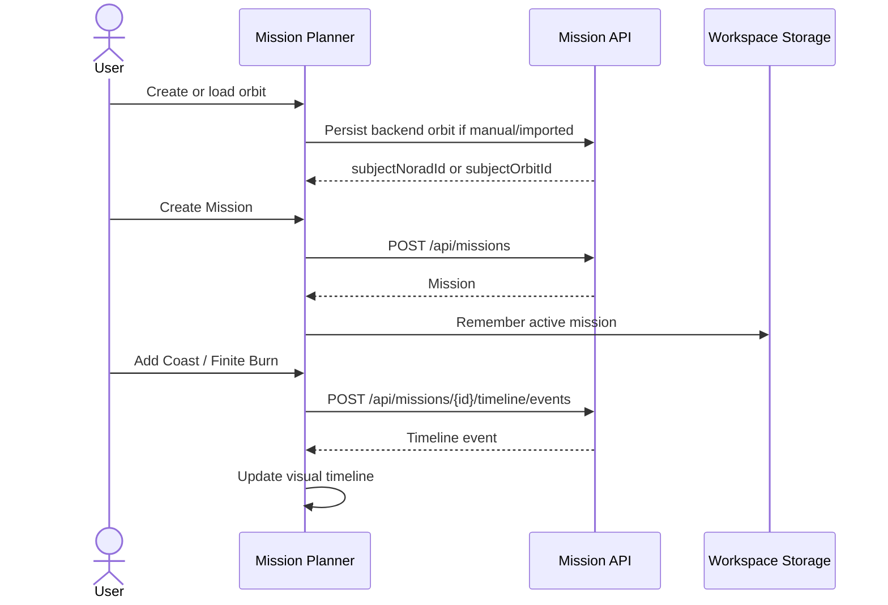
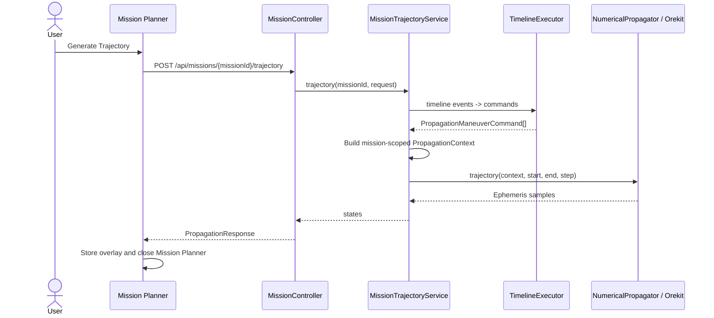

# Orbit Visualization Engine

Command-center orbital operations and mission-planning workspace built with Next.js, CesiumJS, SatelliteJS, Spring Boot, and Orekit.

The product model is:

```text
Orbit -> Mission -> Timeline Events -> Trajectory Products -> Cesium Visualization
```

The main screen is for situational awareness. Planning, analysis, workspace management, and reusable templates live in dedicated command modals.

## Architecture Overview



## Frontend Architecture



## Backend Architecture



## Mission Planning Sequence



## Trajectory Generation Sequence



## Data Flow Diagram

```mermaid
flowchart LR
  TLE[TLE / Manual State / Template] --> OrbitObject[Frontend Orbit Object]
  OrbitObject --> BackendOrbit[Backend Manual Orbit or Catalog NORAD]
  BackendOrbit --> Mission[Mission Subject]

  Mission --> TimelineEvents[Timeline Events]
  TimelineEvents --> Scheduling[UTC / MET / AFTER_EVENT Metadata]
  Scheduling --> ExecutionTime[UTC executionTime]
  ExecutionTime --> BackendTimeline[Backend Timeline Event]

  BackendTimeline --> TimelineExecutor[TimelineExecutor]
  TimelineExecutor --> Commands[Propagation Commands]
  Commands --> PropagationContext[PropagationContext]
  PropagationContext --> Numerical[NumericalPropagator]
  Numerical --> Samples[Trajectory Samples]
  Samples --> OrbitSnapshots[Frontend Orbit Snapshots]
  OrbitSnapshots --> Cesium[Cesium Renderer]
```



## Command Center Screens

| Area | Purpose | Notes |
| --- | --- | --- |
| Main Screen | Situational awareness | Earth visualization, selected orbit, active mission, status badges, simulation controls |
| Mission Planner | Mission design | Mission setup, event creation, visual timeline, scheduling, trajectory generation |
| Analysis | Inspection | Trajectory overlay, range, conjunction status, maneuver summaries, propagation config |
| Workspace | Asset management | Orbit and mission libraries, import/export, clone, rename, delete |
| Templates | Reuse | Orbit templates, mission templates, import/export, metadata |

## Feature Matrix

| Feature | Status | Storage / API | Notes |
| --- | --- | --- | --- |
| Catalog TLE orbit | Available | Backend catalog / NORAD | Supports backend mission subject via `subjectNoradId` |
| Imported TLE orbit | Available | Backend manual orbit | Persisted as manual `TLE` orbit for `subjectOrbitId` mission planning |
| Classical elements orbit | Available | Backend manual orbit | Mission subject uses `subjectOrbitId` |
| Cartesian state orbit | Available | Backend manual orbit | Mission subject uses `subjectOrbitId` |
| Orbit library | Available | `localStorage` | `orbit-library-v1` |
| Mission library | Available | `localStorage` | `mission-library-v1` |
| Orbit templates | Available | `localStorage` | `orbit-template-library-v1` |
| Mission templates | Available | `localStorage` | `mission-template-library-v1` |
| COAST events | Available | Backend timeline | Propagation no-op |
| FINITE_BURN events | Available | Backend timeline | Existing finite burn bridge; no new physics |
| UTC scheduling | Available | Backend `executionTime` | Backend execution remains UTC |
| MET scheduling | Available | Event metadata + computed UTC | Planning layer only |
| After Event scheduling | Available | Event metadata + computed UTC | Planning layer only |
| Visual timeline | Available | Frontend planning layer | Draggable scheduling surface |
| Mission trajectory | Available | `POST /api/missions/{id}/trajectory` | Uses existing numerical propagation |
| Propagation config tab | Partial | Catalog analysis config | Catalog values are real; manual/imported fallback visibility is limited |
| Conjunction sync | Not implemented | Disabled UI | Marked `Coming Soon` |
| Impulsive burns | Not implemented | N/A | Future phase |
| Vector burns | Not implemented | N/A | Future phase |

## State Management

Most state is intentionally local to `OrbitalDashboard.tsx` because the app is currently a single command-center workspace.

State groups:

- orbit source state: active source, selected satellite, manual orbit id.
- simulation state: simulation time, playback speed, frame mode.
- mission state: active mission, timeline events, selected event, mission trajectory overlay.
- scheduling state: UTC/MET mode, dependency metadata, visual timeline drag state.
- analysis state: range pair, conjunction visibility, maneuver visibility, analysis config.
- workspace state: orbit library, mission library, templates, import/export refs.

Persistent local state is handled by `src/services/workspaceStorage.ts`.

Backend API calls are centralized in `src/services/orbitServerApi.ts`.

## Folder Structure

```text
src/
  app/
    layout.tsx
    page.tsx
    api/tle/route.ts

  components/
    OrbitalDashboard.tsx
    CesiumGlobe.tsx

  geometry/
    orbitalMath.ts
    utcDateTime.js

  services/
    orbitServerApi.ts
    workspaceStorage.ts

server/
  src/main/java/com/orbitvisualizationengine/server/
    api/
      MissionController.java
      ManualOrbitController.java
      OrbitController.java

    domain/
      Mission.java
      MissionTimelineEvent.java
      ManualOrbitRecord.java

    dto/
      MissionTrajectoryRequest.java
      CreateMissionRequest.java
      CreateTimelineEventRequest.java

    propagation/
      NumericalPropagator.java
      OrekitManeuverFactory.java
      PropagationContext.java

    repository/
      MissionRepository.java
      MissionTimelineEventRepository.java
      ManualOrbitRepository.java

    service/
      MissionTrajectoryService.java
      MissionTimelineService.java
      TimelineExecutor.java
      ManualOrbitService.java

  src/main/resources/db/
    schema.sql

audit/
  architecture and validation reports
```

## Important Boundaries

Do not casually modify these when working on UI/workspace features:

- `server/src/main/java/.../propagation/NumericalPropagator.java`
- `server/src/main/java/.../propagation/OrekitManeuverFactory.java`
- `server/src/main/java/.../service/TimelineExecutor.java`
- trajectory sampling logic.
- Orekit force-model math.
- backend UTC execution semantics.

Planning-layer UX can change independently as long as it continues producing backend-compatible UTC `executionTime` values.

## Running Locally

Install frontend dependencies:

```bash
npm install
```

Run the frontend:

```bash
npm run dev
```

Run the backend:

```bash
cd server
mvn spring-boot:run
```

Open:

```text
http://localhost:3000
```

## Verification Commands

Frontend lint:

```bash
npm run lint
```

Frontend production build:

```bash
npm run build
```

Backend tests:

```bash
cd server
mvn test
```

## Deployment Notes

Frontend:

- Next.js app can be deployed as a standard Node/Next deployment.
- The `/api/tle` route proxies external TLE URLs to avoid browser CORS issues.

Backend:

- Spring Boot service requires database connectivity and Orekit data availability.
- Schema initialization is defined in `server/src/main/resources/db/schema.sql`.
- Mission trajectory generation requires the backend service to be reachable from the frontend API client configuration.

## Developer Onboarding Checklist

1. Read this README.
2. Skim `audit/command-center-ui-rearchitecture-report.md`.
3. Open `src/components/OrbitalDashboard.tsx` and identify the command modal sections.
4. Open `src/services/orbitServerApi.ts` and map frontend calls to backend endpoints.
5. Open `server/src/main/java/.../MissionTrajectoryService.java`.
6. Confirm mission trajectory flow reaches `NumericalPropagator` without frontend physics manipulation.
7. Run `npm run lint`.
8. Run `npm run build`.

