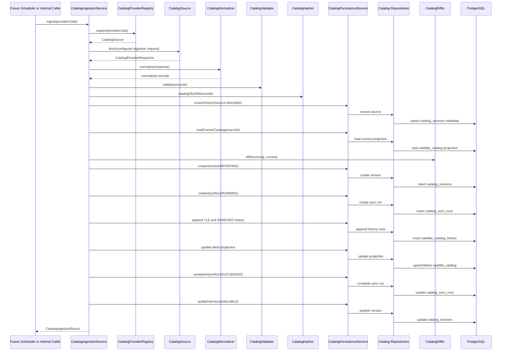

# Public Satellite Catalog Architecture

## Milestone 3: Ingestion Pipeline Foundation

Milestone 3 adds the backend-only ingestion pipeline that turns one provider response into one published catalog version. It does not schedule ingestion, expose ingestion over REST, run Orekit, propagate orbits, or perform proximity analysis.

The pipeline is intentionally provider-neutral. Business ingestion code depends on `CatalogProviderRegistry` and `CatalogSource`; provider-specific URL and endpoint details live in `providers.yml`.

## Ingestion Sequence

## Transaction Boundary

`CatalogIngestionService.ingest(providerCode)` is transactional. Validation and normalization happen before catalog version rows are created, so malformed provider payloads are rejected before database mutation. Once persistence starts, the version, sync run, history appends, projection updates, and publication occur in one database transaction.

This prevents partially imported catalogs from being visible. If the transaction fails, PostgreSQL rolls the work back and no `IMPORTING` catalog version is left behind.

## Component Responsibilities

`CatalogIngestionService`

Coordinates the workflow only: provider lookup, fetch, normalize, validate, hash, diff, persist, and publish. It owns the transaction boundary but does not parse TLEs, compute hashes, compare records, or know SQL.

`CatalogNormalizer`

Converts provider response DTOs into `NormalizedCatalogRecord`. It extracts TLE epoch, orbital fields, launch designator fields, and source payload values into a stable internal shape for validation and persistence.

`CatalogValidator`

Rejects malformed ingestion inputs before database mutation. It checks required object data, TLE line shape, valid epoch, SHA-256 format, and duplicate NORAD IDs inside one provider response.

`CatalogHasher`

Computes deterministic SHA-256 values for normalized TLE pairs and full catalog snapshots. TLE hashes are used for change detection; catalog hashes make catalog versions auditable.

`CatalogDiffer`

Compares normalized incoming records with the current `satellite_catalog` projection for the same source. It classifies records as added, changed, unchanged, or removed.

`CatalogPersistenceService`

Coordinates persistence operations inside the ingestion transaction. It does not contain SQL. It derives persistence inputs such as version counters and delegates table-specific reads and writes to repositories.

`CatalogSourceRepository`

Owns SQL for `catalog_sources`. It creates or updates provider source metadata so catalog versions can reference a stable source id instead of free-text provider names.

`CatalogVersionRepository`

Owns SQL for `catalog_versions`. It creates the immutable version row in `IMPORTING` state and publishes it as `AVAILABLE` after history and projection writes complete.

`CatalogSyncRunRepository`

Owns SQL for `catalog_sync_runs`. It records the ingestion attempt tied one-to-one to the catalog version and stores ingestion counters for auditability.

`SatelliteCatalogHistoryRepository`

Owns SQL for `satellite_catalog_history`. It inserts `TLE` and `REMOVED` events only. It never updates or deletes history rows, preserving append-only reproducibility.

`SatelliteCatalogRepository`

Owns SQL for `satellite_catalog`, the mutable latest-active projection. It loads the current provider projection for diffing, upserts changed active records, marks unchanged records as seen, and removes active projection rows for removed objects.

## Versioning Rules

Each ingestion creates exactly one `catalog_versions` row. The row starts as `IMPORTING` and is published as `AVAILABLE` only after history and projection writes complete.

Changed and added TLEs create `TLE` rows in `satellite_catalog_history`. Missing objects from the same provider create `REMOVED` rows. Unchanged objects do not duplicate history; their latest projection is only marked as seen in the new version.

`satellite_catalog_history` remains append-only. `satellite_catalog` is the mutable latest-active projection and may be updated or pruned when objects are removed.

## Provider Configuration

`providers.yml` defines the active provider and its ingestion request:

- endpoint enum
- expected data format
- configured query parameters
- provider metadata and capabilities

The ingestion pipeline does not hardcode provider URLs or CelesTrak endpoint paths.
