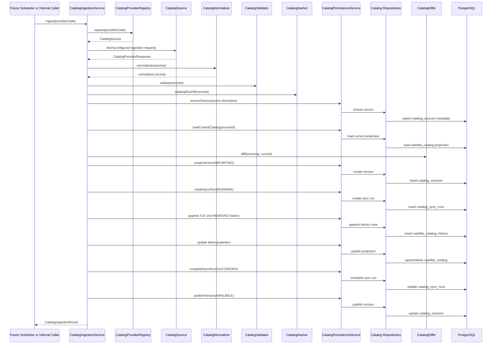
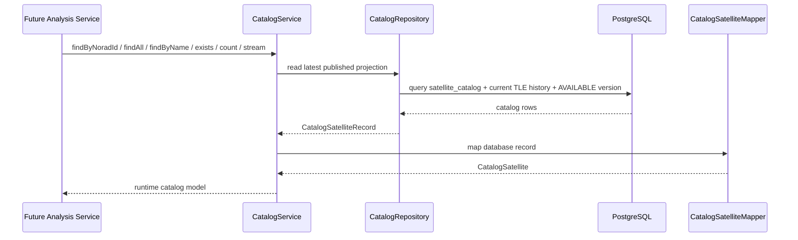
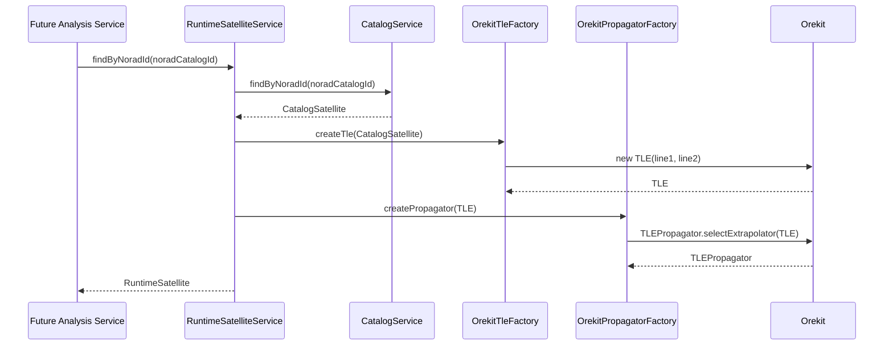

# Public Satellite Catalog Architecture

## Milestone 3: Ingestion Pipeline Foundation

Milestone 3 adds the backend-only ingestion pipeline that turns one provider response into one published catalog version. It does not schedule ingestion, expose ingestion over REST, run Orekit, propagate orbits, or perform proximity analysis.

The pipeline is intentionally provider-neutral. Business ingestion code depends on `CatalogProviderRegistry` and `CatalogSource`; provider-specific URL and endpoint details live in `providers.yml`.

## Ingestion Sequence

## Transaction Boundary

`CatalogIngestionService.ingest(providerCode)` is transactional. Validation and normalization happen before catalog version rows are created, so malformed provider payloads are rejected before database mutation. Once persistence starts, the version, sync run, history appends, projection updates, and publication occur in one database transaction.

This prevents partially imported catalogs from being visible. If the transaction fails, PostgreSQL rolls the work back and no `IMPORTING` catalog version is left behind.

## Component Responsibilities

`CatalogIngestionService`

Coordinates the workflow only: provider lookup, fetch, normalize, validate, hash, diff, persist, and publish. It owns the transaction boundary but does not parse TLEs, compute hashes, compare records, or know SQL.

`CatalogNormalizer`

Converts provider response DTOs into `NormalizedCatalogRecord`. It extracts TLE epoch, orbital fields, launch designator fields, and source payload values into a stable internal shape for validation and persistence.

`CatalogValidator`

Rejects malformed ingestion inputs before database mutation. It checks required object data, TLE line shape, valid epoch, SHA-256 format, and duplicate NORAD IDs inside one provider response.

`CatalogHasher`

Computes deterministic SHA-256 values for normalized TLE pairs and full catalog snapshots. TLE hashes are used for change detection; catalog hashes make catalog versions auditable.

`CatalogDiffer`

Compares normalized incoming records with the current `satellite_catalog` projection for the same source. It classifies records as added, changed, unchanged, or removed.

`CatalogPersistenceService`

Coordinates persistence operations inside the ingestion transaction. It does not contain SQL. It derives persistence inputs such as version counters and delegates table-specific reads and writes to repositories.

`CatalogSourceRepository`

Owns SQL for `catalog_sources`. It creates or updates provider source metadata so catalog versions can reference a stable source id instead of free-text provider names.

`CatalogVersionRepository`

Owns SQL for `catalog_versions`. It creates the immutable version row in `IMPORTING` state and publishes it as `AVAILABLE` after history and projection writes complete.

`CatalogSyncRunRepository`

Owns SQL for `catalog_sync_runs`. It records the ingestion attempt tied one-to-one to the catalog version and stores ingestion counters for auditability.

`SatelliteCatalogHistoryRepository`

Owns SQL for `satellite_catalog_history`. It inserts `TLE` and `REMOVED` events only. It never updates or deletes history rows, preserving append-only reproducibility.

`SatelliteCatalogRepository`

Owns SQL for `satellite_catalog`, the mutable latest-active projection. It loads the current provider projection for diffing, upserts changed active records, marks unchanged records as seen, and removes active projection rows for removed objects.

## Versioning Rules

Each ingestion creates exactly one `catalog_versions` row. The row starts as `IMPORTING` and is published as `AVAILABLE` only after history and projection writes complete.

Changed and added TLEs create `TLE` rows in `satellite_catalog_history`. Missing objects from the same provider create `REMOVED` rows. Unchanged objects do not duplicate history; their latest projection is only marked as seen in the new version.

`satellite_catalog_history` remains append-only. `satellite_catalog` is the mutable latest-active projection and may be updated or pruned when objects are removed.

## Provider Configuration

`providers.yml` defines the active provider and its ingestion request:

- endpoint enum
- expected data format
- configured query parameters
- provider metadata and capabilities

The ingestion pipeline does not hardcode provider URLs or CelesTrak endpoint paths.

## Milestone 4: Catalog Runtime Layer

Milestone 4 adds the read-only runtime API for the latest published catalog projection. This layer does not ingest provider data, call providers, schedule work, expose REST endpoints, run Orekit, parse TLEs, create propagators, or perform proximity analysis.

The runtime catalog is the boundary future analysis modules should depend on when they need public catalog satellites. It reads from PostgreSQL only and returns immutable `CatalogSatellite` objects.

## Runtime Access Pattern

## Runtime Responsibilities

`CatalogService`

Public runtime entry point for catalog reads. It validates caller input, throws a catalog-specific exception for missing NORAD ids, maps repository records into runtime models, and exposes `findByNoradId`, `findAll`, `findByName`, `exists`, `count`, and `stream`.

`CatalogRepository`

Owns SQL for read-only access to the latest published projection. Lightweight checks such as `exists` and `count` read directly from `satellite_catalog`. Rich reads join the projection to the current `satellite_catalog_history` row for TLE/object fields and to version/source tables for catalog provenance.

`CatalogSatelliteRecord`

Internal repository record representing the selected database columns. It is not exposed outside the runtime repository/mapper boundary.

`CatalogSatelliteMapper`

Maps database records into immutable runtime catalog objects. It keeps row shape separate from the public model future analysis services will consume.

`CatalogSatellite`

Immutable runtime model for a published catalog satellite. It carries the latest active TLE and catalog/version provenance but performs no TLE parsing or physics.

## Runtime Rules

Runtime catalog access is provider-agnostic. It never talks to CelesTrak, Space-Track, or any future provider. It only reads published database state created by ingestion.

The runtime layer intentionally does not cache results yet. Future modules such as propagation, event detection, relative motion, and proximity analysis should consume `CatalogService` instead of querying catalog tables directly.

## Milestone 5: Orekit Runtime Integration

Milestone 5 adds the isolated bridge from runtime catalog satellites to Orekit TLE objects and TLE propagators. It does not propagate trajectories, run event detection, compute visibility, perform conjunction or relative-motion analysis, expose REST APIs, schedule work, or cache runtime satellites.

Orekit dependencies are confined to the `catalog.runtime.orekit` package. The bridge consumes `CatalogSatellite` objects from the runtime catalog layer and never reads repositories, tables, providers, or provider DTOs.

## Orekit Runtime Bridge

## Orekit Bridge Responsibilities

`OrekitTleFactory`

Validates the runtime catalog TLE fields and constructs an Orekit `TLE`. It checks required lines, exact TLE line length, line prefixes, matching line satellite numbers, and consistency with the catalog NORAD id before delegating to Orekit.

`OrekitPropagatorFactory`

Constructs Orekit `TLEPropagator` instances from a validated `TLE`. It owns propagator construction only and does not run propagation.

`RuntimeSatellite`

Immutable wrapper containing the source `CatalogSatellite`, the Orekit `TLE`, and the `TLEPropagator`. It is the handoff object future analysis services can consume.

`RuntimeSatelliteService`

Coordinates the bridge from catalog lookup to runtime satellite construction. It depends on `CatalogService`, `OrekitTleFactory`, and `OrekitPropagatorFactory`; it never talks to repositories or providers.

`InvalidCatalogTleException`

Runtime-specific exception for malformed catalog TLEs. It keeps Orekit parsing failures from leaking as low-level exceptions across the catalog runtime boundary.

## Orekit Runtime Rules

The Orekit runtime bridge is provider-neutral. It does not know whether a satellite came from CelesTrak, Space-Track, a user import, or a commercial catalog. Its only input is the published `CatalogSatellite` model.

The bridge creates propagator objects but performs no propagation loops. Time-stepping, event detection, proximity analysis, visibility, and relative-motion workflows belong to later modules.
