# Public Satellite Catalog Architecture

## Milestone 3: Ingestion Pipeline Foundation

Milestone 3 adds the backend-only ingestion pipeline that turns one provider response into one published catalog version. It does not schedule ingestion, expose ingestion over REST, run Orekit, propagate orbits, or perform proximity analysis.

The pipeline is intentionally provider-neutral. Business ingestion code depends on `CatalogProviderRegistry` and `CatalogSource`; provider-specific URL and endpoint details live in `providers.yml`.

## Ingestion Sequence

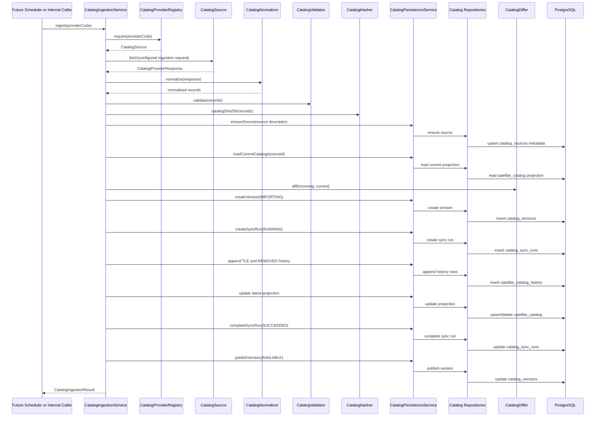

## Transaction Boundary

`CatalogIngestionService.ingest(providerCode)` is transactional. Validation and normalization happen before catalog version rows are created, so malformed provider payloads are rejected before database mutation. Once persistence starts, the version, sync run, history appends, projection updates, and publication occur in one database transaction.

This prevents partially imported catalogs from being visible. If the transaction fails, PostgreSQL rolls the work back and no `IMPORTING` catalog version is left behind.

## Component Responsibilities

`CatalogIngestionService`

Coordinates the workflow only: provider lookup, fetch, normalize, validate, hash, diff, persist, and publish. It owns the transaction boundary but does not parse TLEs, compute hashes, compare records, or know SQL.

`CatalogNormalizer`

Converts provider response DTOs into `NormalizedCatalogRecord`. It extracts TLE epoch, orbital fields, launch designator fields, and source payload values into a stable internal shape for validation and persistence.

`CatalogValidator`

Rejects malformed ingestion inputs before database mutation. It checks required object data, TLE line shape, valid epoch, SHA-256 format, and duplicate NORAD IDs inside one provider response.

`CatalogHasher`

Computes deterministic SHA-256 values for normalized TLE pairs and full catalog snapshots. TLE hashes are used for change detection; catalog hashes make catalog versions auditable.

`CatalogDiffer`

Compares normalized incoming records with the current `satellite_catalog` projection for the same source. It classifies records as added, changed, unchanged, or removed.

`CatalogPersistenceService`

Coordinates persistence operations inside the ingestion transaction. It does not contain SQL. It derives persistence inputs such as version counters and delegates table-specific reads and writes to repositories.

`CatalogSourceRepository`

Owns SQL for `catalog_sources`. It creates or updates provider source metadata so catalog versions can reference a stable source id instead of free-text provider names.

`CatalogVersionRepository`

Owns SQL for `catalog_versions`. It creates the immutable version row in `IMPORTING` state and publishes it as `AVAILABLE` after history and projection writes complete.

`CatalogSyncRunRepository`

Owns SQL for `catalog_sync_runs`. It records the ingestion attempt tied one-to-one to the catalog version and stores ingestion counters for auditability.

`SatelliteCatalogHistoryRepository`

Owns SQL for `satellite_catalog_history`. It inserts `TLE` and `REMOVED` events only. It never updates or deletes history rows, preserving append-only reproducibility.

`SatelliteCatalogRepository`

Owns SQL for `satellite_catalog`, the mutable latest-active projection. It loads the current provider projection for diffing, upserts changed active records, marks unchanged records as seen, and removes active projection rows for removed objects.

## Versioning Rules

Each ingestion creates exactly one `catalog_versions` row. The row starts as `IMPORTING` and is published as `AVAILABLE` only after history and projection writes complete.

Changed and added TLEs create `TLE` rows in `satellite_catalog_history`. Missing objects from the same provider create `REMOVED` rows. Unchanged objects do not duplicate history; their latest projection is only marked as seen in the new version.

`satellite_catalog_history` remains append-only. `satellite_catalog` is the mutable latest-active projection and may be updated or pruned when objects are removed.

## Provider Configuration

`providers.yml` defines the active provider and its ingestion request:

- endpoint enum
- expected data format
- configured query parameters
- provider metadata and capabilities

The ingestion pipeline does not hardcode provider URLs or CelesTrak endpoint paths.

## Milestone 4: Catalog Runtime Layer

Milestone 4 adds the read-only runtime API for the latest published catalog projection. This layer does not ingest provider data, call providers, schedule work, expose REST endpoints, run Orekit, parse TLEs, create propagators, or perform proximity analysis.

The runtime catalog is the boundary future analysis modules should depend on when they need public catalog satellites. It reads from PostgreSQL only and returns immutable `CatalogSatellite` objects.

## Runtime Access Pattern

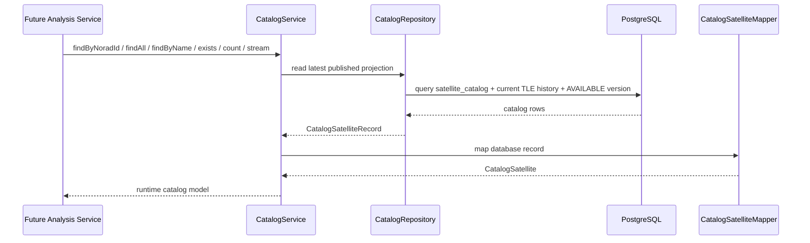

## Runtime Responsibilities

`CatalogService`

Public runtime entry point for catalog reads. It validates caller input, throws a catalog-specific exception for missing NORAD ids, maps repository records into runtime models, and exposes `findByNoradId`, `findAll`, `findByName`, `exists`, `count`, and `stream`.

`CatalogRepository`

Owns SQL for read-only access to the latest published projection. Lightweight checks such as `exists` and `count` read directly from `satellite_catalog`. Rich reads join the projection to the current `satellite_catalog_history` row for TLE/object fields and to version/source tables for catalog provenance.

`CatalogSatelliteRecord`

Internal repository record representing the selected database columns. It is not exposed outside the runtime repository/mapper boundary.

`CatalogSatelliteMapper`

Maps database records into immutable runtime catalog objects. It keeps row shape separate from the public model future analysis services will consume.

`CatalogSatellite`

Immutable runtime model for a published catalog satellite. It carries the latest active TLE and catalog/version provenance but performs no TLE parsing or physics.

## Runtime Rules

Runtime catalog access is provider-agnostic. It never talks to CelesTrak, Space-Track, or any future provider. It only reads published database state created by ingestion.

The runtime layer intentionally does not cache results yet. Future modules such as propagation, event detection, relative motion, and proximity analysis should consume `CatalogService` instead of querying catalog tables directly.

## Milestone 5: Orekit Runtime Integration

Milestone 5 adds the isolated bridge from runtime catalog satellites to Orekit TLE objects and TLE propagators. It does not propagate trajectories, run event detection, compute visibility, perform conjunction or relative-motion analysis, expose REST APIs, schedule work, or cache runtime satellites.

Orekit dependencies are confined to the `catalog.runtime.orekit` package. The bridge consumes `CatalogSatellite` objects from the runtime catalog layer and never reads repositories, tables, providers, or provider DTOs.

## Orekit Runtime Bridge

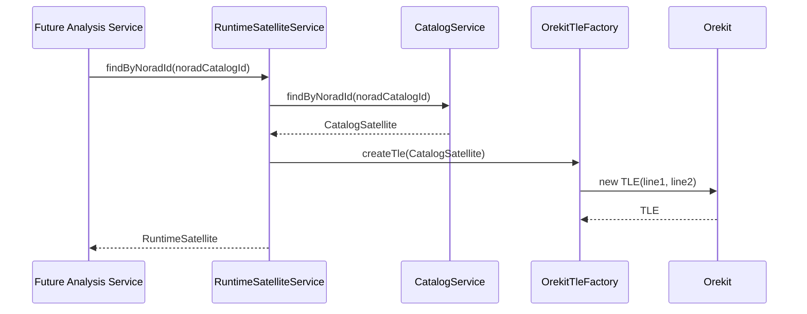

## Orekit Bridge Responsibilities

`OrekitTleFactory`

Validates the runtime catalog TLE fields and constructs an Orekit `TLE`. It checks required lines, exact TLE line length, line prefixes, matching line satellite numbers, and consistency with the catalog NORAD id before delegating to Orekit.

`OrekitPropagatorFactory`

Constructs Orekit `TLEPropagator` instances from a validated `TLE` or `CatalogSatellite` on demand. It owns propagator construction only and does not run propagation. Propagators are deliberately not stored inside `RuntimeSatellite`, keeping the runtime model independent from a specific propagation algorithm lifecycle.

`RuntimeSatellite`

Immutable wrapper containing the source `CatalogSatellite` and validated Orekit `TLE`. It is the handoff object future analysis services can consume before choosing an SGP4, numerical, DSST, ephemeris, or custom propagation strategy.

`RuntimeSatelliteService`

Coordinates the bridge from catalog lookup to runtime satellite construction. It depends on `CatalogService` and `OrekitTleFactory`; it never talks to repositories or providers.

`InvalidCatalogTleException`

Runtime-specific exception for malformed catalog TLEs. It keeps Orekit parsing failures from leaking as low-level exceptions across the catalog runtime boundary.

## Orekit Runtime Rules

The Orekit runtime bridge is provider-neutral. It does not know whether a satellite came from CelesTrak, Space-Track, a user import, or a commercial catalog. Its only input is the published `CatalogSatellite` model.

The bridge validates TLEs and can create propagator objects on demand through `OrekitPropagatorFactory`, but performs no propagation loops. Time-stepping, event detection, proximity analysis, visibility, and relative-motion workflows belong to later modules.

## Milestone 6: Propagation Engine

Milestone 6 adds the runtime propagation layer on top of `RuntimeSatellite`. It samples a single runtime satellite over a caller-provided time span and returns immutable Cartesian state history. It does not perform event detection, visibility analysis, conjunction analysis, proximity search, relative motion, caching, background work, REST exposure, scheduler integration, force-model configuration, or database access.

The public propagation API is provider-neutral. It consumes a `RuntimeSatellite` already created by the Milestone 5 bridge and never talks to catalog providers, ingestion services, repositories, or controllers.

## Propagation Sequence

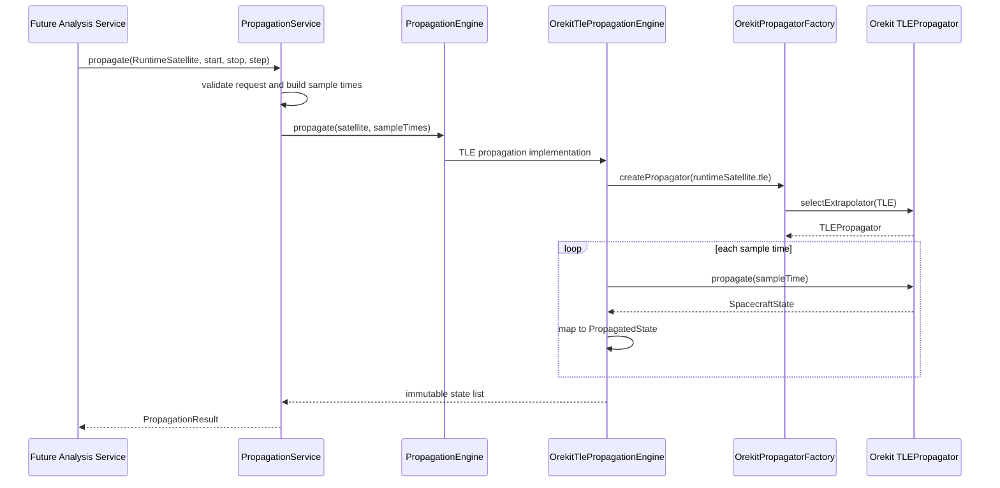

## Propagation Responsibilities

`PropagationService`

Public runtime entry point for propagation. It validates the runtime satellite, start time, stop time, and positive step duration; builds deterministic sample times including the final stop time; delegates propagation to the configured engine; and returns an immutable `PropagationResult`.

`PropagationEngine`

Small internal boundary between propagation orchestration and the concrete propagation implementation. It exists so the service does not depend on Orekit classes directly, while avoiding a broader strategy framework before multiple propagator families are actually implemented.

`OrekitTlePropagationEngine`

Current production implementation for TLE propagation. It creates a fresh `TLEPropagator` on demand through `OrekitPropagatorFactory`, propagates each requested sample time, and maps Orekit `SpacecraftState` output into runtime models. It uses TEME for TLE output because that is the native SGP4 frame.

`PropagatedState`

Immutable runtime state sample containing timestamp, output frame name, Cartesian position, and Cartesian velocity. It intentionally does not expose Orekit `SpacecraftState` so future modules can consume propagation output without depending on Orekit internals.

`PropagationResult`

Immutable propagation product containing the source `RuntimeSatellite`, requested time bounds, requested step duration, and generated state history. Later event, visibility, relative-motion, and proximity modules can consume this result without knowing how it was generated.

`PropagationException` and `PropagationRequestException`

Runtime-specific failures for propagation. Invalid caller parameters fail before Orekit is invoked; Orekit/runtime failures are wrapped at the propagation boundary.

## Propagation Rules

The propagation layer creates propagators on demand and does not store them in `RuntimeSatellite` or cache them globally. This keeps propagator lifecycle local to one propagation request and leaves room for later NumericalPropagator, DSST, ephemeris-backed, or custom propagation engines.

Milestone 6 supports only TLE propagation. Future force-model configuration, maneuver handling, event detection, and proximity workflows should be built above this layer rather than mixed into the catalog runtime bridge.

## Milestone 7: Event Detection Framework

Milestone 7 adds the event detection framework above runtime propagation. It coordinates propagation result generation with optional event detector execution, but it does not implement concrete event behavior yet. There is no visibility, eclipse, conjunction, ground-station, relative-motion, maneuver, REST, scheduler, cache, database, or provider integration in this milestone.

The event framework is provider-neutral. It consumes `RuntimeSatellite` and the propagation runtime models; it never talks to catalog providers, ingestion services, repositories, controllers, or schedulers.

## Event Detection Sequence

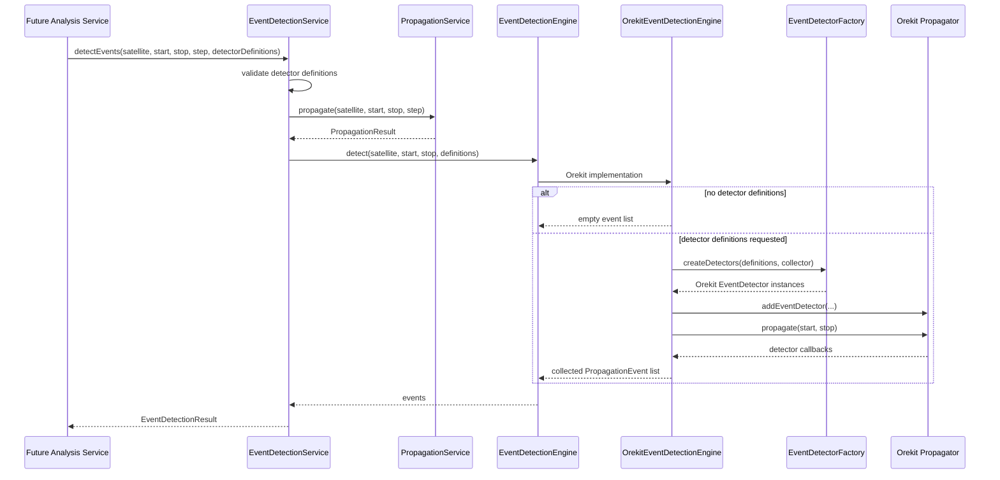

## Event Detection Responsibilities

`EventDetectionService`

Public event-detection entry point. It validates detector definition lists, invokes `PropagationService` to produce the normal state history, invokes `EventDetectionEngine` for event collection, and returns an immutable `EventDetectionResult`. It does not know Orekit and does not build detectors itself.

`EventDetectionEngine`

Internal boundary between event orchestration and the concrete event-detection implementation. This keeps detector execution independent from `PropagationService` and `PropagationEngine`, so future detector families can be added without modifying the propagation state-history path.

`OrekitEventDetectionEngine`

Orekit-specific event execution layer. It creates a fresh propagator for event detection, attaches Orekit `EventDetector` instances from `EventDetectorFactory`, runs the detector propagation interval, and returns collected runtime events. With no detector definitions, it returns an empty event list without running a second propagation.

`EventDetectorFactory`

Orekit-specific factory that maps runtime detector definitions to Orekit `EventDetector` instances using registered `OrekitEventDetectorBuilder` components. No concrete builders are implemented in this milestone; unsupported detector definitions fail clearly instead of silently doing nothing.

`PropagationEventDetectorDefinition`

Provider-neutral runtime detector definition contract. Future detector definitions such as visibility, eclipse, node crossing, apsis, distance threshold, conjunction, or custom events can implement this contract without changing `PropagationService` or `PropagationEngine`.

`PropagationEvent`

Immutable runtime event record containing event type, timestamp, crossing direction, detector name, and string attributes. It intentionally does not expose Orekit detector or spacecraft-state objects.

`PropagationEventType`

Runtime event taxonomy for future detector implementations: visibility, eclipse, conjunction, node crossing, apsis, distance threshold, and custom detector events.

`EventDetectionResult`

Immutable event-detection product containing the regular `PropagationResult` plus detected events. The event list is defensively copied and may be empty.

## Event Detection Rules

Event collection is separate from propagation result generation. `PropagationService` still produces state histories only. Event detection is layered above it and may run detector propagation independently when detector definitions exist.

The current implementation permits a future single-pass propagation model. `EventDetectionService` depends on the abstract `EventDetectionEngine`, not directly on `OrekitEventDetectionEngine`, and callers receive only `EventDetectionResult`. A later milestone can replace the internal engine with one that installs detectors during the same propagation pass that samples states, while preserving the public event-detection contract and leaving detector definitions unchanged.

Milestone 7 deliberately includes no concrete detectors. Future detector milestones should add focused detector definition records and matching Orekit detector builders under `catalog.runtime.propagation.orekit.events`, without changing the public propagation service or provider/catalog layers.

## Milestone 8: Ground Station Runtime Model

Milestone 8 adds a provider-neutral runtime ground station layer. It gives future visibility, access-window, pass-prediction, tracking, antenna, and communication modules a stable read-only API for ground stations. It does not compute visibility, elevation, line of sight, event detectors, communication links, antenna behavior, weather, atmospheric refraction, REST endpoints, scheduler workflows, caching, database schema, or provider integration.

The ground station runtime layer is independent from the satellite catalog ingestion pipeline. It may be backed by configuration today and by database or user-defined repositories later without changing callers.

## Ground Station Access Pattern

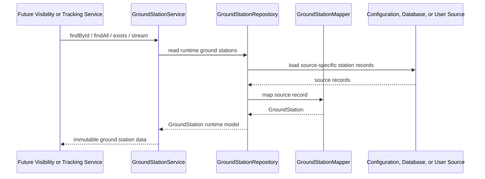

## Ground Station Responsibilities

`GroundStationService`

Public read-only runtime entry point. It validates station ids, throws a domain exception for missing stations, and exposes `findById`, `findAll`, `exists`, and `stream`. Future analysis modules should depend on this service rather than reading station sources directly.

`GroundStationRepository`

Source abstraction for runtime station data. The first implementation is configuration-backed, but the interface is deliberately source-neutral so future database, project-scoped, or user-defined repositories can replace it without changing visibility or tracking callers.

`ConfiguredGroundStationRepository`

Configuration-backed repository for the current milestone. It maps configured station records into runtime models, rejects duplicate station ids, and stores an immutable lookup map. It is not a cache; it is the configured source implementation.

`GroundStationMapper`

Maps source-specific station records into runtime `GroundStation` objects. This keeps configuration binding details out of the public runtime model and leaves room for future database/user-source mappers.

`GroundStation`

Immutable runtime ground station model containing `GroundStationId`, display name, geodetic position, and configuration attributes. It performs no visibility, Earth-frame, or atmospheric calculations.

`GroundStationId`

Immutable station identifier value object. It trims and validates source ids before lookup.

`GroundStationPosition`

Immutable geodetic position in latitude degrees, longitude degrees, and altitude meters. It validates finite coordinate values and legal latitude/longitude ranges, but does not convert to Orekit frames.

`GroundStationConfiguration`

Immutable attribute container for source-neutral station configuration metadata. Future modules can define richer typed configuration when a real behavior requires it.

## Ground Station Rules

The runtime model intentionally contains no Orekit objects. Future Earth-model adapters, such as conversion to Orekit `TopocentricFrame`, must live under `catalog.runtime.groundstation.orekit` so visibility and tracking physics stay isolated from source loading and service lookup.

Ground station access is provider-neutral and satellite-catalog-neutral. It does not know whether stations came from application configuration, a future database table, a user workspace, or an external operational source.

## Milestone 9: Ground Station Visibility Analysis

Milestone 9 adds the first complete mission-analysis feature: visibility windows between one runtime satellite and one runtime ground station. It does not implement antenna models, communication link budgets, weather, atmospheric refraction, terrain masking, Doppler, REST endpoints, scheduler workflows, caching, database schema, or provider integration.

The visibility layer is provider-neutral. It consumes runtime satellites, propagation results, and runtime ground stations; it never talks to catalog providers, ingestion services, repositories, controllers, or schedulers.

## Visibility Sequence

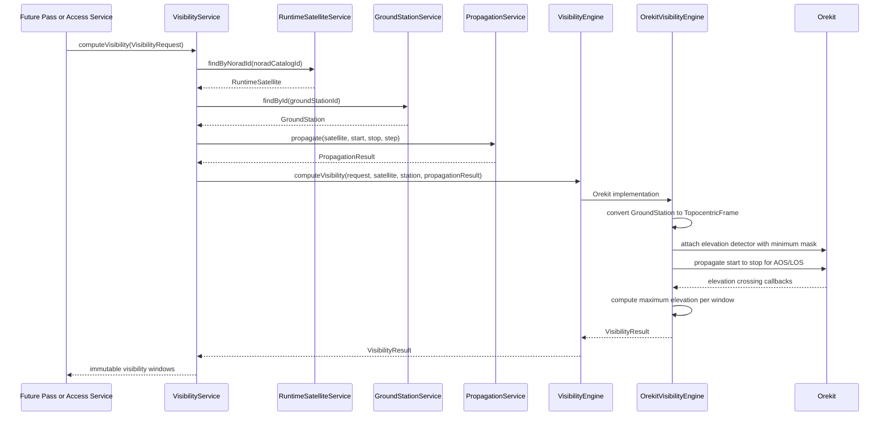

## Visibility Responsibilities

`VisibilityService`

Public runtime entry point for ground-station visibility. It validates the request boundary, loads the `RuntimeSatellite` and `GroundStation` through their runtime services, invokes `PropagationService` for the normal state history, and delegates window computation to `VisibilityEngine`. It does not know Orekit and does not access providers, repositories, or database state.

`VisibilityEngine`

Internal boundary between visibility orchestration and the concrete physics implementation. This keeps the public service independent from Orekit classes and leaves room for later engines if numerical, ephemeris-backed, or custom propagation products require different visibility execution.

`OrekitVisibilityEngine`

Orekit-specific visibility implementation. It converts `GroundStation` to an Orekit `TopocentricFrame`, installs an elevation detector using the configured minimum elevation mask, detects acquisition of signal and loss of signal crossings, and computes maximum elevation for each returned window. Orekit objects stay inside `catalog.runtime.visibility.orekit`.

`VisibilityRequest`

Immutable request model containing the NORAD catalog id, ground station id, start time, stop time, propagation step, and minimum elevation mask. It validates finite elevation masks, positive step duration, and a valid time interval before analysis starts.

`VisibilityWindow`

Immutable access-window model containing acquisition of signal, loss of signal, maximum-elevation timestamp, maximum elevation in degrees, and duration. It exposes mission-analysis results without exposing Orekit detector or spacecraft-state objects.

`VisibilityResult`

Immutable visibility product containing the source request and defensively copied visibility windows. The window list may be empty when the satellite never rises above the configured elevation mask during the requested interval.

## Visibility Rules

Visibility analysis is layered above the runtime catalog, ground station, and propagation services. Future pass prediction, access planning, antenna, communication, and tracking modules should consume `VisibilityService` rather than reimplementing station lookup or elevation crossing logic.

The current maximum-elevation value is computed from the generated propagation sample history plus the AOS and LOS endpoints. This keeps Milestone 9 aligned with the existing propagation product while leaving continuous extrema refinement to a later detector-focused milestone.

No Orekit classes escape the visibility package. Public callers receive only immutable runtime visibility models.

## Milestone 10: Eclipse Analysis

Milestone 10 adds provider-neutral eclipse analysis for runtime catalog satellites. It detects sunlight, penumbra, and umbra intervals over a requested propagation span. It does not implement power generation, battery simulation, thermal modeling, payload scheduling, mission planning, REST endpoints, scheduler workflows, caching, database schema, or provider integration.

The eclipse layer consumes the runtime satellite and propagation services. It never talks to catalog providers, ingestion services, repositories, controllers, or schedulers.

## Eclipse Sequence

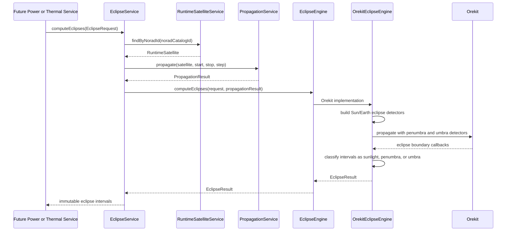

## Eclipse Responsibilities

`EclipseService`

Public runtime entry point for eclipse analysis. It validates the request boundary, loads the `RuntimeSatellite` through `RuntimeSatelliteService`, invokes `PropagationService` for the requested time span, and delegates interval classification to `EclipseEngine`. It does not know Orekit and does not access providers, repositories, or database state.

`EclipseEngine`

Internal boundary between eclipse orchestration and the concrete eclipse implementation. This keeps the public service independent from Orekit classes and leaves room for future engines if numerical, ephemeris-backed, or custom propagation products require different eclipse execution.

`OrekitEclipseEngine`

Orekit-specific eclipse implementation. It builds Earth occultation geometry using WGS84 Earth and Orekit solar ephemerides, attaches penumbra and umbra `EclipseDetector` instances to a fresh propagator, collects boundary times, and classifies each interval as `SUNLIGHT`, `PENUMBRA`, or `UMBRA`. Orekit objects stay inside `catalog.runtime.eclipse.orekit`.

`EclipseRequest`

Immutable request model containing the NORAD catalog id, start time, stop time, and propagation step. It validates positive NORAD id, non-null times, a valid time interval, and positive step duration before analysis starts.

`EclipseInterval`

Immutable eclipse interval containing type, start time, stop time, and duration. It validates that duration matches the interval span.

`EclipseType`

Runtime eclipse taxonomy with `SUNLIGHT`, `PENUMBRA`, and `UMBRA`. Future power, thermal, payload, and mission-planning modules can consume these values without depending on Orekit detector classes.

`EclipseResult`

Immutable eclipse product containing the source request and defensively copied intervals. Intervals cover the requested span and may contain only sunlight when no eclipse occurs.

## Eclipse Rules

Eclipse analysis is layered above runtime catalog and propagation services. Future power generation, thermal, payload scheduling, and mission-planning modules should consume `EclipseService` instead of reimplementing Sun/Earth occultation logic.

Eclipse analysis requires solar ephemerides in the Orekit data configuration. The runtime fails clearly when required Orekit data is unavailable rather than silently degrading to an approximate or non-physical model.

No Orekit classes escape the eclipse package. Public callers receive only immutable runtime eclipse models.

## Milestone 11: Relative Motion Analysis

Milestone 11 adds provider-neutral relative-motion analysis between two runtime catalog satellites. It propagates both satellites over the same requested interval and computes relative position and velocity in the primary satellite's LVLH/RTN frame. It does not implement conjunction detection, collision probability, covariance, maneuver planning, docking, formation control, REST endpoints, scheduler workflows, caching, database schema, or provider integration.

The relative-motion layer consumes runtime satellite and propagation services. It never talks to catalog providers, ingestion services, repositories, controllers, or schedulers.

## Relative Motion Sequence

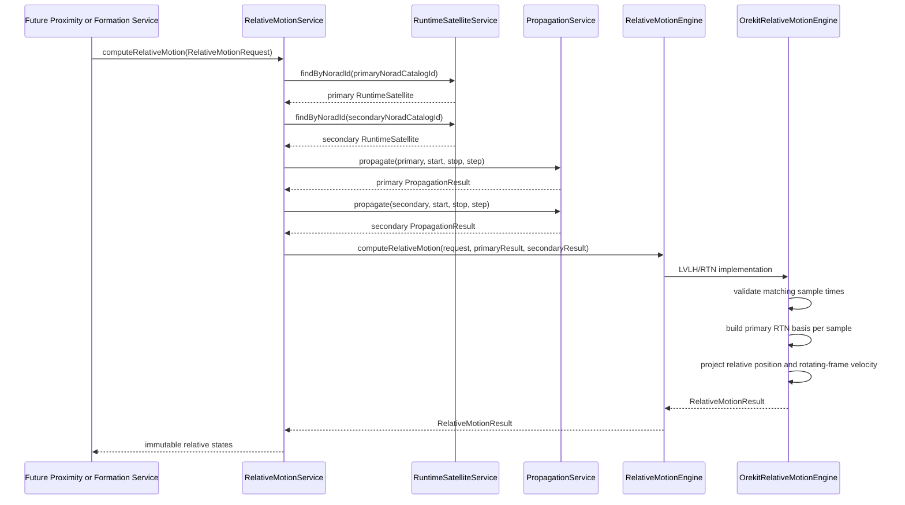

## Relative Motion Responsibilities

`RelativeMotionService`

Public runtime entry point for pairwise relative motion. It validates the request boundary, loads both `RuntimeSatellite` objects through `RuntimeSatelliteService`, propagates both satellites with `PropagationService`, and delegates relative-state computation to `RelativeMotionEngine`. It does not know Orekit and does not access providers, repositories, or database state.

`RelativeMotionEngine`

Internal boundary between service orchestration and relative-frame computation. This keeps future conjunction, rendezvous, formation-flying, and proximity modules dependent on stable runtime models rather than a concrete propagation implementation.

`OrekitRelativeMotionEngine`

Current RTN implementation. It verifies that primary and secondary propagation results have identical sample times, builds the primary satellite's instantaneous radial, in-track, and cross-track basis, projects secondary-minus-primary relative position into that basis, and computes rotating-frame relative velocity using the primary angular-rate correction. Orekit/Hipparchus math types stay inside `catalog.runtime.relativemotion.orekit`.

`RelativeMotionRequest`

Immutable request model containing primary NORAD id, secondary NORAD id, start time, stop time, propagation step, and relative frame. It rejects invalid ids, identical primary/secondary ids, invalid time spans, and non-positive step durations.

`RelativeFrame`

Runtime frame taxonomy for relative motion. Milestone 11 supports `LVLH_RTN`, where x is radial, y is in-track, and z is cross-track. Future frame conventions can be added when a real analysis workflow requires them.

`RelativeState`

Immutable state sample containing timestamp, frame, relative position, and relative velocity. It exposes no Orekit spacecraft-state, frame, or transform objects.

`RelativeMotionResult`

Immutable result containing the source request and defensively copied relative states. Later conjunction, formation-flying, rendezvous, and proximity modules can consume these states without querying catalog tables or calling Orekit directly.

## Relative Motion Rules

Relative motion is layered above runtime propagation. The service intentionally propagates both satellites through `PropagationService` so future propagator families, ephemeris products, or numerical engines can feed the same relative-motion contract.

Milestone 11 computes relative motion only. Distance thresholds, encounter detection, covariance, probability of collision, maneuver planning, docking, and formation control belong to later focused modules.

No Orekit classes escape the relative-motion package. Public callers receive only immutable runtime relative-motion models.

## Milestone 12: Pairwise Conjunction Analysis

Milestone 12 adds provider-neutral pairwise conjunction analysis between two runtime catalog satellites. It propagates both satellites, computes their relative-motion history, and reduces that history to the closest approach over the requested interval. It does not implement whole-catalog search, spatial indexing, covariance, collision probability, maneuver planning, screening thousands of satellites, REST endpoints, scheduler workflows, caching, database schema, or provider integration.

The conjunction layer consumes runtime satellite, propagation, and relative-motion services. It never talks to catalog providers, ingestion services, repositories, controllers, or schedulers.

## Conjunction Sequence

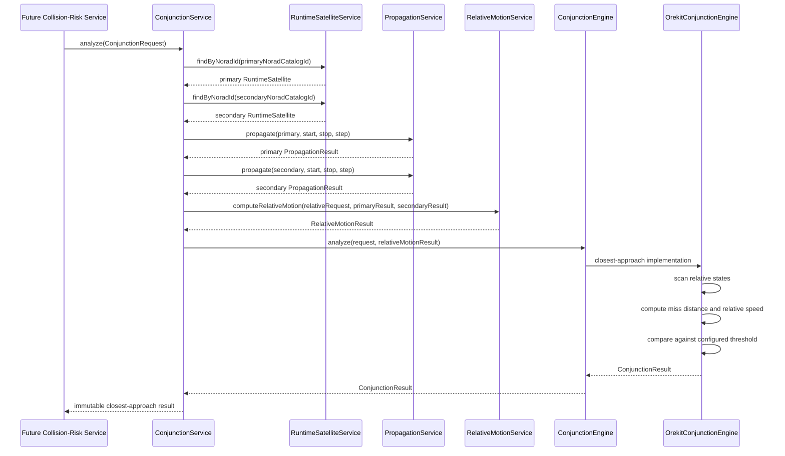

## Conjunction Responsibilities

`ConjunctionService`

Public runtime entry point for pairwise conjunction analysis. It validates the request boundary, loads both `RuntimeSatellite` objects through `RuntimeSatelliteService`, propagates both satellites with `PropagationService`, asks `RelativeMotionService` for the relative-motion history, and delegates closest-approach analysis to `ConjunctionEngine`. It does not know Orekit and does not access providers, repositories, or database state.

`ConjunctionEngine`

Internal boundary between service orchestration and closest-approach analysis. This keeps future catalog-wide screening and collision-risk modules dependent on stable runtime models rather than a specific propagation or relative-motion implementation.

`OrekitConjunctionEngine`

Current pairwise implementation. It analyzes the sampled `RelativeMotionResult`, finds the state with the minimum relative-position norm, computes time of closest approach, miss distance, relative speed, and compares the miss distance against the configured threshold. It does not compute covariance or collision probability.

`ConjunctionRequest`

Immutable request model containing primary NORAD id, secondary NORAD id, start time, stop time, propagation step, relative frame, and miss-distance threshold. It rejects invalid ids, identical primary/secondary ids, invalid time spans, non-positive step durations, and invalid thresholds. A null relative frame defaults to `LVLH_RTN`.

`ClosestApproach`

Immutable closest-approach model containing TCA, miss distance, relative speed, and the closest `RelativeState`. It validates that the TCA matches the closest relative state's timestamp.

`ConjunctionStatus`

Runtime status taxonomy with `CLEAR` and `CONJUNCTION`. The status is based only on the configured miss-distance threshold in this milestone.

`ConjunctionResult`

Immutable result containing the source request, closest approach, and conjunction status. Future catalog-wide screening, collision probability, and maneuver-planning modules can consume this result without querying catalog tables or calling Orekit directly.

## Conjunction Rules

Pairwise conjunction analysis is layered above runtime propagation and relative motion. The service intentionally reuses `RelativeMotionService` so later improvements to propagation families or relative-frame handling flow into pairwise conjunction analysis without duplicating math.

Milestone 12 uses sampled relative-motion history. Continuous TCA refinement, covariance, probability of collision, maneuver planning, large-scale screening, and spatial indexing belong to later focused modules.

No Orekit classes escape the conjunction package. Public callers receive only immutable runtime conjunction models.

## Milestone 13: Catalog-Wide Conjunction Screening

Milestone 13 adds provider-neutral catalog screening between one primary runtime satellite and the current runtime catalog. It streams catalog satellites, skips the primary object, delegates each pairwise analysis to `ConjunctionService`, keeps only `CONJUNCTION` results, and sorts candidates by increasing miss distance. It does not implement KD-trees, R-trees, spatial indexing, parallel execution, covariance, collision probability, maneuver planning, schedulers, REST endpoints, caching, database schema, or provider integration.

The screening layer is intentionally simple. It exists to provide a stable public API and a replaceable algorithm boundary before later large-scale screening optimizations are introduced.

## Catalog Screening Sequence

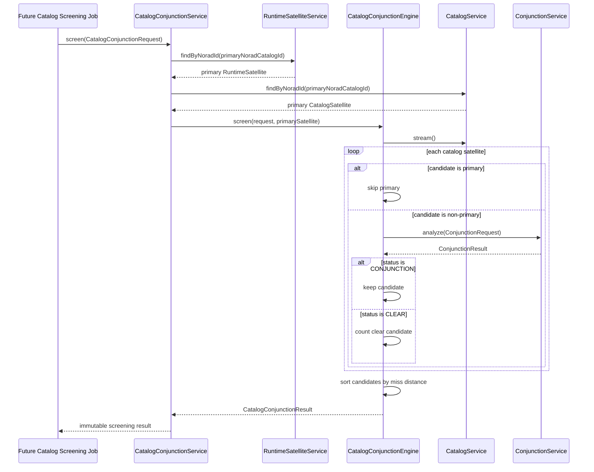

## Catalog Screening Responsibilities

`CatalogConjunctionService`

Public runtime entry point for catalog-wide screening. It validates the request boundary, loads the primary runtime satellite through `RuntimeSatelliteService` so malformed/unavailable runtime TLEs fail before screening, loads the primary catalog satellite through `CatalogService`, and delegates screening to `CatalogConjunctionEngine`. It does not know Orekit, repositories, or propagation math.

`CatalogConjunctionEngine`

Internal boundary for catalog screening algorithms. The current implementation is linear and sequential, but future KD-tree, R-tree, coarse-filter, or batched algorithms can replace the engine without changing the public screening API.

`DefaultCatalogConjunctionEngine`

Current intentionally simple implementation. It streams `CatalogService`, skips the primary NORAD id, invokes `ConjunctionService` for each non-primary candidate, keeps only results whose status is `CONJUNCTION`, sorts retained candidates by increasing miss distance, and records screening statistics. It does not perform propagation math or access repositories.

`CatalogConjunctionRequest`

Immutable request model containing primary NORAD id, start time, stop time, propagation step, relative frame, and miss-distance threshold. A null relative frame defaults to `LVLH_RTN`.

`CatalogConjunctionCandidate`

Immutable retained candidate containing the candidate `CatalogSatellite` and its pairwise `ConjunctionResult`.

`CatalogScreeningStatistics`

Immutable screening counters for catalog satellites seen, primary objects skipped, candidates analyzed, conjunction candidates retained, and clear candidates discarded. It validates internal counter consistency.

`CatalogConjunctionResult`

Immutable screening result containing the source request, primary catalog satellite, sorted candidates, and screening statistics.

## Catalog Screening Rules

Catalog screening is an orchestration layer above pairwise conjunction analysis. Pairwise physics remains inside `ConjunctionService`, which keeps propagation, relative motion, closest approach, and threshold classification reusable by both pairwise and catalog-wide workflows.

Milestone 13 originally used a sequential catalog stream. Milestone 14 introduces a replaceable spatial candidate index while preserving the same public screening API. Parallel execution, batch propagation, covariance, probability of collision, maneuver planning, and production-scale scheduler integration belong to later focused modules.

No Orekit classes escape the catalog-screening package. Public callers receive only immutable runtime screening models.

## Milestone 14: Spatial Candidate Indexing

Milestone 14 adds a replaceable in-memory spatial-index layer in front of catalog-wide conjunction screening. The index reduces the candidate set before expensive pairwise analysis, but it does not propagate satellites, compute conjunctions, calculate collision probability, access repositories, schedule work, cache results, expose REST APIs, or modify database schema.

The first implementation uses coarse bins over available catalog orbital elements: inclination, RAAN, and mean motion. This is intentionally conservative and replaceable. Rows with incomplete orbital metadata are kept in a fallback bucket and included in queries so missing metadata does not silently hide candidates.

## Spatial Candidate Sequence

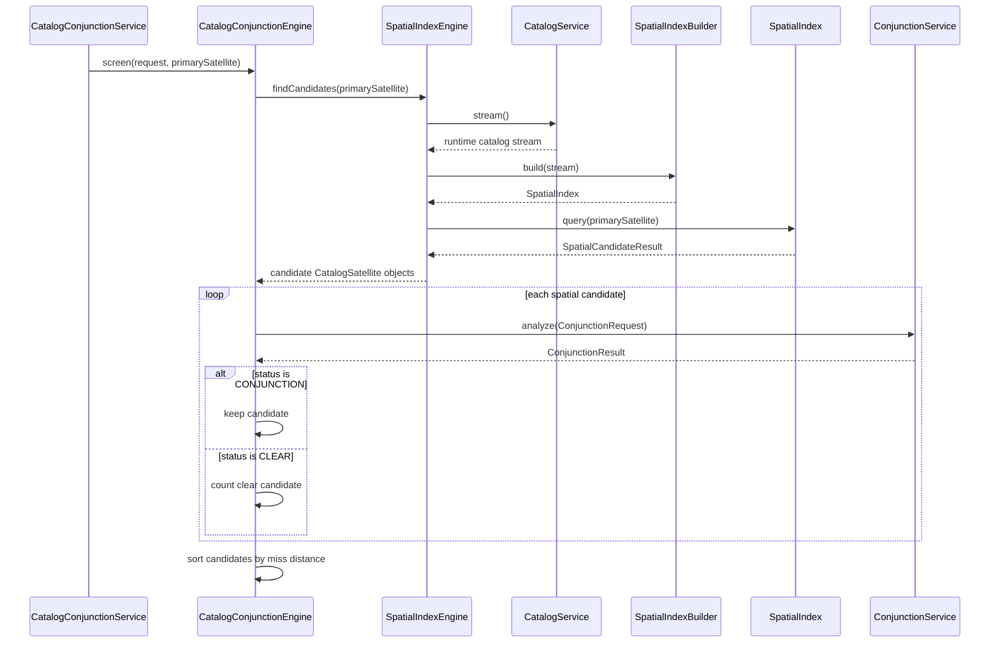

## Spatial Index Responsibilities

`SpatialIndexEngine`

Public internal boundary for candidate reduction. It owns the workflow of reading the runtime catalog through `CatalogService`, building an index, and querying candidates around the primary satellite. Screening code depends on this boundary rather than scanning catalog streams directly.

`DefaultSpatialIndexEngine`

Current runtime implementation. It builds a fresh in-memory index from the latest catalog stream for each screening request and returns only candidate satellites plus screening counters. It does not know Orekit, propagation, conjunction math, repositories, or providers.

`SpatialIndexBuilder`

Factory boundary for constructing a replaceable in-memory index from streamed `CatalogSatellite` objects. The default builder uses coarse orbital-element bins and can be replaced later without changing `CatalogConjunctionService` or the public screening API.

`SpatialIndex`

Query interface for an in-memory candidate index. It accepts a `SpatialIndexQuery` and returns a `SpatialCandidateResult`.

`SpatialIndexQuery`

Immutable query model containing the primary `CatalogSatellite`. It intentionally does not include Orekit states or propagated ephemerides.

`SpatialCandidate`

Immutable wrapper around a candidate `CatalogSatellite`. It keeps the index result shape explicit while exposing no physics or provider objects.

`SpatialCandidateResult`

Immutable index result containing spatial candidates and index-level counters. The result defensively copies candidate lists and exposes convenience access to candidate satellites for screening.

## Spatial Index Rules

Spatial indexing is only a prefilter. Pairwise physics remains inside `ConjunctionService`, and the screening engine still invokes pairwise analysis for every returned candidate.

The default index is deliberately simple. It is not a KD-tree, R-tree, octree, spatial database, cache, parallel executor, covariance engine, or collision-probability model. Future high-performance implementations can replace `SpatialIndexBuilder` or `SpatialIndexEngine` without changing public catalog-screening callers.

## Milestone 15: Parallel Catalog Screening

Milestone 15 adds a replaceable execution boundary for running independent pairwise conjunction analyses concurrently. It preserves the public `CatalogConjunctionService` API and keeps the screening flow layered: spatial indexing reduces candidates, the executor runs independent pairwise tasks, and `ConjunctionService` remains the only owner of pairwise physics.

The executor does not know Orekit, propagation math, relative-motion math, spatial indexing, repositories, schedulers, REST endpoints, cache state, covariance, collision probability, or maneuver planning.

## Parallel Screening Sequence

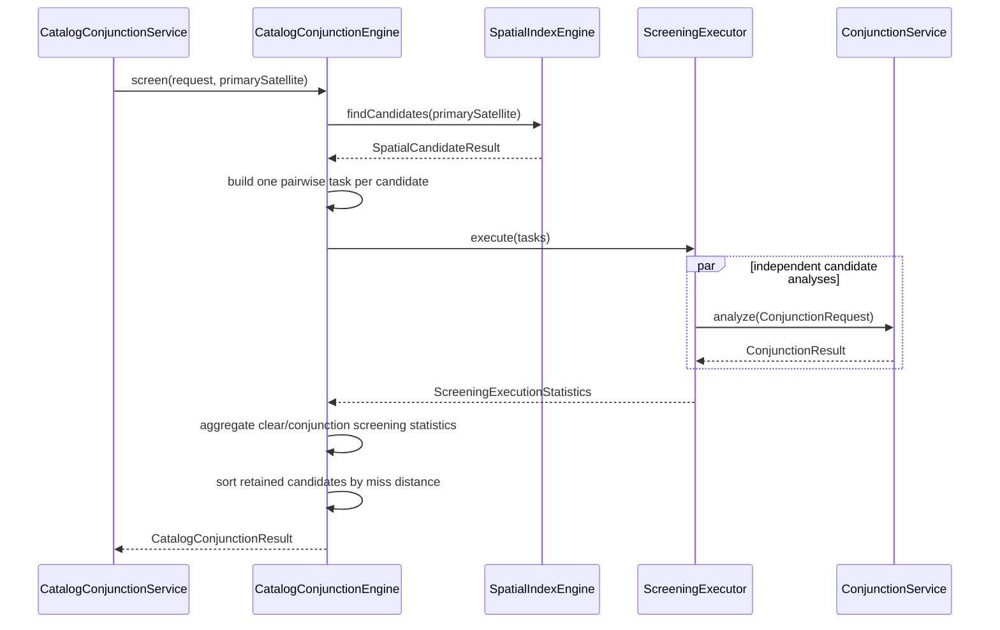

## Parallel Screening Responsibilities

`ScreeningExecutor`

Concurrency boundary for catalog screening. It accepts independent tasks, executes them, returns execution statistics, and surfaces failures clearly. It does not build conjunction requests, inspect satellite data, or classify results.

`DefaultScreeningExecutor`

Current local implementation. It uses a per-request virtual-thread executor to run candidate analyses concurrently without exposing custom thread-pool tuning APIs. If any task fails, it throws a catalog conjunction exception with the failed task count and suppressed causes rather than silently dropping candidates.

`ScreeningExecutionStatistics`

Immutable execution counters for submitted, successful, and failed tasks. These counters are separate from `CatalogScreeningStatistics`, which describes domain screening outcomes such as analyzed, clear, and conjunction candidates.

`DefaultCatalogConjunctionEngine`

Remains orchestration-only. It obtains candidates from `SpatialIndexEngine`, builds pairwise work items, delegates concurrency to `ScreeningExecutor`, aggregates completed pairwise results, and sorts retained conjunction candidates by increasing miss distance. It does not own thread management or pairwise physics.

## Parallel Screening Rules

Pairwise analyses are independent and may complete in any order. Public output remains deterministic because retained conjunction candidates are sorted by miss distance, then by NORAD id for ties.

Parallel screening is local execution only. Distributed execution, scheduler integration, custom tuning APIs, caching, database changes, collision probability, covariance, and maneuver planning remain later focused modules.
